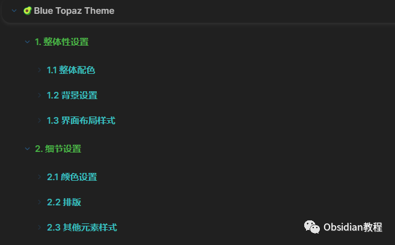
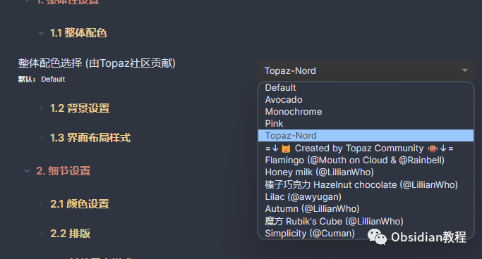
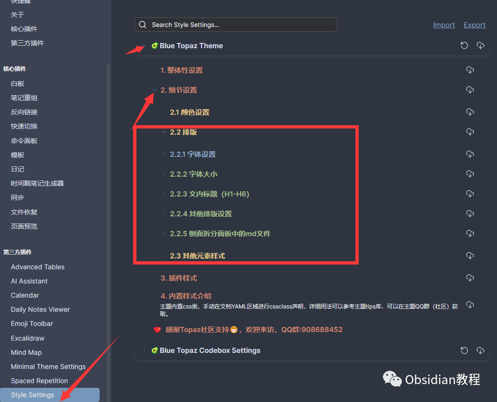
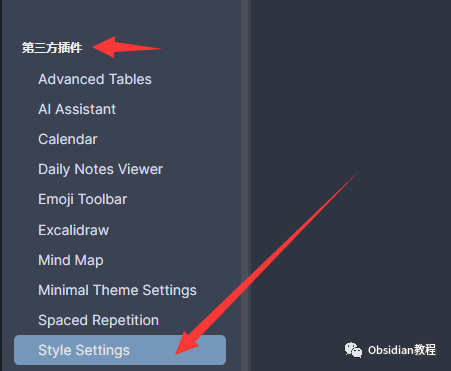
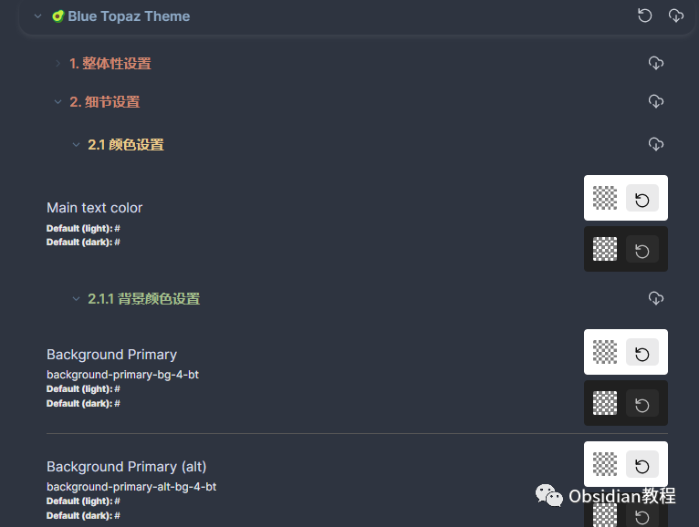
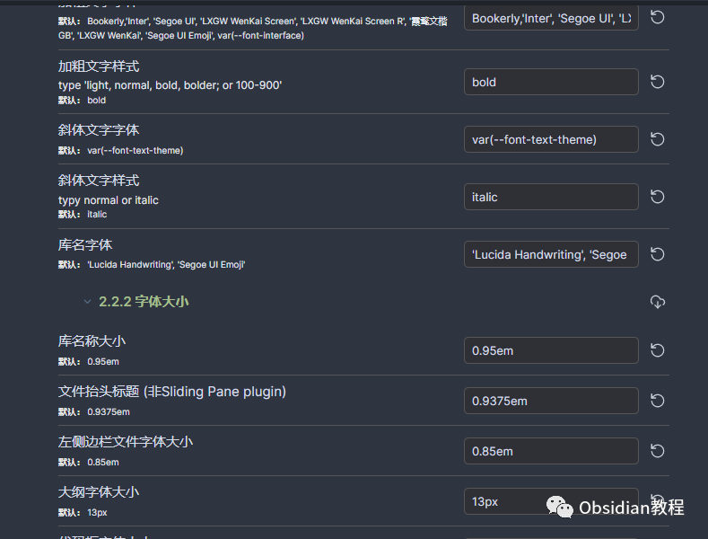

# Obsidian插件:Style Settings调整某个特定主题的部分样式

### 点击下方公众号，回复关键字：**Obsidian** ，获取Obsidian资料合集。

Obsidian 不仅是一款强大的知识管理工具，其丰富的插件生态也为使用者提供了诸多个性化定制的可能性。  
今天，我将带你深入了解其中一个特别的插件——Style Settings。并对其进行介绍、展示功能，以及指导其安装与使用

## 

  

1  
  
1Style Settings 插件简介

在日常使用 Obsidian 时，你肯定有想过调整某个特定主题的部分样式，比如字体大小、配色等，而有不想完全更换整个主题？  
Style Settings 正是为此设计的。该插件允许用户微调 Obsidian 主题的样式，为知识管理工作空间增添一抹个性色彩。  

## 2主要功能

### **2.1 颜色定制**

  
无论你是对某个特定颜色过敏，还是想为你的 Obsidian 添加一点自己的风格，Style Settings 的颜色定制功能都能满足你。这个功能允许用户针对不同的界面元素，如标题、链接、背景等，自定义颜色。  

  

### **2.2 字体调整**

  
默认字体过大或过小？Style Settings 插件可以帮助你微调字体大小，让界面更加符合你的阅读习惯。同时，你还可以选择你喜欢的字体风格，比如斜体或加粗，为你的笔记添加更多个性。

### **2.3 界面布局**

  
除了颜色和字体，该插件还支持界面布局的微调。你可以调整各个面板的间距、边距，以及其他界面元素的布局，使其更加合理和舒适。

## 

3安装与使用

### **3.1 在线安装**（需要科学上网） ：****

****  
****

  * ### 打开 Obsidian， 点击左下角的设置图标。

  * 在设置菜单中，选择“插件”。
  * 点击“社区插件”，然后在搜索框中输入“Style Settings”。
  * 找到“Style Settings”插件，点击“安装”。
  * 安装完成后，回到“插件”菜单，找到“Style Settings”并启用。

###   

**3.2离线安装：****  
****因为网络原因很多同学无法直接在线安装obsidian插件，这里我已经把obsidian所有热门插件下载好了**  
只需要关注下方公众号，后台回复：**插件** 即可获取

### 4使用

  * 安装并启用插件后，你可以直接在已安装插件里面找到Style Settings ，点击它，你会进入插件的主界面。这里列出了所有可以定制的样式选项。

  

  * 对于颜色定制，点击你想要修改的部分，选择一个新颜色，或直接输入颜色代码，或者点选。

  * 对于字体调整，使用滑块或直接输入数字来调整大小；同时，你还可以选择字体风格。

  * 界面布局的修改也是通过滑块或数字输入来完成的。
  * 所有的更改都会实时反映在 Obsidian 的界面上，你可以随时预览效果。
  * 如果对更改后的样式满意，直接关闭 Style Settings 界面即可；如果不满意，可以点击“重置”按钮，将样式恢复到默认状态。

  

## 5总结

Style Settings 为 Obsidian 的用户提供了一个简单易用的方式，来微调主题样式，让知识管理工具更加贴合个人喜好。无论你是希望对界面进行大幅度的定制，还是仅仅想改变一两个小细节，这个插件都能为你提供强大的支持。  
希望这篇文章能帮助你更好地理解和使用 Style Settings，让你的 Obsidian 更加独一无二。  
  
  
1**扫码购买****《 Obsidian实战教程》****从入门到精通， 链接您的每一个思维瞬间。****  
**  
往 期精彩[1.Obsidian插件:Outliner一个用于改进Obsidian中列表的插件](http://mp.weixin.qq.com/s?__biz=MzkyMDUyMDM2Mg==&mid=2247483977&idx=1&sn=d9dad6649c783c9dd1486ff5de070c6e&chksm=c190d18cf6e7589aa92d39c7af0d97df780435da681fdce51d26fa9a0b977f492a1ebcc2d73d&scene=21#wechat_redirect)  
[2.Obsidian插件:Templater 一个为 Obsidian 用户设计的插件](http://mp.weixin.qq.com/s?__biz=MzkyMDUyMDM2Mg==&mid=2247483964&idx=1&sn=c157b7b458c9256f9585925b7fe94b14&chksm=c190d1f9f6e758ef33b886d915251e1c12d1f072cc663f17cb3b6771ed53726d2bd56482de4b&scene=21#wechat_redirect)  
[3.Obsidian插件:Advanced Slides为你的知识网络增加动态幻灯片功能](http://mp.weixin.qq.com/s?__biz=MzkyMDUyMDM2Mg==&mid=2247483950&idx=1&sn=92edb3fe9c4331d6c007fe7d2ac4549e&chksm=c190d1ebf6e758fdff7da2afc5e82aff39e07de8fcb879e163c4c211f3d393e84f3bce551c49&scene=21#wechat_redirect)  

点分享

点点赞

点在看
