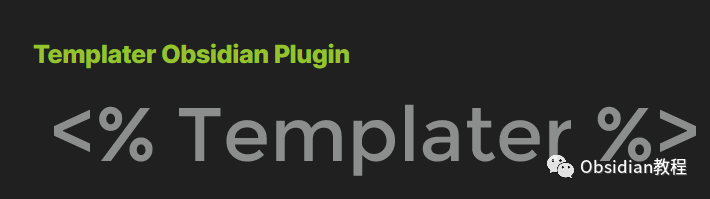
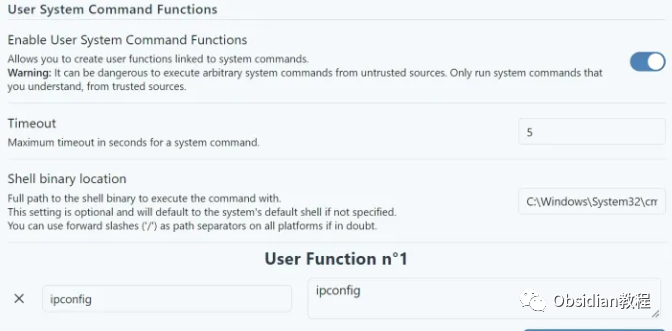
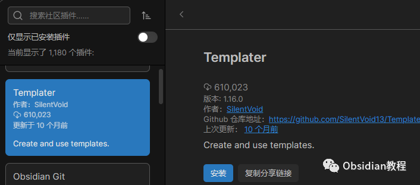
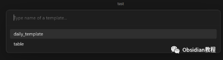

# Obsidian插件:Templater 一个为 Obsidian 用户设计的插件

  
在数字笔记时代，Obsidian以其独特的链接设计和强大的插件生态赢得了无数用户的心。  
而在这众多的插件中，Templater无疑是为Obsidian加持的一把利剑。它不仅允许我们将笔记模板化，还提供了一种功能强大的模板语言，帮助我们在笔记中插入动态变量和函数。  
  
1为什么选择Templater？ 想象一下，每次你写日记时，都需要输入当前的日期；每次记录会议笔记，都需要构建相同的结构。这样的重复劳动无疑是效率的大敌。  
而Templater的出现，正是为了解决这种痛点。它可以帮你自动插入日期、时间，甚至是复杂的函数结果。更让人兴奋的是，它还支持JavaScript代码执行，这意味着你可以通过代码进一步操作这些变量和函数。 2功能概览

  * **模板语言：** Templater定义了一种模板语言，允许你轻松地在笔记中插入变量和函数结果。
  * **JavaScript代码执行：** 高级用户可以利用JavaScript操作模板中的变量和函数，实现更复杂的操作。
  * **完整的文档：** 不论你是初学者还是专家，Templater为你提供了完备的使用文档，帮助你快速上手。
  * **社区支持** ：Templater有一个活跃的社区，你可以在这里分享你的模板、获取他人的创意，或寻求帮助。

3安全提示   
由于Templater支持执行JavaScript代码和系统命令，使用时需要特别小心。不要轻易运行或导入来自不受信任源的代码或命令。确保你了解并信任所有执行的代码和命令。   
4如何开始使用Templater？

  * 安装：在Obsidian的设置中，转到“插件”部分，搜索“Templater”，然后点击安装。完成后，激活该插件。

  
  

  * 创建模板：开始新建一个笔记，使用Templater定义的模板语言书写你的模板。你可以创建一个日常的日志模板，每次写日记时，Templater会帮你自动插入当前日期。

  

  * 使用模板：在任何笔记中，当你需要插入模板时，只需调用Templater命令（通常是通过命令面板或快捷键），然后选择你的模板，模板内容会自动填充到你的笔记中。

  
  
5结语 在数字笔记的世界中，效率是我们追求的目标，而Templater无疑帮助我们走得更远。无论你是Obsidian的新手还是资深用户，都值得尝试这款强大的插件，让你的笔记体验更上一层楼。  
  
  
1**扫码购买****《 Obsidian实战教程》****从入门到精通， 链接您的每一个思维瞬间。****  
**  
往 期精彩1.[Obsidian插件:Advanced Slides为你的知识网络增加动态幻灯片功能](http://mp.weixin.qq.com/s?__biz=MzkyMDUyMDM2Mg==&mid=2247483950&idx=1&sn=92edb3fe9c4331d6c007fe7d2ac4549e&chksm=c190d1ebf6e758fdff7da2afc5e82aff39e07de8fcb879e163c4c211f3d393e84f3bce551c49&scene=21#wechat_redirect)  
[2.Obsidian插件:Tasks从零散笔记到完美任务管理](http://mp.weixin.qq.com/s?__biz=MzkyMDUyMDM2Mg==&mid=2247483938&idx=1&sn=6603deda8ad8a2aa37784514fc945f3d&chksm=c190d1e7f6e758f144409e0aa7cc19df581f1cd2a5894d3f67c6b6b789c922acf752f83b5b45&scene=21#wechat_redirect)  
[3.Obsidian插件:Advanced Tables笔记界的“Excel”](http://mp.weixin.qq.com/s?__biz=MzkyMDUyMDM2Mg==&mid=2247483923&idx=1&sn=26aa5d0c1a9d12e5647d180abcd9f5ff&chksm=c190d1d6f6e758c0be3ecc75e3887d0f1ca1e6c77583f541290b6223d1d2e5c3d1b58daacb89&scene=21#wechat_redirect)  

点分享

点点赞

点在看
