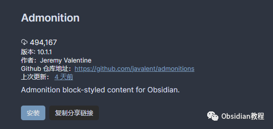
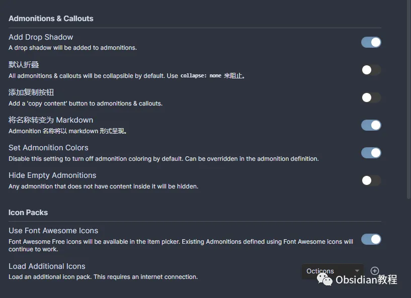

# Obsidian插件:​ Admonition 为笔记增添亮点，更加醒目

今天来聊聊 Obsidian 中一个非常实用的插件——Admonition。你有没有遇到过在做笔记时，有些重要信息需要特别突出显示，或者想要加上一些醒目的提醒、警告，来避免错过关键内容？这时，Admonition 插件绝对能帮你大忙。

### 插件概述

Admonition 插件是专门用来在 Obsidian 中创建各种类型的信息框的工具。这些信息框包括提示、警告、信息等，能够让你的笔记更具可读性与专业感。

而且，这个插件的一个重要亮点是它可以高度自定义，让你的笔记在视觉上更加符合你的个人需求。你不仅可以选择预设的样式和图标，还能通过 CSS 自定义，让每个信息框都独一无二。

### 如何安装 Admonition 插件

安装这个插件的过程非常简单，跟着我一步步来，你也能快速上手。

  1. **在线安装：**

     * 打开 Obsidian，点击左下角的“设置”图标。
     * 在设置页面找到“第三方插件”选项，点击进入。
     * 点击“浏览”按钮，在搜索框中输入“Admonition”。
     * 找到插件后，点击安装，并确保启用插件。
  2. **离线安装：**

     * 如果你因为网络问题不能在线安装插件，不用担心，我已经准备好了插件包。  

### 点击下方公众号，回复关键字：**Obsidian** ，获取Obsidian资料合集。

### 使用 Admonition 插件

有了这个插件，你可以轻松创建各种信息框，让重要信息一目了然。下面是几种常见的使用方法：

  1. **提示框（Tip）**
         
         title: 小贴士  
         记得检查操作步骤，避免失误。  
         

  2. **警告框（Warning）**
         
         title: 注意  
         这个操作可能会有风险，请谨慎！  
         

  3. **信息框（Info）**
         
         title: 重要信息  
         请确保按步骤完成每一项操作。  
         

这些信息块不仅让你的笔记结构更加清晰，还能快速吸引读者注意力，确保他们不会错过重要的内容。

### 自定义样式

Admonition 插件支持通过 CSS 来完全自定义每个信息框的外观。比如，你可以给提示框添加自定义的背景色、边框或图标，让它们在视觉上更符合你的需求。

例如，下面的 CSS 代码可以让你的提示框有一个清新的蓝色背景，并且加上绿色的左侧边框：
    
    
    .admonition.ad-tip {  
      background-color: #e0f7fa;  
      border-left: 5px solid #00796b;  
    }  
    

你只需要在 Obsidian 的设置中找到“外观”部分，点击“CSS 代码片段”，然后添加这个代码片段，保存并启用。这样，所有的提示框就会应用这个样式，瞬间提升你笔记的视觉效果。

### 插件的优势

Admonition 插件的最大优点就是它可以让笔记的内容更加有层次感。通过使用不同风格的信息框，你可以轻松区分提醒、警告或是额外的背景信息，避免在笔记中简单的文字堆砌，让读者可以迅速抓住重点。

在做笔记时，我们往往会遇到需要特别标注的内容，比如一些操作注意事项，或者是需要特别记住的重要信息。使用 Admonition 插件，能让这些内容在笔记中突出显示，帮助我们避免忽略细节。

### 我的使用体验

作为一名 Obsidian 的重度用户，我个人对 Admonition 插件爱不释手。每次看到那些色彩分明、结构清晰的提示框，我都能感到一股愉悦的心情，仿佛在给我的笔记增添了生命力。

不仅如此，插件强大的自定义功能让我能够根据不同的需要调整信息框的外观，真的是既实用又有趣。无论是为了标记操作注意事项，还是给自己留下一些灵感提示，这个插件都能完美胜任。

### 结语

如果你也想让你的 Obsidian 笔记更加专业、更加醒目，不妨试试 Admonition 插件。它会让你在管理笔记时更加得心应手，同时也提升笔记的美观度和可读性。相信我，这个插件一旦试过，你会爱上它的！

### 点击下方公众号，回复关键字：**Obsidian** ，获取Obsidian资料合集。

****-END****-****

**ok，今天先说到这，如果你想更深入的了解Obsidian，现在只要购买我们的《Obsidian实操案例课》，便可免费加入「玩转效率笔记」社群，与一群人交流效率提升的经验，实现自我管理的目标。** 如果你对Obsidian有热情，这个课程绝对不容错过！
