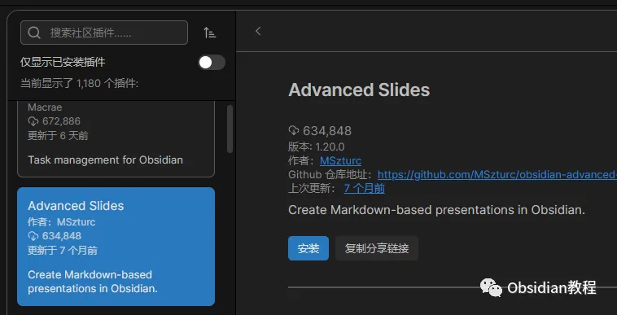
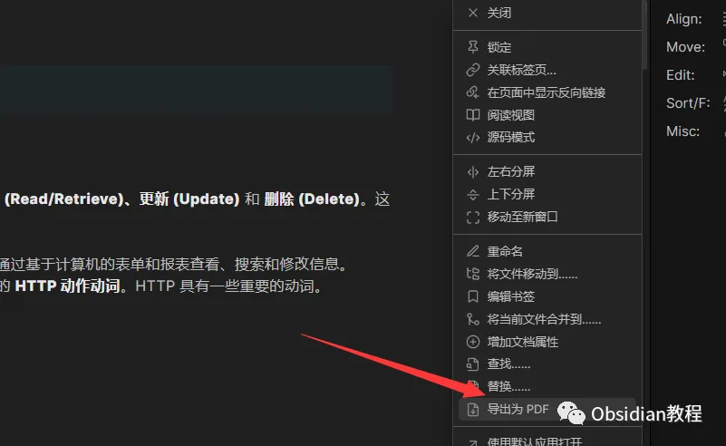
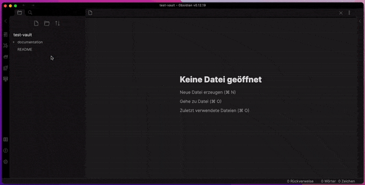

# Obsidian插件:​ Advanced Slides 为知识网络增加动态幻灯片

嗨，我是鬼哥，10年+老程序员一枚。

你们有没有遇到过这种情况，领导突然叫你做个PPT汇报工作进度，结果你手上只有一堆零碎的笔记和markdown文件？

真是头大啊！幸好我发现了Obsidian的一个神器插件——**Advanced Slides** 。

今天鬼哥就来给大家讲讲这个插件怎么用，绝对能让你从零开始也能做出高逼格的PPT。

**插件介绍**

Advanced Slides 是 Obsidian 上的一款插件，专门用来将 Markdown 文件转换成幻灯片。简单来说，就是让你在 Obsidian 里面用 Markdown 写笔记的同时，也能快速生成幻灯片。这对于那些习惯于用 Markdown 做记录、整理资料的人来说，简直就是一大福音啊。

### **下载和安装**

### **1.在线安装：**

  * 打开Obsidian，点击左下角的“设置”图标。
  * 在设置菜单中，选择“第三方插件”选项。
  * 点击“浏览”按钮，搜索“Advanced Slides”。
  * 找到插件后，点击“安装”。
  * 安装完成后，切换插件的“启用”开关。

### **2.离线安装：****  
****因为网络原因很多同学无法直接在线安装obsidian插件，这里我已经把obsidian所有热门插件下载好了**  
只需要关注下方公众号，后台回复：**插件** 即可获取

  

### **使用方法**

安装完成后，我们来看看怎么用这个插件制作幻灯片吧。

#### **创建幻灯片**

新建笔记：在 Obsidian 中新建一个笔记，命名为“演示文稿”或者其他你喜欢的名字。

写 Markdown：在笔记中使用 Markdown 语法编写你的幻灯片内容。这里有几个关键的格式：

例如：

  *   *   *   *   *   *   *   *   * 

    
    
    # 我的演示文稿## 第一张幻灯片- 这是一个列表- 这是另一个列表项  
    ---  
    ## 第二张幻灯片

     * 每张幻灯片用三个短横线 --- 分隔。

     * 使用 # 标题来表示幻灯片的标题。

     * 使用普通的 Markdown 语法来添加文本、图片、代码块等内容。

#### **幻灯片样式**

Advanced Slides 还支持一些自定义的样式，你可以通过在 Markdown 文件的顶部添加 css 样式来实现。
      
      *   *   *   *   * 
    
    
    
    

这段代码会将所有幻灯片中的一级标题（即 # 标题）颜色变成红色。这样你就可以根据自己的需求，随心所欲地美化你的幻灯片啦。

**导出幻灯片**

编写完幻灯片内容后，点击右上角的“预览”按钮，就可以看到你的幻灯片效果了。觉得满意后，点击“导出”，选择你需要的格式，就可以将幻灯片保存到本地。

### **Advanced Slides 的优势**

#### **简单快捷**  

和传统的 PPT 制作工具相比，Advanced Slides 的优势在于它的简单和快捷。你只需要用 Markdown 语法编写内容，然后就可以快速生成一份专业的幻灯片。尤其是对于那些已经习惯了用 Markdown 做笔记的人来说，这种方式简直是如鱼得水。

#### **灵活可定制**

通过自定义 CSS，你可以对幻灯片进行高度的定制。无论是字体、颜色、布局，还是动画效果，都可以根据自己的需求进行调整。这种灵活性是传统 PPT 工具所无法比拟的。

#### **一站式工作流**

使用 Advanced Slides，你可以在一个平台上完成所有的工作。从资料的收集整理，到最终的演示文稿制作，都可以在 Obsidian 里面搞定。这不仅提高了效率，也减少了在不同工具之间切换的麻烦。

### **Advanced Slides 能解决什么问题**

**统一工作流** ：无缝整合 Obsidian 的笔记和幻灯片制作功能，让你的工作流程更加顺畅。

**高效输出** ：利用 Markdown 的简洁语法，快速生成高质量的幻灯片，极大提高了工作效率。

**灵活美观** ：通过自定义 CSS 样式，幻灯片的美观度和个性化都得到了极大提升。

### **使用****感受**

自从用了 Advanced Slides，鬼哥做PPT的效率那是直线上升。以前为了赶一个汇报PPT，经常是通宵达旦，现在有了这个插件，几乎就是写写Markdown，点几下鼠标的事。而且因为是基于Obsidian的，所有的笔记资料都可以直接引用，真的方便得不得了。

如果你也是一个Obsidian的重度用户，同时又经常需要制作PPT的话，鬼哥强烈推荐你试试这个Advanced Slides插件。

相信我，用了它，你再也不想回到传统的PPT制作工具了。

  
  
  
1******扫码购买****《 Obsidian实战教程》****从入门到精通， 链接您的每一个思维瞬间。**  

