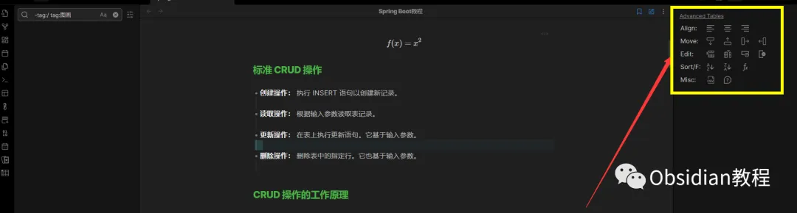
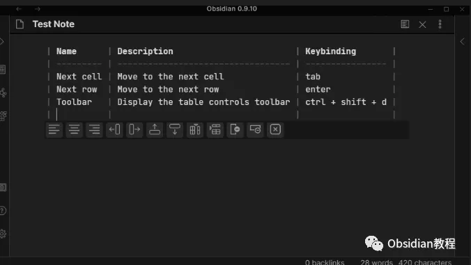
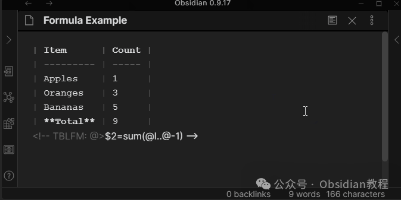

# Obsidian插件:​ Advanced Tables 高效管理你的表格

嗨，我是鬼哥，10年+老程序员一枚。今天要给大家介绍的是 Obsidian 插件里的一个宝藏——**Advanced Tables** 。很多小伙伴在使用 Obsidian 做笔记时，都会遇到一个问题：如何在 Markdown 文件里优雅地管理表格？这时，Advanced Tables 就闪亮登场了。它不仅让你能轻松创建和编辑表格，还能进行各种高级操作，让你的笔记更有条理、更具可读性。

### **插件介绍**

Advanced Tables 是一个专为 Obsidian 用户设计的插件，它极大地简化了 Markdown 表格的创建和编辑过程。你再也不用手动调整每个单元格的宽度，也不用担心表格格式的混乱。这个插件为表格操作提供了一系列的快捷键和自动化功能，让你专注于内容而不是格式。

### **下载与安装**

首先，我要提醒大家，使用第三方插件前，最好先备份你的Obsidian笔记。安全第一！

安装的步骤其实非常简单：

### **1.在线安装**（需要科学上网） ：****

  
在Obsidian中安装插件是一个简单直接的过程：  

  1. 打开Obsidian，点击左下角的“设置”图标。
  2. 在设置菜单中，选择“第三方插件”选项。
  3. 点击“浏览”按钮，搜索“Advanced Tables”。
  4. 找到插件后，点击“安装”。
  5. 安装完成后，切换插件的“启用”开关。  

### **2.离线安装：****  
****因为网络原因很多同学无法直接在线安装obsidian插件，这里我已经把obsidian所有热门插件下载好了**  

只需要关注下方公众号，后台回复：**插件** 即可获取

  

安装成功后，你的obsidian左侧栏目中就会出现他的标识。

这样就可以在笔记中使用了。

### **使用方法**

**1.创建表格** ：在 Obsidian 中创建一个新的 Markdown 文件，输入表格的基础格式，例如：**2.格式化表格** ：安装 Advanced Tables 后，只需在表格中按下 Ctrl + T（或 Cmd + T），插件会自动对表格进行格式化调整，使其对齐整齐，清晰易读。**3.添加行和列** ：想要在表格中添加新的行或列，只需将光标放在表格中的任意位置，按下快捷键 Ctrl + Enter（添加行）或 Ctrl + Shift + Enter（添加列），插件会自动为你插入新的行或列。**4.删除行和列** ：同样地，想要删除某一行或列，只需将光标放在相应的位置，按下 Ctrl + D（删除行）或 Ctrl + Shift + D（删除列），一切都那么简单。**5.移动行和列** ：需要调整表格的结构？将光标放在需要移动的行或列上，按下 Alt + 上/下箭头（移动行）或 Alt + 左/右箭头（移动列），即可轻松实现。

### **插件的好处**

使用 Advanced Tables，你能轻松搞定复杂的表格操作。无论是整理数据还是创建对比分析，这个插件都能助你一臂之力。它不仅节省时间，还能让你的笔记更加整洁和专业。此外，通过快捷键和自动化功能，极大地提高了工作效率。

### **应用场景**

**1.学术研究** ：在撰写论文或报告时，常常需要整理大量的数据和信息。使用 Advanced Tables，可以快速创建和编辑数据表格，方便统计和对比。**2.项目管理** ：管理项目时需要跟踪进度和任务，使用表格可以清晰地展示项目的各个方面。Advanced Tables 让你轻松调整和更新项目表格，实时掌握项目动态。

**3.个人笔记** ：日常生活中的各种记录，如收支情况、日程安排等，用表格记录更加直观和清晰。Advanced Tables 让你在 Obsidian 中高效地管理这些记录。

### **解决的问题**

在没有 Advanced Tables 之前，Markdown 表格的创建和编辑过程繁琐且易出错，特别是当表格内容较多时，手动调整格式几乎是不可能完成的任务。Advanced Tables 自动化的功能彻底解决了这一难题，让你不再为表格的对齐和格式发愁。

### **使用感受**

鬼哥使用 Advanced Tables 一段时间后，真心觉得它是 Obsidian 中不可或缺的利器。不仅功能强大，还非常贴心，完全满足了我对表格管理的需求。表格的自动对齐和快捷键操作，极大地提高了我的工作效率。再也不用担心表格混乱或格式不整齐了，每次打开笔记都是整整齐齐的，心情也跟着舒畅了不少。

### 

### 赶紧去试试吧，相信你会和鬼哥一样，爱上这个强大的工具。  

  
  
  
1******扫码购买****《 Obsidian实战教程》****从入门到精通， 链接您的每一个思维瞬间。**  

