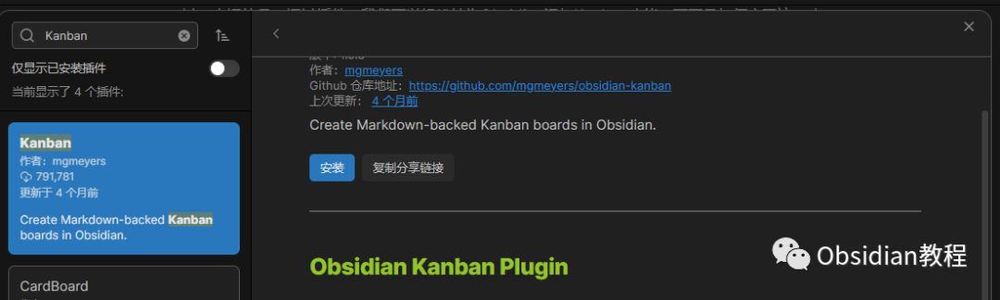
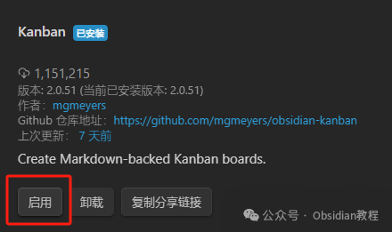
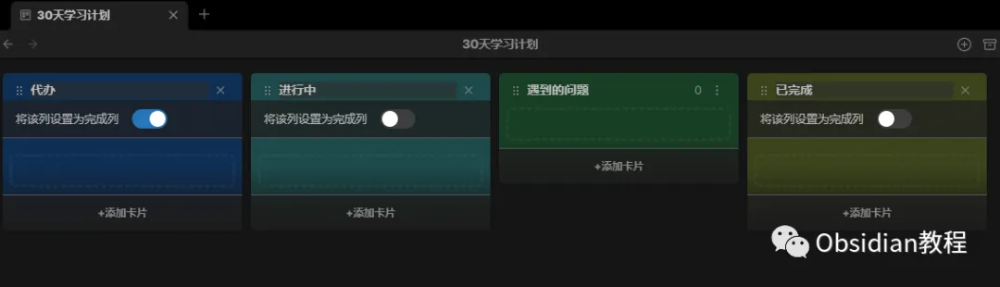
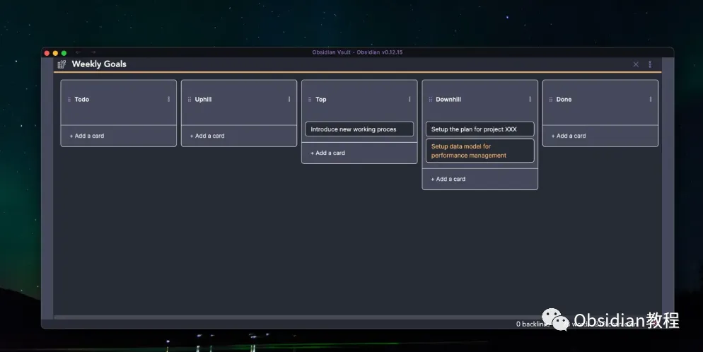

# Obsidian插件:​ Kanban 任务卡片让管理更高效和有趣

嗨，我是鬼哥，10年+老程序员一枚。今天要跟大家介绍的是Obsidian中的另一个神奇插件——**Kanban** 插件。这个插件可以在Obsidian中创建基于Markdown的看板，让你在记笔记的同时，还能高效地进行任务管理和项目规划。听起来是不是很酷？那咱们就一起来看看吧！

### **Kanban 插件简介**

Kanban插件的主要功能是帮助你在Obsidian中创建和管理看板。看板是一种可视化的项目管理工具，通常用来跟踪任务的进度。你可以在看板上创建任务卡片，并将它们拖动到不同的列中，以显示任务的当前状态。

这个插件完全基于Markdown，因此你的看板数据是纯文本的，非常便于编辑和管理。

### **下载和安装**

安装的步骤其实非常简单：

### **1.在线安装**（需要科学上网） ：****

  
在Obsidian中安装插件是一个简单直接的过程：  

  1. 打开Obsidian，点击左下角的“设置”图标。
  2. 在设置菜单中，选择“第三方插件”选项。
  3. 点击“浏览”按钮，搜索“ Kanban ”。
  4. 找到插件后，点击“安装”。
  5. 安装完成后，切换插件的“启用”开关。  

### **2.离线安装：****  
****因为网络原因很多同学无法直接在线安装obsidian插件，这里我已经把obsidian所有热门插件下载好了**  

只需要关注下方公众号，后台回复：**插件** 即可获取

启用插件：安装完成后，点击“Enable”按钮启用插件。

### **使用方法**

安装并启用插件后，你可以按照以下步骤创建和管理看板：创建看板：打开一个新的或现有的Markdown文件，输入以下命令来创建一个看板：

  *   *   * 

    
    
    ---kanban-plugin: basic---

添加列和卡片：在看板中，你可以添加多个列，每个列代表一个任务状态。然后，在列中添加任务卡片。示例如下：
      
      *   *   *   *   *   *   *   *   * 
    
    
    
    ## To Do- [ ] Task 1- [ ] Task 2  
    ## In Progress- [ ] Task 3  
    ## Done- [ ] Task 4

拖动卡片：在编辑模式下，你可以直接拖动卡片到不同的列中，以更新任务的状态。使用标签和优先级：你还可以为卡片添加标签和优先级，以便更好地组织和管理任务。

### **带来的好处**

任务可视化：通过看板视图，你可以直观地查看和管理任务的进度，避免遗漏重要事项。高效的任务管理：你可以快速创建、编辑和更新任务，提高了任务管理的效率。Markdown支持：所有看板数据都存储在Markdown文件中，便于编辑和备份。

### **能解决什么问题**

任务混乱：如果你有很多任务需要管理，看板可以帮助你理清思路，避免任务混乱。进度跟踪：看板可以直观地显示任务的当前状态，方便你跟踪项目进度。团队协作：如果你和团队成员使用同一个Obsidian Vault，看板可以帮助你们协同工作，及时更新任务状态。

**优点：**

**可视化管****理** ：通过看板的形式直观展示任务，方便管理和追踪。

**灵活性高** ：支持自定义列和任务，适应不同的管理需求。

**易于操作** ：通过拖拽和 Markdown 语法，操作简单便捷。

**鬼哥的使用感受** 自从用了Kanban插件，鬼哥的任务管理效率大大提升。以前用纸质看板，总是觉得不方便，现在用Obsidian的Kanban插件，所有任务都能在电脑上轻松管理。拖动卡片更新状态也非常方便，整个过程就像在玩游戏一样。再加上Markdown的支持，让数据管理变得更加简单和灵活。总的来说，Obsidian的Kanban插件是一款非常实用的任务管理工具，无论是个人使用还是团队协作，都能带来极大的便利。鬼哥强烈推荐大家试试这款插件，相信你们也会像我一样爱上它的！赶快安装Kanban插件，让你的任务管理变得更加高效和有趣吧！  
  
  
1******扫码购买****《 Obsidian实战教程》****从入门到精通， 链接您的每一个思维瞬间。**  

