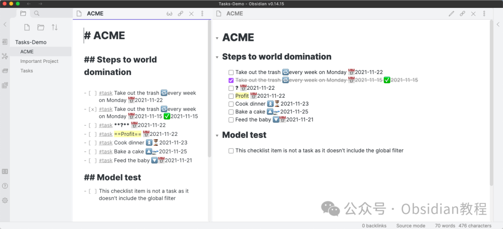
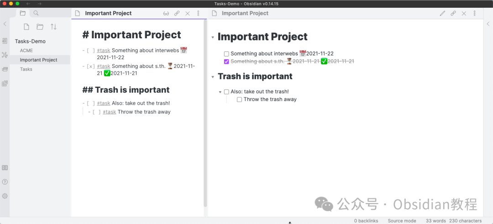
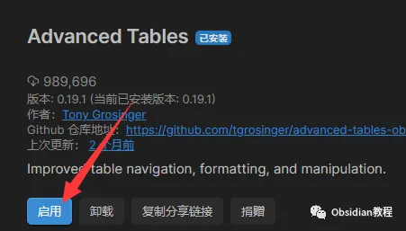
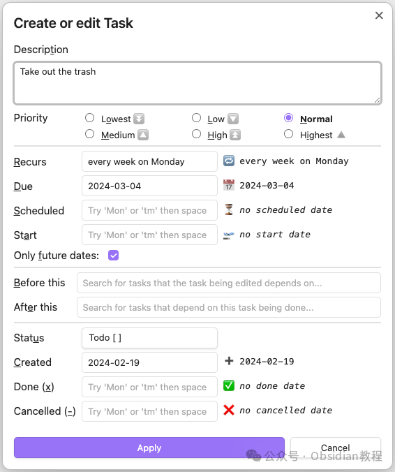

# Obsidian插件:​ Tasks 全面掌控你的Obsidian任务管理

嗨，我是鬼哥，10年+老程序员一枚。今天咱们来聊聊 Obsidian 里一款超实用的插件——**Tasks** 。这款插件可以说是 Obsidian 知识库里的任务管理神器，不仅功能强大，还能让你在笔记中轻松追踪任务进度。用上它之后，你的任务管理将变得井井有条，效率倍增。

### **Tasks 插件介绍**

Tasks 插件是为 Obsidian 量身定制的任务管理工具。它可以让你在整个知识库中追踪任务，查询任务状态，并在任意位置标记任务完成。  


  * **丰富的功能：** 从设置截止日期、重复任务，到使用子任务清单和过滤器，"Tasks"插件为我提供了我需要的一切工具，让我可以按照自己的方式管理任务。

  * **实时更新：** 只需在任何视图或查询中切换任务状态，它就会自动更新原始文件。这种无缝的同步让我的生活更加有序。

  * **强大的查询功能：** 我可以创建一个查询块，在Obsidian的任何位置显示我想要关注的任务。例如，我可以查询所有今天到期的任务，或者显示来自特定项目的所有任务。




不论你在哪个视图或查询中切换任务状态，源文件都会自动更新，方便快捷。  


### **下载和安装**

安装的步骤其实非常简单：

### **1.在线安装**（需要科学上网） ：****

  
在Obsidian中安装插件是一个简单直接的过程：  


  1. 打开Obsidian，点击左下角的“设置”图标。
  2. 在设置菜单中，选择“第三方插件”选项。
  3. 点击“浏览”按钮，搜索“ Tasks ”。
  4. 找到插件后，点击“安装”。
  5. 安装完成后，切换插件的“启用”开关。  




### **2.离线安装：****  
****因为网络原因很多同学无法直接在线安装obsidian插件，这里我已经把obsidian所有热门插件下载好了**  


只需要关注下方公众号，后台回复：**插件** 即可获取

### **配置 Tasks**

安装完成后，我们需要对 Tasks 进行一些配置，以便它更好地为我们服务：

  1. 在“设置”页面中，找到“插件”列表，点击“Tasks”。
  2. 在配置页面中，你可以设置一些默认选项，比如任务状态的标签、日期格式等。


### **使用方法**

#### **创建任务******

在 Obsidian 中创建任务非常简单。你只需要在笔记中使用特定的语法来定义任务。例如：
      
      *   * 
    
    
    
     - [ ] 完成项目报告 #task @due(2024-06-10)- [ ] 参加团队会议 #task @due(2024-06-11) @repeat(weekly)

在这些任务中，`[ ]` 表示未完成的任务，`@due(日期)` 表示任务的到期日期，`@repeat(周期)` 表示任务的重复周期。

#### **查询任务**

Tasks 插件允许你在笔记中查询任务状态。你可以使用以下语法来查询所有未完成且截止日期在明天之前的任务：

  *   *   *   * 

    
    
    ```tasksnot donedue before tomorrowsort by due

这个查询块会显示所有未完成且截止日期在明天之前的任务，并按截止日期排序。切换任务状态在任何视图或查询中，你都可以通过点击任务前的方框来切换任务状态。任务状态更新后，会自动同步到源文件，确保所有任务信息的一致性。 

### **Tasks 插件的优势**

  1. **统一管理** ：在整个知识库中统一管理任务，避免遗漏。

  2. **高效查询** ：通过查询语法快速找到未完成任务，提高效率。

  3. **自动更新** ：在任意位置更新任务状态，源文件自动同步。

  4. **灵活性强** ：支持任务的多种属性设置，如到期日期、重复任务等。


### **适用场景**

Tasks 插件适用于多种任务管理场景，包括但不限于：

  * **项目管理** ：跟踪项目中的各项任务及其进度。

  * **日常待办** ：管理日常的待办事项，如购物清单、会议安排等。

  * **长期目标** ：设定并追踪长期目标及其分步骤任务。


### **鬼哥的使用体验**

作为一个繁忙的程序员，鬼哥每天都要处理各种任务和项目。自从用上 Tasks 插件，任务管理变得轻松了许多。无论是项目报告的撰写，还是团队会议的安排，都能在 Obsidian 中高效管理。特别是它的查询功能，让我能够快速找到未完成的任务，再也不用翻阅大量笔记去寻找任务了。Tasks 插件确实是 Obsidian 用户的必备工具，尤其是对那些需要管理大量任务的朋友们来说，它能够极大地提高工作效率，让任务管理变得更加得心应手。如果你还没有尝试过，鬼哥强烈推荐你赶紧装上试试，相信你一定会爱上它！  
  
  
1******扫码购买****《 Obsidian实战教程》****从入门到精通， 链接您的每一个思维瞬间。**  


