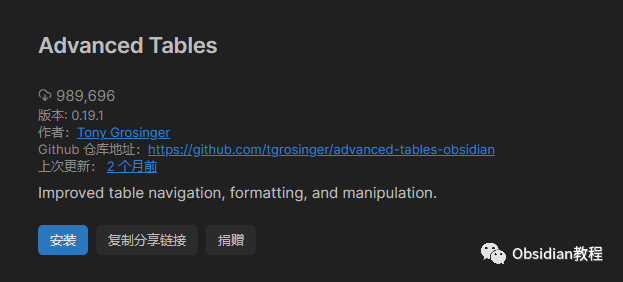
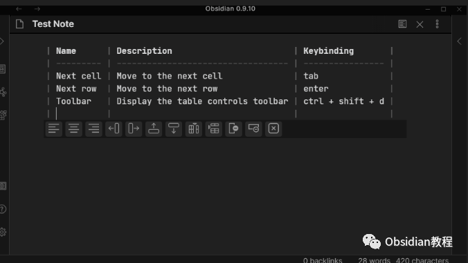
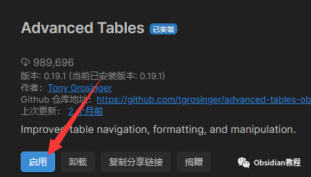
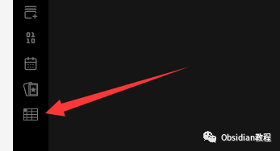
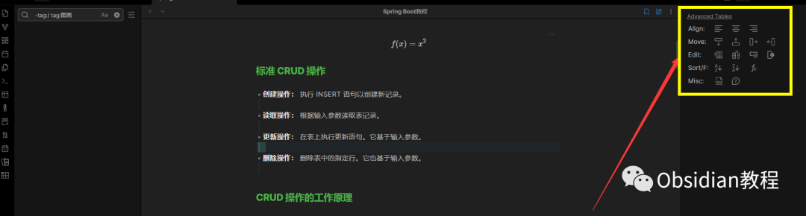

# Obsidian插件:​Advanced Tables笔记界的“Excel”

如果你正在阅读这篇文章，那么很可能你已经是Obsidian的用户，或者你对数字笔记颇有研究。Obsidian作为当下非常流行的链接式笔记工具，以其高度的自定义性和扩展性深受用户喜爱。

而今天，我要向大家推荐的，是一个让我对Obsidian更加着迷的插件——"Advanced Tables"。

1我为什么要用“Advanced Tables”？

首先，我必须坦白，作为一个长期使用Excel的用户，尽管Markdown的简洁性吸引了我，但每次制作表格时，我都深感不满。无法方便地在单元格之间导航，不支持复杂的公式运算，以及对于表格的整体布局和美化功能的匮乏，这些都让我倍感束手束脚。

当我无意中发现了"Advanced Tables"这个插件时，简直如获至宝。它彻底改变了我在Obsidian中制作和编辑表格的方式。

2它带给我的哪些惊喜？

  * 像Excel一样的操作感：这对于我这种已经习惯了Excel的用户来说，简直是福音。不仅可以使用Tab键在单元格间快速跳转，Enter键还可以帮助我迅速地新建一行。

  * 公式的支持：这一点真的太酷了。尽管大多数时候我们不需要在笔记中做复杂的计算，但是只要想到在需要的时候，我可以在我的Obsidian笔记中直接写下公式，这种感觉真的很棒。

  * 表格的美观度：过去，每次当我在Markdown中完成表格编辑后，它们总是看起来乱糟糟的。但有了这个插件，一切都变得井井有条。

  * 在移动端上的体验：移动端的支持是一个大亮点。虽然它在手机上的表现和桌面版有所不同，但仍然能够满足我的基本需求。

3如果你也想试试，该如何开始？

首先，我要提醒大家，使用第三方插件前，最好先备份你的Obsidian笔记。安全第一！

安装的步骤其实非常简单：

  * 打开Obsidian，进入设置。

  * 在插件部分，你需要关闭安全模式，这样才能安装第三方插件。

  * 然后，点击浏览社区插件，搜索"Advanced Tables"，找到它并安装。

  * 最后，别忘了启用它。

现在，你已经可以开始你的Obsidian高级表格之旅了！

安装成功后，你的obsidian左侧栏目中就会出现他的标识。

这样就可以在笔记中使用了

4一些建议

虽然"Advanced Tables"提供了很多强大的功能，但我建议新手用户在开始时，先熟悉基本的表格创建和编辑功能。随着使用的深入，你会发现更多隐藏的“宝藏”功能。

5总结

对于那些希望在Obsidian中获得更加丰富的表格编辑体验的用户，"Advanced Tables"无疑是一个必尝试的插件。

在使用过程中，你可能会遇到一些小问题或困惑，但请相信我，一旦你习惯了它，你会发现它带给你的，远远超出了你的期望。

  
  
  
1**扫码购买****《 Obsidian实战教程》****从入门到精通， 链接您的每一个思维瞬间。****  
**  
往 期精彩[1.Obsidian插件:Spaced Repetition - 利用间隔重复的原理帮助你复习笔记。](http://mp.weixin.qq.com/s?__biz=MzkyMDUyMDM2Mg==&mid=2247483909&idx=1&sn=0c3588ad2c062cb1053454221e389e36&chksm=c190d1c0f6e758d6b1e749451e121194f55419d14a8315a5cb7b8bcbd0dcf6cf7029d2a04526&scene=21#wechat_redirect)  
[2.Obsidian插件：Tag Wrangler - 为标签提供更专业的面板](http://mp.weixin.qq.com/s?__biz=MzkyMDUyMDM2Mg==&mid=2247483891&idx=1&sn=3b5668d2191ed6ac85a091d57d64c838&chksm=c190d236f6e75b20f59cc228d6df01a8f3bf3d220e214563aabd43dd53c8fd73ad9eaaf3bbc5&scene=21#wechat_redirect)  
[3.Obsidian插件:Templater在笔记中使用预定义模板](http://mp.weixin.qq.com/s?__biz=MzkyMDUyMDM2Mg==&mid=2247483877&idx=1&sn=1e5653a67b47ad8395a472b0c9ea311b&chksm=c190d220f6e75b364e4b28e5ac67d0b79ad21d6949eb142c512fb22ac6eb4f8e7651ad896b96&scene=21#wechat_redirect)  

点分享

点点赞

点在看
