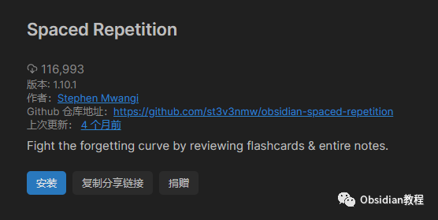
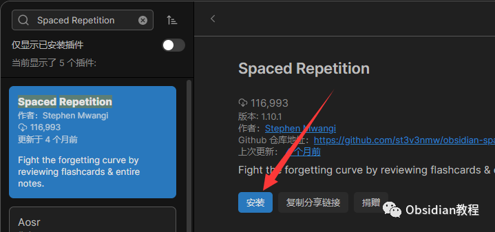
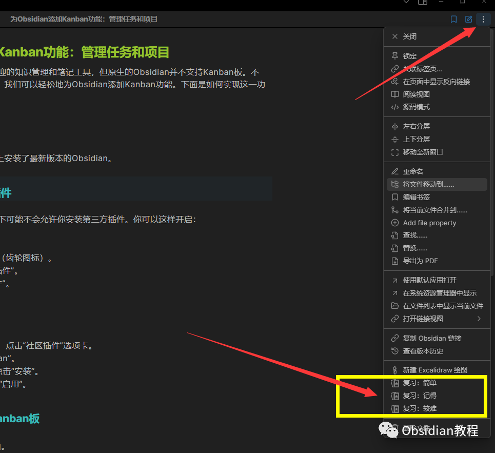
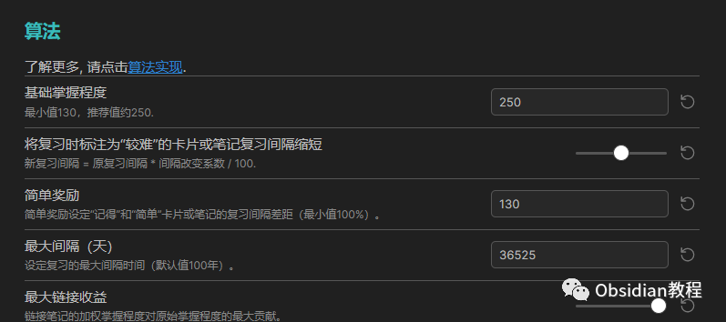

# Obsidian插件:​Spaced Repetition - 利用间隔重复的原理帮助你复习笔记。

## 1**介绍**

间隔重复是一种学习方法，目的是通过特定的时间间隔优化学习和记忆。Obsidian 的Spaced Repetition插件基于这一原理，帮助用户定期复习笔记，确保长期的知识吸收和记忆。  

## 2**功能** ****

  * 复习日程管理：为笔记设置复习日期，按照间隔重复的原则进行提醒。
  * 动态复习间隔：根据用户的复习反馈，自动调整下次复习的时间间隔。
  * 复习评分系统：用户可以在复习后给自己的表现打分，进而影响下次的复习安排。
  * 复习队列视图：提供一个专门的面板，显示待复习的笔记和它们的到期日期。

##  3**安装**

  * 打开 Obsidian。
  * 进入设置区域。
  * 在“第三方插件”部分，搜索“Spaced Repetition”。
  * 找到并点击“安装”。

  * 一旦安装完成，确保插件被“启用”。

## 

  

4**使用**

### **1\. 为笔记设置复习日期**

  * 打开你想复习的笔记。
  * 点击右上角3个...选择复习笔记。
  * 选择一个起始日期。基于这个日期，插件将计算并提醒你下次复习的时间。

###   

### **2\. 查看复习队列**

  * 在 Obsidian 的左侧边栏，点击 Review 插件图标。
  * 你会看到一个按日期组织的复习列表，列出了所有需要复习的笔记。

### **3\. 进行复习**

  * 从复习队列点击相应的笔记进入复习。
  * 复习完笔记后，通过命令面板选择“Rate Review”来为你的表现评分。例如，你可以选择“Easy”, “Good”, “Hard”等来描述这次复习的感觉。
  * 插件会根据你的评分来确定下次复习的日期。

##   

## 

###   

### **4\. 调整插件设置**

  * 在 Obsidian 设置中，找到Spaced Repetition的设置部分。
  * 这里你可以自定义复习的间隔、评分标准等。

##   

5提示和技巧

  * 考虑在开始使用插件时为少量笔记设置复习日期，以逐渐熟悉其工作方式。
  * 如果你发现某天的复习任务过多，可以调整某些笔记的复习日期，以平衡复习任务。

## 6总结

Spaced Repetition 插件为 Obsidian 用户提供了一种科学的方法来系统地复习他们的笔记。通过有效地利用间隔重复原理，你可以确保不仅仅是短时间内记住知识，而是长期保留和回忆。  
  
  
1**扫码购买****《 Obsidian实战教程》****从入门到精通， 链接您的每一个思维瞬间。****  
**  
往 期精彩[1.Obsidian插件-Dataview：强大的数据查询和展示工具](http://mp.weixin.qq.com/s?__biz=MzkyMDUyMDM2Mg==&mid=2247483865&idx=1&sn=03bddfa0b503811ae8caac10282caf1f&chksm=c190d21cf6e75b0a8977ddf76b2c0a07687190ac19126e6a5042afa570d9fea8257d1163b5a5&scene=21#wechat_redirect)  
[2.Obsidian Git 插件：自动备份笔记到Git并提供版本控制](http://mp.weixin.qq.com/s?__biz=MzkyMDUyMDM2Mg==&mid=2247483859&idx=1&sn=3e36b3f0e1e924ec90cf523b63829b36&chksm=c190d216f6e75b0054a019ff60803e7a0611c4ea27a37244c1568fe7e8d02c5f02776da95037&scene=21#wechat_redirect)  
[3.Obsidian插件:Mind Map - 将你的笔记转化为思维导图](http://mp.weixin.qq.com/s?__biz=MzkyMDUyMDM2Mg==&mid=2247483845&idx=1&sn=ad8ce1c9212d6c1d261faec1e038d848&chksm=c190d200f6e75b16810f9ce688c67db9b4e4d38e54c740e6799b405a0291e4d3b1bc347943d7&scene=21#wechat_redirect)

点分享

点点赞

点在看
