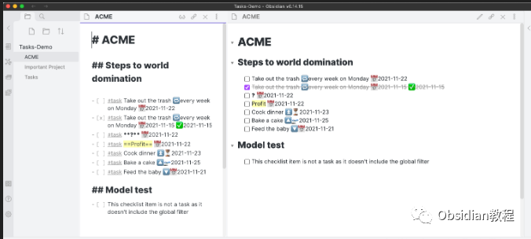
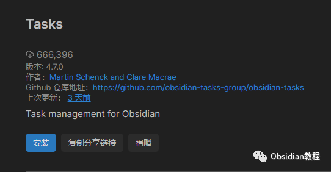
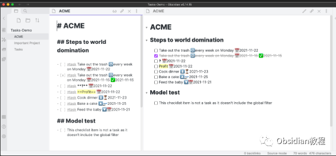
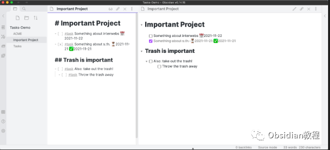
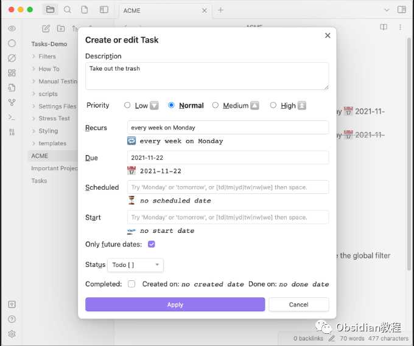

# Obsidian插件:​Tasks从零散笔记到完美任务管理

作为一个忠实的Obsidian用户，我已经习惯了在这个应用里畅快淋漓地记录所有的点滴。  
但每当我试图在Obsidian中管理待办事项时，我总感觉少了点什么。直到我发现了“Tasks”插件，它如同一杯咖啡，为我的日常任务管理注入了活力！  

### 1**为什么我（以及很多其他人）痴迷于"Tasks"插件？**   

**全库任务追踪：** 曾几何时，我习惯于在不同的笔记中设置任务清单，但这使得追踪变得复杂。  
"Tasks"插件允许我跨整个知识库追踪任务，并在任何地方标记它们为已完成。这让我从笔记的桎梏中解放出来，实现了真正的任务管理。  
**丰富的功能：** 从设置截止日期、重复任务，到使用子任务清单和过滤器，"Tasks"插件为我提供了我需要的一切工具，让我可以按照自己的方式管理任务。  
**实时更新：** 只需在任何视图或查询中切换任务状态，它就会自动更新原始文件。这种无缝的同步让我的生活更加有序。  
**强大的查询功能：** 我可以创建一个查询块，在Obsidian的任何位置显示我想要关注的任务。例如，我可以查询所有今天到期的任务，或者显示来自特定项目的所有任务。

###  2**如何开始使用这个神奇的插件？**   

**安装：**  

  * 在Obsidian的“社区插件浏览器”中搜索“Tasks”。
  * 在设置中启用插件（在“社区插件”下找到“Tasks”）。

  
  

  * 查看插件的设置。建议您尽早设置全局过滤器（如果需要的话）。
  * 替换原始的“切换复选框状态”快捷键为“Tasks: Toggle Done”。我个人建议您移除原始的切换快捷键，并将“Tasks”的切换设置为Ctrl + Enter（或Mac上的Cmd + Enter）。

  
**开始创建任务：**  
就像你在Markdown笔记中通常做的那样，创建一些任务。例如：

  * 这不是很重要，没有日期
  * 记得完成那个重要的事情 📅 2022-12-17
  * 发送生日卡给Kate 🔁 每年1月4日 ⏳ 2023-01-04  

  
**未完成任务：** 首先，你希望查询所有未完成的任务，这些任务的前面会有一个未选中的复选框，例如 - [ ]、* [ ] 或 1. [ ]。不论它们在哪个笔记中，这个查询都会找到它们。  

  
**今天或更早到期的任务：** 接着，你希望查看所有设定了今天或更早到期日期的任务。  
**任务数量限制：** 考虑到性能，你不希望查询结果中展示太多任务。因此，你设置了一个上限，只显示最多100个任务。  
**按文件名分组：** 为了更有条理地查看结果，你希望根据任务所在的文件名对它们进行分组。  
**排序：** 在所有任务中，你首先按照到期日期进行排序，越早到期的任务越在前面。如果两个任务有相同的到期日期，那么再根据任务描述进行排序。  

这样，查询结果会为你展示所有未完成且今天或更早到期的任务，它们按照所在的文件名进行了分组，并按照到期日期和任务描述排序，但最多只显示100个任务。这种查询方式旨在帮助你更高效地查看和管理你的任务。

最后，为了更好地理解查询的具体细节和Tasks插件如何解读它，你还添加了一**个“explain”指令** 。这意味着当你查看查询结果时，Tasks插件还会为你提供关于这个查询是如何工作的简单解释。

**总结：** 这个查询示例展示了Obsidian的Tasks插件的强大功能，使你能够根据多种条件跨整个知识库查询任务。不仅如此，通过组织和排序，它还为你提供了一个清晰的视图，以便你优先处理最紧急的任务。

对于长期使用Obsidian来管理日常工作、学习或其他活动的用户来说，Tasks插件无疑是一个神器。想象一下，你再也不需要在数十个或数百个笔记中逐一寻找任务，而是通过几行简单的代码，即可快速获取你需要的所有信息。这将大大提高你的生产力和工作效率。

  
  
  
1**扫码购买****《 Obsidian实战教程》****从入门到精通， 链接您的每一个思维瞬间。****  
**  
往 期精彩[1.Obsidian插件:Advanced Tables笔记界的“Excel”](http://mp.weixin.qq.com/s?__biz=MzkyMDUyMDM2Mg==&mid=2247483923&idx=1&sn=26aa5d0c1a9d12e5647d180abcd9f5ff&chksm=c190d1d6f6e758c0be3ecc75e3887d0f1ca1e6c77583f541290b6223d1d2e5c3d1b58daacb89&scene=21#wechat_redirect)  
[2.Obsidian插件:Spaced Repetition - 利用间隔重复的原理帮助你复习笔记。](http://mp.weixin.qq.com/s?__biz=MzkyMDUyMDM2Mg==&mid=2247483909&idx=1&sn=0c3588ad2c062cb1053454221e389e36&chksm=c190d1c0f6e758d6b1e749451e121194f55419d14a8315a5cb7b8bcbd0dcf6cf7029d2a04526&scene=21#wechat_redirect)  
[3.Obsidian插件：Tag Wrangler - 为标签提供更专业的面板](http://mp.weixin.qq.com/s?__biz=MzkyMDUyMDM2Mg==&mid=2247483891&idx=1&sn=3b5668d2191ed6ac85a091d57d64c838&chksm=c190d236f6e75b20f59cc228d6df01a8f3bf3d220e214563aabd43dd53c8fd73ad9eaaf3bbc5&scene=21#wechat_redirect)  

点分享

点点赞

点在看
