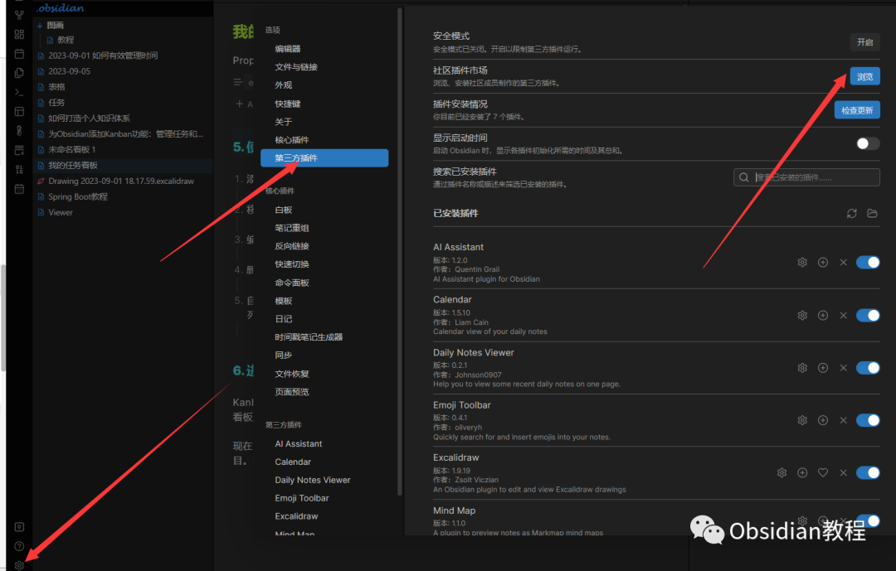
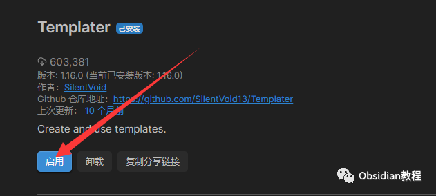

# Obsidian插件:​Templater在笔记中使用预定义模板

### 点击下方公众号，回复关键字：**Obsidian** ，获取Obsidian资料合集。

1介绍Templater 是一个为 Obsidian 设计的插件，使用户能够在笔记中使用预定义模板。这不仅仅是插入固定文本，你还可以添加动态内容、执行脚本、集成其他插件等功能。

## 

  

2功能

动态模板：允许你插入变量或脚本来生成内容，例如当前的日期或时间。系统命令：直接从你的 Obsidian 笔记运行外部命令或脚本。用户定义变量：为你的模板定义特定的变量。集成其他插件：与其他 Obsidian 插件合作，从而在模板中使用这些插件的功能。

## 

3安装

  * 打开 Obsidian。
  * 在左侧边栏点击设置图标。
  * 在设置面板中，选择“第三方插件”。
  * 在上方搜索栏中输入“Templater”。
  * 找到 Templater 插件并点击“安装”。

  

安装完毕后，你需要点击“启用”以启动插件功能。  

## 4使用

**创建模板：****  
**

  * 在任意位置创建一个新的笔记，这将作为你的模板。
  * 在这个笔记中，你可以写下任何你想在其他笔记中重用的内容。
  * 例如：今天是 <% tp.date.now("YYYY-MM-DD") %> 将在模板中插入当前日期。

  
**配置模板文件夹：****  
**

  * 回到 Obsidian 的设置 > Templater 设置。
  * 设置“模板文件夹”为你存储模板的文件夹名称。

  
**使用模板：**  

  * 打开或创建一个新笔记。
  * 通过命令面板 (Ctrl/Cmd + P) 找到“Insert template”命令。
  * 选择你想要插入的模板，它会自动填充到你的笔记中。

  
**设置用户变量：**

  * 在 Obsidian 的设置 > Templater 设置 > User defined templates variables 中定义你的变量。
  * 例如，你可以设置一个变量为你的名字，然后在模板中使用它。
  * 使用其他插件功能：确保你已经安装和启用了与 Templater 集成的其他插件。然后按照那些插件的文档来在模板中使用其功能。

  

## 5结束

  
Templater 插件为 Obsidian 的用户提供了强大的模板功能，使得笔记创建过程更加快速和高效。  
通过熟悉和利用这个插件，你可以更好地管理和优化你的知识工作流。  
  
  
1**扫码购买****《 Obsidian实战教程》****从入门到精通， 链接您的每一个思维瞬间。****  
**  
往 期精彩[1.Obsidian插件-Dataview：强大的数据查询和展示工具](http://mp.weixin.qq.com/s?__biz=MzkyMDUyMDM2Mg==&mid=2247483865&idx=1&sn=03bddfa0b503811ae8caac10282caf1f&chksm=c190d21cf6e75b0a8977ddf76b2c0a07687190ac19126e6a5042afa570d9fea8257d1163b5a5&scene=21#wechat_redirect)  
[2.Obsidian Git 插件：自动备份笔记到Git并提供版本控制](http://mp.weixin.qq.com/s?__biz=MzkyMDUyMDM2Mg==&mid=2247483859&idx=1&sn=3e36b3f0e1e924ec90cf523b63829b36&chksm=c190d216f6e75b0054a019ff60803e7a0611c4ea27a37244c1568fe7e8d02c5f02776da95037&scene=21#wechat_redirect)  
[3.Obsidian插件:Mind Map - 将你的笔记转化为思维导图](http://mp.weixin.qq.com/s?__biz=MzkyMDUyMDM2Mg==&mid=2247483845&idx=1&sn=ad8ce1c9212d6c1d261faec1e038d848&chksm=c190d200f6e75b16810f9ce688c67db9b4e4d38e54c740e6799b405a0291e4d3b1bc347943d7&scene=21#wechat_redirect)

点分享

点点赞

点在看
