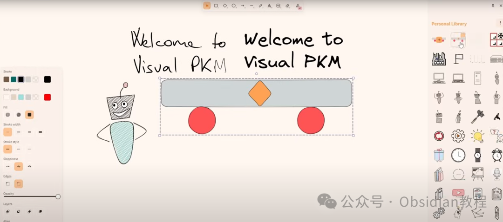
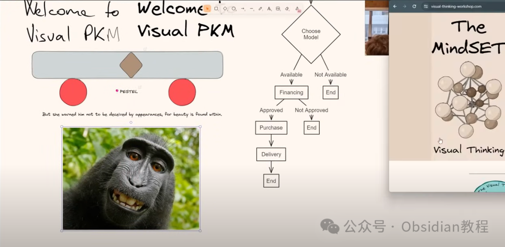
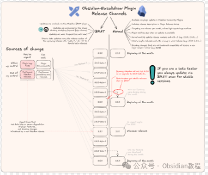

# Obsidian插件—Excalidraw，最强的视觉化插件！

作为Obsidian 的忠实用户。今天咱们聊聊 Obsidian 里的 **Excalidraw** 插件，一个能把你的笔记变成「视觉化战斗机」的工具。

  

说起 Excalidraw，很多人可能已经听说过它是一个开源的手绘白板工具。

但如果你是 Obsidian 的用户，你会发现 **这个插件不仅仅是画个草图那么简单** 。它不仅能画流程图、思维导图、手绘草图，还能直接嵌入 Markdown 文档，实现 **双链笔记 + 可视化思维** 的无缝结合，直接提升你的笔记体验。

如果你还在用手写流程图，或者在 Notion、Xmind 里到处切换，不妨看看 Excalidraw，它能让你在 **Obsidian 里画图、标注、插入链接、自动导出、甚至用 LaTeX 公式** ，彻底解决图文混排的难题。

咱们直接进入正题，看看这个插件到底能干啥、怎么装、怎么用，以及有哪些**神级功能** ！

## **1\. Excalidraw 插件的核心功能**

Excalidraw 作为 Obsidian 的一款插件，直接把 Excalidraw 这个强大的手绘工具无缝集成到了 Obsidian 里，主要有以下功能：

**🎨 画图与笔记的完美结合**

  * **手绘白板** ：支持画流程图、思维导图、手绘图、示意图等，支持 **自由手绘、线条、形状、文字、图片插入** 。
  * **Markdown 集成** ：可以直接在 Obsidian 里插入 Excalidraw 图表，并且 **支持 Markdown 语法和笔记双链** ，超强互动。
  * **块引用与超链接** ：可以 **直接在 Excalidraw 里引用 Obsidian 里的笔记块、章节、甚至是其他 Excalidraw 文件** ，形成笔记之间的 **可视化关联** 。

**🔗 高级链接 & 嵌入功能**

  * **Markdown-embed** ：支持 `![[image.excalidraw|100x100]]` 这种格式，**精准控制嵌入图片的大小与对齐方式** 。
  * **超链接支持** ：可以在 Excalidraw 里直接 **插入 Obsidian 内部链接** （比如 `[[我的笔记]]`），也可以插入外部链接（`[Obsidian 官网](https://obsidian.md)`）。
  * **拖拽支持** ：可以 **拖拽 Markdown 文件、图片、网址到 Excalidraw** ，直接转换成链接或者图片。

**🛠️ 自动化 & 便捷工具**

  * **自动导出** ：可以 **自动导出 PNG / SVG 格式** ，方便插入 Markdown 文档或者其他软件使用。
  * **快捷键操作** ：几乎所有功能都有 **快捷键** ，比如 `CTRL + 点击` 可以新建 / 打开图表，非常高效。
  * **模板支持** ：可以设置 **默认的画图模板** ，比如常用的流程图样式、默认颜色、字体等。

**🧪 实验性功能**

  * **OCR 文字识别** ：可以配合 OCR 插件，直接 **识别图片上的文字** 并转化为文本。
  * **LaTeX 公式支持** ：如果你是科研 / 学术用户，Excalidraw 也支持 **数学公式 LaTeX** ，用 `CTRL + CMD + Click` 编辑公式。

## **2\. Excalidraw 插件的安装与配置**

**🔍 如何安装？**

  1. 打开 **Obsidian** ，进入 **设置（Settings）** 。
  2. 在 **「社区插件（Community Plugins）」** 里，搜索 `Excalidraw`。
  3. 点击 **「安装（Install）」** ，然后 **启用（Enable）** 。

安装完毕后，**你可以在左侧的 Obsidian 工具栏找到 Excalidraw 的按钮** ，点击即可新建绘图文件！

  

点击下方公众号，回复关键字：**Obsidian** ，获取Obsidian资料合集。

## **3\. Excalidraw 的核心用法**

**📝 基本绘图**

  1. **新建绘图** ：点击左侧的 Excalidraw 图标，或者 **使用`CTRL + Click` 在文件管理器里新建绘图**。
  2. **添加形状** ：支持 **矩形、圆形、箭头、自由绘图、文本框** 等。
  3. **手写支持** ：如果你用的是触控笔，比如 iPad + Obsidian Mobile，那手写笔记简直绝配！

**🔗 嵌入 Markdown**

  * **插入图片 / 绘图**
        
        ![[my-drawing.excalidraw]]  
        

  * **调整大小**
        
        ![[my-drawing.excalidraw|100x100]]  
        

  * **居左/居右对齐**
        
        ![[my-drawing.excalidraw|100|left]]  
        

**如何组织 Excalidraw 文件** 默认情况下，Excalidraw 的文件会保存在你的 Vault 里（通常是 `.excalidraw.md` 结尾）。你可以：

  * **把它们整理到单独的文件夹** （比如 `Excalidraw` 文件夹）。
  * **使用双链`[[文件名]]` 直接在 Markdown 里引用 Excalidraw**。

## **4\. Excalidraw 高级功能**

**📌 快捷操作**

操作| 快捷键  
---|---  
新建 Excalidraw 画板| `CTRL + Click`  
插入超链接| `CTRL + K`  
旋转选中对象| `ALT + R`  
复制样式| `CTRL + ALT + C`  
粘贴样式| `CTRL + ALT + V`  
  
**🎨 自定义颜色 & 主题**

  * **可以修改默认颜色** ，方法：

    1. 打开 **Excalidraw 设置** 。
    2. 找到 **"颜色调色板"** 部分，修改默认颜色。
  * **支持深色 / 浅色模式自动切换** ：

    * 你可以让 Excalidraw 自动适配 **Obsidian 的主题模式** ，保证在黑暗模式下也有良好的显示效果。

**📌 超强导出功能**

  * **自动导出 PNG / SVG** ，直接在 Markdown 里插入高质量的矢量图。
  * **可以给 Markdown 导出不同模式的图片** （深色 / 浅色），适配不同的阅读习惯。

## **5\. 适合哪些用户？**

如果你符合以下情况，Excalidraw 绝对值得一试：✅ **知识管理 / 学习** ：做笔记、画流程图、制作「第二大脑」。  
✅ **科研 / 公式编辑** ：支持 LaTeX 公式，适合写论文、做科研笔记。  
✅ **编程 / 代码思维导图** ：记录架构设计、数据结构、项目管理等。  
✅ **工作流优化** ：整合各种信息，制作项目计划、思维导图、业务流程。

🔥 **Excalidraw 绝对是 Obsidian 最强的「视觉化插件」** ，它解决了 Markdown 纯文本的局限，让你的笔记真正「活」起来。如果你是 Obsidian 用户，强烈建议试试！

💡 **如果你喜欢用 Excalidraw，记得关注它的社区和更新，它的功能还在不断扩展，未来可期！**

  
  
  
1点击下方公众号，回复关键字：**Obsidian** ，获取Obsidian资料合集。
