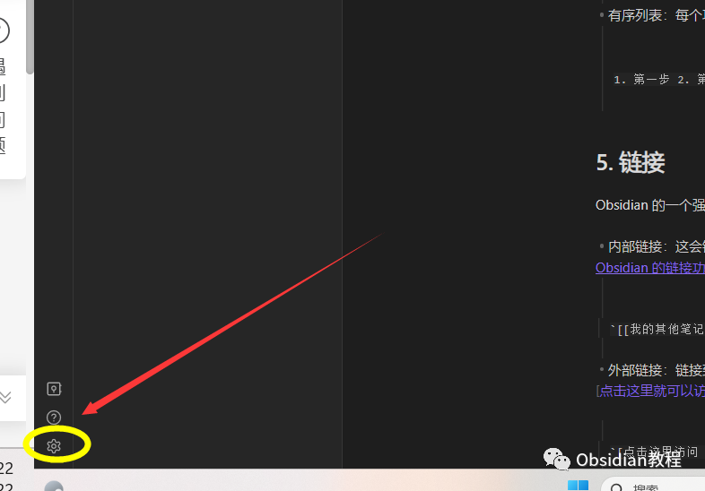
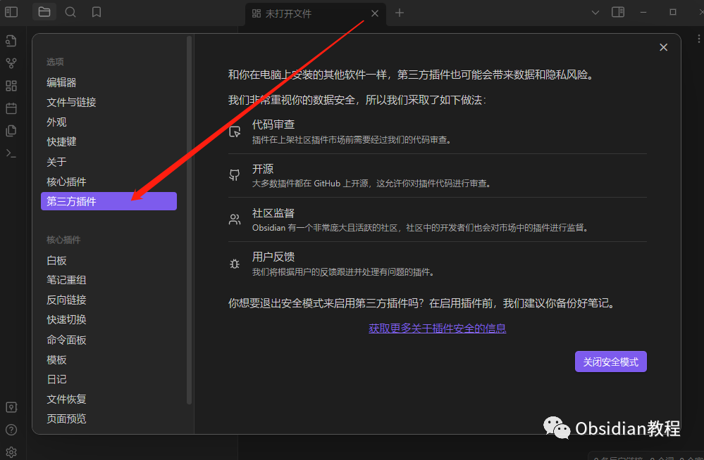
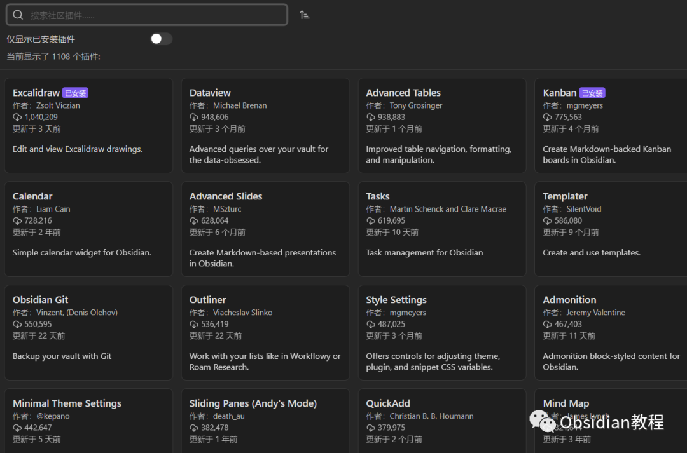
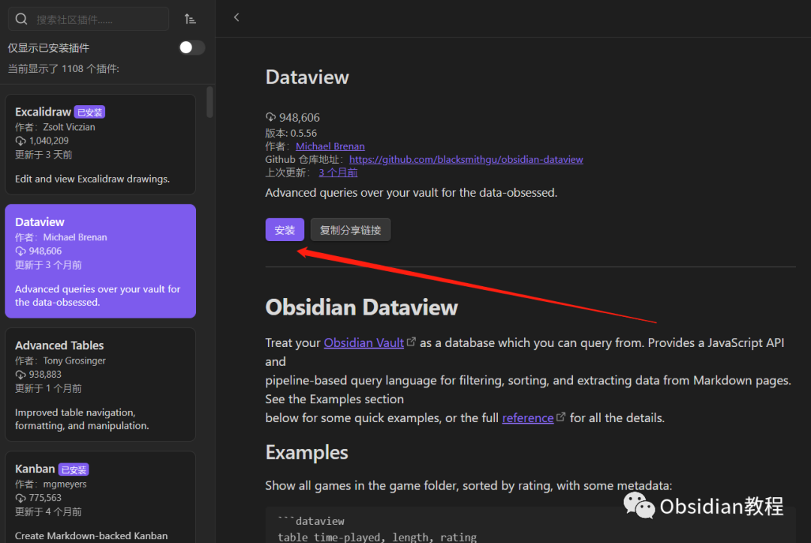
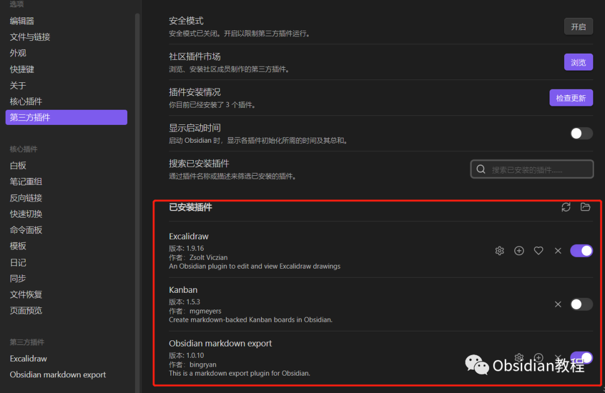
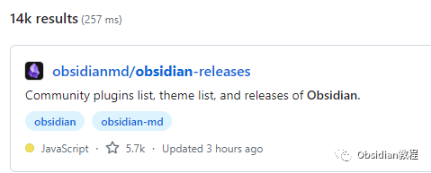
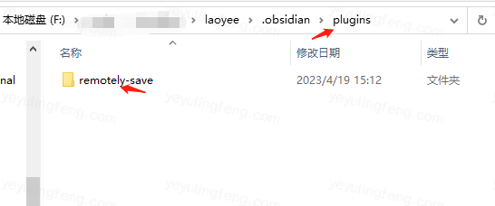

# Obsidian插件及安装保姆级教程

### 点击下方公众号，回复关键字：**Obsidian** ，获取Obsidian资料合集。

  

##   

1\. Obsidian 插件简介

  

Obsidian 插件是为 Obsidian 笔记应用开发的额外功能。  
这些可以是由 Obsidian 官方提供，也可以是由社区或第三方开发者创建的。插件旨在增强应用的基础功能，使之更加强大和多功能。  

### **插件的优势：**

**  
**

  * 高度定制化：允许用户根据自己的需求调整 Obsidian 的功能。
  * 丰富的选择：从日历插件到 kanban 看板，你总能找到满足需求的工具。
  * 活跃的社区：Obsidian 的社区非常活跃，新的插件和更新频繁发布。  

##   

2\. 如何在 Obsidian 中安装插件？

  

### **通过 Obsidian 内置的插件商店安装：**

  
1.启动 Obsidian：打开你的 Obsidian 应用。  
2.访问设置面板：在左下角找到并点击齿轮图标（设置）。  

3.打开插件区域：在左侧的导航菜单中，有核心插件和第三方插件，找到并点击“第三方插件”选项。  

4.这里要访问第三方插件，需要先关闭安全模式  

访问社区插件：在插件页面上方，你会看到“社区插件”选项卡。  
点击“社区插件”。  

5.浏览或搜索插件：你可以在搜索框中输入插件的名字或者描述，找到你需要的插件。  

6.安装插件：点击你想安装的插件旁边的“安装”按钮。  

安装完成后就可以使用了，可以在第三方插件“已安装”查看。  

### **Obsidian诟病的地方，就是插件市场国内经常连不上，如果出现这样的情况，建议重新配置网络。**

### **  
**

### **手动安装插件：**

  
如果你从 GitHub 或其他来源得到了一个插件的 .zip 文件，可以按照以下步骤手动安装：

1.下载插件：确保你已经下载了插件的 .zip 文件。  
2.解压文件：使用你的文件管理器或专用工具（如 7-Zip 或 WinRAR）解压下载的文件。  
3.定位 Obsidian 插件目录：打开你的 Obsidian 工作空间，找到 .obsidian 文件夹。进入该文件夹，你应该看到一个名为 plugins 的目录。  
  
  
4.复制插件到目录：将解压出来的插件文件夹复制或移动到 plugins 目录中。  
5.启动或重启 Obsidian：确保新插件被正确加载。  
  
  
1点击下方公众号，回复关键字：**Obsidian** ，获取Obsidian资料合集。
