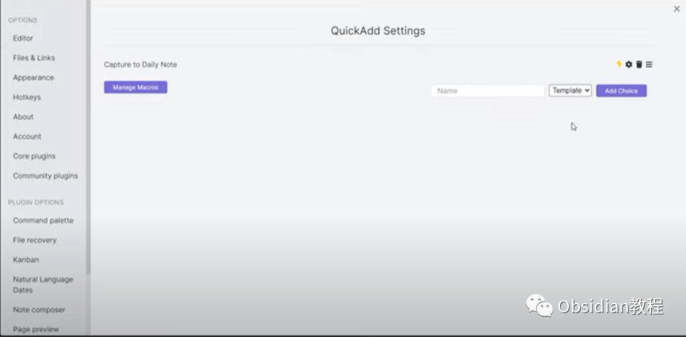
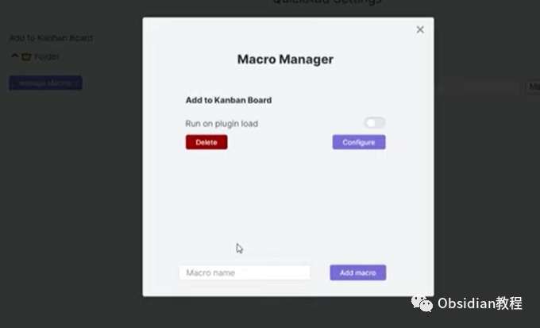
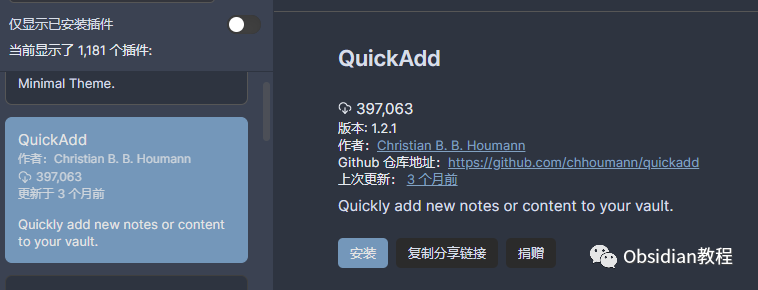

# Obsidian插件:用QuickAdd插件快速打造你的Obsidian知识宝库

### 点击下方公众号，回复关键字：**Obsidian** ，获取Obsidian资料合集。

  
1**引言** 在数字时代，随着知识和信息的日益增多，个人知识管理变得尤为重要。Obsidian作为一款强大的知识管理工具，借助其丰富的插件生态，使我们能够轻松地整理和链接我们的思想。  
其中，QuickAdd插件是不可忽视的一个助手，它通过提供模板、捕获、宏和多选四大功能，为我们的知识整理带来极大的便利。

###  2**主要功能**

  
**模板 (Templates):**  
想象一下，每当你想要记录新的想法时，都能够以固定的格式和位置创建新笔记。这不仅保持了笔记的一致性，也节省了大量的时间。QuickAdd的模板功能正是为此而生。  
  
**捕获 (Captures):**  
在浏览网页或阅读文档时，常会遇到想要记录的内容。QuickAdd的捕获功能使得这变得简单，只需一键，便可以将这些珍贵的信息快速记录到预定的笔记中。  
******  
****宏 (Macros):**  
宏功能为高级用户打开了无限可能。通过它，你可以将模板和捕获串联起来，创建强大的工作流，极大地提高你的工作效率。  
**多选 (Multi choices):**  
通过创建文件夹，将相关的选项整合在一起，使你的操作更加清晰有序。

###  3**下载与安装**

### **3.1在线安装**（需要科学上网） ：****

  

  * 首先打开你的Obsidian应用，点击左下角的设置图标。
  * 在弹出的界面中，选择“社区插件”，然后点击“浏览”按钮。
  * 在搜索框中输入“QuickAdd”，找到QuickAdd插件并点击“安装”。
  * 安装完成后，回到“已安装的插件”列表，找到QuickAdd插件并启用它。

  
**3.2离线安装：****  
****因为网络原因很多同学无法直接在线安装obsidian插件，这里我已经把obsidian所有热门插件下载好了**  
只需要关注下方公众号，后台回复：**插件** 即可获取  
  

### 4**使用案例**

让我们通过一些实际的例子来探索QuickAdd的威力。假设你是一个热爱国际象棋的玩家，每天都有新的比赛和策略想要记录。  
**创建比赛笔记:**  
你可以创建一个模板，每次有新的比赛时，只需一键便可以创建一个包含日期、对手名称和比赛结果的新笔记。  
**记录策略:**  
当你在浏览网页时，看到了一个很好的开局策略，你可以使用捕获功能，将这些信息快速添加到你的“开局策略”笔记中。  
**自动整理:**  
通过宏功能，你可以设置一个快捷键，每当你完成一场比赛的记录后，自动将这场比赛的链接添加到你的“比赛列表”笔记中。

###  5**注意事项**

在使用QuickAdd时，也有一些需要注意的地方：  

  * 确保你的Obsidian是最新版本，以避免兼容性问题。
  * 在使用宏功能时，建议先在一个测试环境中尝试，避免产生不期望的结果。
  * 如果在使用过程中遇到问题，不要犹豫，到Obsidian的社区论坛寻求帮助，那里有很多热心的用户和丰富的资源。

###  6**结语**

通过探索QuickAdd，我们不仅提高了个人知识管理的效率，也为我们的Obsidian使用打开了新的可能。现在，就下载QuickAdd，开始你的知识管理之旅吧！  
  
  
1**扫码购买****《 Obsidian实战教程》****从入门到精通， 链接您的每一个思维瞬间。****  
**  
往 期精彩1.[Obsidian插件:Style Settings调整某个特定主题的部分样式](http://mp.weixin.qq.com/s?__biz=MzkyMDUyMDM2Mg==&mid=2247484016&idx=1&sn=8d2293151cd2f31784f5cc32b99f039e&chksm=c190d1b5f6e758a3b10880a0c9332c22675882eae00d865b1d3ede3eb97cea390e6444c80080&scene=21#wechat_redirect)  
[2.Obsidian插件:Admonition在笔记中插入引人注目的提示框、警告框和其他信息块。](http://mp.weixin.qq.com/s?__biz=MzkyMDUyMDM2Mg==&mid=2247484015&idx=1&sn=3729a11c0f65f4dbd3a9b16e8b012970&chksm=c190d1aaf6e758bc24923b28b032d2cd01cd7d59dfa3ba8be9a2ed10ff42046e7f5db0f19532&scene=21#wechat_redirect)  
[3.Obsidian插件:Outliner一个用于改进Obsidian中列表的插件](http://mp.weixin.qq.com/s?__biz=MzkyMDUyMDM2Mg==&mid=2247483977&idx=1&sn=d9dad6649c783c9dd1486ff5de070c6e&chksm=c190d18cf6e7589aa92d39c7af0d97df780435da681fdce51d26fa9a0b977f492a1ebcc2d73d&scene=21#wechat_redirect)  

点分享

点点赞

点在看
