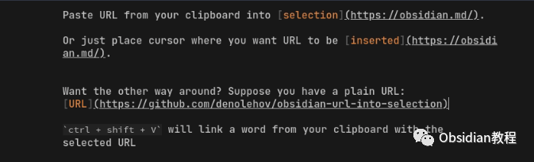

# Obsidian插件:让链接插入更加灵活的 Paste URL into selection

点击下方公众号，回复关键字：**Obsidian** ，获取Obsidian资料合集。

  
我们都知道，Obsidian 是一个强大而灵活的笔记软件，它的插件系统更是让人惊艳。  
今天，我们要介绍的是 “Paste URL into selection”插件，它可以让我们像 Notion 一样灵活、快速地插入链接。不仅如此，它还能帮助我们在已有的链接中插入文本。  
现在就让我们来深入了解一下它！

## 

  

1安装步骤

首先，我们需要在 Obsidian 中安装这个插件。操作非常简单：

### **  
**

### **1.在线安装**（需要科学上网） ：****

  
1.在Obsidian的设置中，找到“第三方插件”选项，点击“社区插件”2.在搜索框中输入“ Paste URL into selection”，找到并安装它。3.安装完成后，激活该插件，在成功安装插件后，我们需要对其进行简单的配置，以符合我们的需求。

**2.离线安装：****  
****因为网络原因很多同学无法直接在线安装obsidian插件，这里我已经把obsidian所有热门插件下载好了**  
只需要关注下方公众号，后台回复：**插件** 即可获取安装完成后，别忘了启用它，现在我们已经可以开始享受它带来的便利了。

## 

2链接插入的魅力

你是否曾为了在文本中插入一个链接而感到烦恼？传统的方式需要我们手动输入 Markdown 的链接格式，但现在有了这个插件，一切都变得简单而有趣。

###   

### **快速插入链接**

  

  * 首先，选中你想要为其插入链接的文本。
  * 复制你想要插入的链接地址。
  * 直接使用 Ctrl/Cmd + V 将链接粘贴到选中的文本中。

  
就这样，你选中的文本已经变成了一个可点击的链接，而链接地址就是你刚刚复制的地址。简单快捷，不是吗？  

### **反向操作**

  
有时，我们可能想要在已有的链接中插入一些文本。这个插件也可以帮助我们做到这一点：  

  * 选中一个已有的链接。
  * 打开命令面板（通过 Ctrl/Cmd + P），然后输入你想要插入的文本。
  * 通过你事先设置的热键，完成文本的插入。

  
如此，你就能轻松地在链接中插入文本，而无需手动调整 Markdown 格式。  

## 3个性化设置

虽然插件的默认设置已经非常实用，但你也可以根据自己的需求进行一些个性化设置。比如，你可以为“反向操作”设置一个方便记忆的热键，让你的操作更加顺手。  
为了设置热键，你只需再次打开 Obsidian 的“设置”界面，然后在“热键”栏目中找到“Paste URL into selection”，并为其中的命令设置你喜欢的热键。  

## 4总结

Paste URL into selection 是一个简单却非常实用的插件，它让我们在 Obsidian 中插入和管理链接变得更加轻松。  
如果你也是链接的重度用户，那就赶快试试这个插件吧，它定会给你带来不少惊喜！  
  
  
1**扫码购买****《 Obsidian实战教程》****从入门到精通， 链接您的每一个思维瞬间。****  
**  
往 期精彩1.[Obsidian插件:Note Refactor 在 Obsidian 中轻松地提取选定部分的笔记到新的笔记中。](http://mp.weixin.qq.com/s?__biz=MzkyMDUyMDM2Mg==&mid=2247484435&idx=1&sn=c4ecdb98cdcd329ab4a18c9571818096&chksm=c190d7d6f6e75ec00580be3a0b5014ab489ba49b1905a5299a9bf14c2cbdc75eb2d6d83bea57&scene=21#wechat_redirect)  
2.[Obsidian插件: Highlightr 为笔记提供简单而美观的高亮显示菜单](http://mp.weixin.qq.com/s?__biz=MzkyMDUyMDM2Mg==&mid=2247484434&idx=1&sn=131c0124e2562249c3ac868fcc2b4542&chksm=c190d7d7f6e75ec1c5897ef21027cb1d33deff1b7ebcb09c5ccf1a195e4e570f69d3079ac5f2&scene=21#wechat_redirect)  
[3.Obsidian插件: Pandoc 一个强大的文档导出工具](http://mp.weixin.qq.com/s?__biz=MzkyMDUyMDM2Mg==&mid=2247484337&idx=1&sn=0a7344f1a0d9d40e8a559f3ea2058f79&chksm=c190d074f6e759624befeebc9935cb831090a20adb10cdaaefb586df7d2e3ba65ce93339b699&scene=21#wechat_redirect)  

点分享

点点赞

点在看
