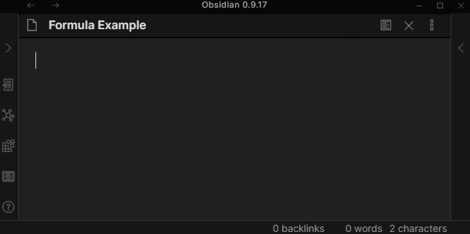
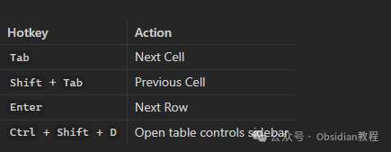
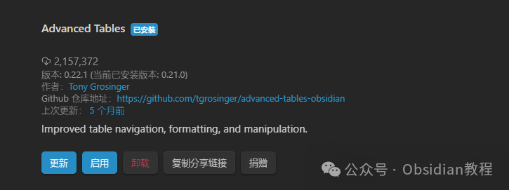

# Obsidian插件，Advanced Tables真正实现表格的“Excel化”操作！

今天咱们要聊的是Obsidian中的一款超级有用的插件——**Advanced Tables** ，它能让你在Obsidian的Markdown表格操作中，体验到像Excel一样的流畅感！如果你是经常需要在Obsidian里处理表格的朋友，那么这款插件绝对会让你眼前一亮。

首先，我得告诉你，**Obsidian** 本来就支持Markdown表格，但这些表格操作起来是比较原始的，你只能用简单的文本符号来标记表格。换句话说，就是每次你想填充或调整表格时，都得用键盘不停地敲字，效率超低！你得先在表格里手动插入“|”符号，然后再去对齐、填充内容，甚至调整列宽这些操作，都是要通过手动调整表格的Markdown代码来完成。基本上，想写表格就像给Markdown加点特殊符号而已，实用性和效率都相对较低。

然而，有了**Advanced Tables** 插件，你就能彻底改变这一局面，真正实现表格的“Excel化” 操作！这款插件提供了丰富的功能，不仅支持表格的自动格式化，还能让你像在电子表格里一样轻松操作表格数据——直接用键盘操作，就能流畅地在表格里切换单元格、调整列宽、排序、甚至添加公式。这对那些需要管理数据、记录信息的Obsidian用户来说，无疑是一个绝对提高工作效率的神器！

### **Advanced Tables 插件的优势**

  1. 1\. **自动格式化：** 你只需要输入数据，插件会帮你自动整理和格式化，告别手动对齐的繁琐。
  2. 2\. **表格导航：** 你可以用Tab键轻松跳到下一个单元格，用Enter键跳到下一行，简直像在操作Excel一样！
  3. 3\. **支持表格公式：** 是的，你没有听错，Markdown里的表格也可以用公式啦！需要做计算的时候，直接输入公式，完美解决数据处理问题。
  4. 4\. **动态增减行列：** 不用担心表格不够用，插入或删除行列都超简单！
  5. 5\. **列对齐：** 你可以轻松调整表格每一列的对齐方式（左对齐、右对齐、居中对齐），更加规范美观。
  6. 6\. **排序功能：** 你可以按照任意一列对表格行进行排序，轻松管理和分析数据。
  7. 7\. **导出为CSV：** 完成数据处理后，可以一键导出为CSV格式，方便后续使用。  

### **如何使用 Advanced Tables 插件**

使用**Advanced Tables** 插件并不复杂，首先你需要安装并启用它，接着你就可以开始用它来管理你的Markdown表格了。

#### **创建表格**

  1. 1\. 打开Obsidian，创建一个新的Markdown文件。
  2. 2\. 输入一个“|”字符，接着输入表格的第一个标题，按下Tab键。
  3. 3\. 一直按Tab键输入后续的标题，直到所有列的标题都完成。
  4. 4\. 完成标题输入后，按Enter键进入表格的第一行，接着填写数据，再按Enter键进入下一行。

你就能像这样快速创建一个表格：
    
    
    | 姓名  | 年龄  | 性别  |  
    |-------|-------|-------|  
    | 张三  | 28    | 男    |  
    | 李四  | 32    | 女    |  
    | 王五  | 24    | 男    |

#### **表格导航**

在表格内，使用以下快捷键来导航：

  * • **Tab** ：跳到下一个单元格
  * • **Shift + Tab** ：跳到上一个单元格
  * • **Enter** ：跳到下一行
  * • **Ctrl + Shift + D** ：打开表格控制侧边栏，你可以在这里对表格进行进一步的操作。
  * 

#### **公式功能**

如果你需要在表格里使用公式来进行计算，插件会支持类似Excel的公式输入方式。只需要输入公式，插件会自动计算结果。例如，在表格的某个单元格中输入“=A1+B2”，就能实现数据的即时计算，非常方便。

#### **如何安装 Advanced Tables 插件**

  1. 1\. 打开Obsidian设置，进入**第三方插件** 页面。
  2. 2\. 确保**安全模式** 已关闭。
  3. 3\. 点击**浏览社区插件** ，在搜索框中输入“Advanced Tables”。
  4. 4\. 点击**安装** 按钮，完成安装。
  5. 5\. 安装完成后，关闭插件窗口并启用该插件。
  6. 

**离线安装** ：如果你无法在线安装插件，别担心，我已经把热门插件下载好了点击下方公众号，回复关键字：**Obsidian** ，获取Obsidian资料合集。

#### **Obsidian Mobile 用户**

如果你是Obsidian的移动端用户，不用担心，**Advanced Tables** 插件同样适用。不过需要注意的是，使用Tab和Enter键在表格中导航的功能可能在移动端不完全支持，但你可以在移动端的工具栏添加“下一单元格”和“下一行”命令，方便操作。

### **总结**

作为Obsidian的一个社区插件，**Advanced Tables** 的功能远远超出了你对普通Markdown表格的预期。如果你是需要经常操作表格来记录、分析数据的用户，这个插件简直是必备良品。它的自动格式化、公式支持、表格排序等功能，使得在Obsidian中使用表格变得轻松愉快，简直是Obsidian笔记管理和信息记录中的一剂强心针。

我自己在使用这款插件后，完全告别了原始的表格操作，工作效率提升了不少，尤其是在整理数据、做笔记时，表格的自动化操作真的大大减轻了我的负担。如果你还没有尝试过，赶紧安装试试吧！

### 点击下方公众号，回复关键字：**Obsidian** ，获取Obsidian资料合集。

****-END****-****

**ok，今天先说到这，如果你想更深入的了解Obsidian，现在只要购买我们的《Obsidian实操案例课》，便可免费加入「玩转效率笔记」社群，与一群人交流效率提升的经验，实现自我管理的目标。**
