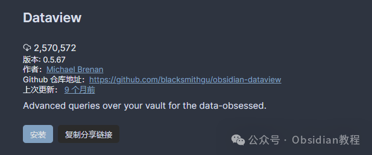
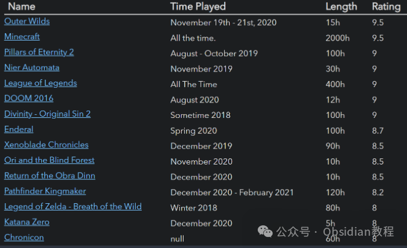
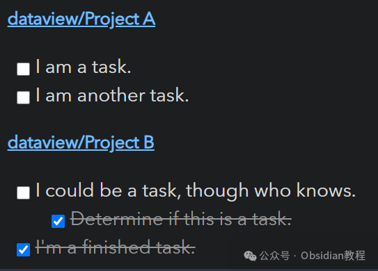

# Obsidian插件，Dataview让你的笔记库变成可查询的数据库

我是鬼哥，10 年+老程序员一枚，Obsidian 重度用户。

今天聊聊 **Dataview** ，这个插件可不得了，它能让你的 Obsidian 笔记库变成一个 **可查询的数据库** ，而不是一堆零散的 Markdown 文件！

  

想象一下，你的 Obsidian 里有几百篇笔记，记录了书籍、任务、项目、习惯跟踪等各种信息。可是当你想查找某个特定类别的笔记时，比如“2023年看过的书”或者“所有未完成的任务”，就只能靠关键词搜索，效率低得让人抓狂。**Dataview 直接帮你解决这个问题** ，你可以用类 SQL 语法来查询、过滤、排序你的笔记，就像在数据库里检索数据一样！  

**一句话总结：Dataview 就是 Obsidian 里的数据管理神器** ，无论是查任务、看进度、统计数据，还是玩点高级自动化，它都能满足你。如果你对 SQL 语法或者 JavaScript 有点了解，那 Dataview 甚至可以变成你的第二个大脑！

接下来，我会详细介绍 **Dataview 的功能、安装、使用方法** ，以及 **实际案例** ，让你快速上手！

## Dataview 能干啥？

Dataview 的核心功能就是把 Markdown 笔记变成数据库，然后通过查询语言来筛选、分类和展示数据。你可以用它来：

  * **任务管理** ：列出所有未完成的任务，甚至按标签分类。
  * **书籍管理** ：筛选出 2023 年看过的书，并按评分排序。
  * **项目跟踪** ：找出所有未完成的项目，按更新时间排序。
  * **时间统计** ：计算你在某个项目上花了多少小时。

Dataview 的查询方式有四种：

  1. **Dataview Query Language（DQL）** ：类似 SQL 的查询语法，适合基础查询。
  2. **DataviewJS** ：基于 JavaScript，可以自定义更高级的查询和渲染。
  3. **内联表达式** ：直接在 Markdown 里写 `= this.file.name` 这样的查询，适合小型查询。
  4. **JavaScript 内联表达式** ：支持 JS 代码的查询，功能最强大。

### 示例：快速查询笔记库

**1\. 查找所有游戏，并按评分排序**

    
    
     table time-played, length, rating  
    from "games"  
    sort rating desc  
    

**2\. 列出所有未完成的任务**

****
    
    
    task from #projects/active  
    

**3\. 找出 2021 年读过的书，并按类别分组**
    
    
     for (let group of dv.pages("#book").where(p => p["time-read"].year == 2021).groupBy(p => p.genre)) {  
    	dv.header(3, group.key);  
    	dv.table(["Name", "Time Read", "Rating"],  
    		group.rows  
    			.sort(k => k.rating, 'desc')  
    			.map(k => [k.file.link, k["time-read"], k.rating]))  
    }  
    

## 如何安装 Dataview？

  1. **打开 Obsidian** ，进入 **设置（Settings）→ 插件（Community Plugins）** 。
  2. 搜索**"Dataview"** ，找到后点击 **安装（Install）** ，然后 **启用（Enable）** 。
  3. 你可以直接在笔记里写 Dataview 查询，也可以新建 **代码块** （`dataview` 或 `dataviewjs`）。

**离线安装** ：如果你无法在线安装插件，别担心，我已经把热门插件下载好了点击下方公众号，回复关键字：**Obsidian** ，获取Obsidian资料合集。

## Dataview 数据结构解析

Dataview 主要是基于 **Markdown Frontmatter** （YAML 元数据）和 **内联字段** 来提取数据的。

### 1️⃣ Markdown Frontmatter（YAML 元数据）

在 Markdown 文档的开头，你可以用 `---` 包裹一段 YAML，存储一些元数据，比如：
    
    
    ---  
    alias: "如何使用 Dataview"  
    last-reviewed: 2023-01-01  
    tags: [Obsidian, Dataview]  
    rating: 8  
    completed: false  
    ---  
    

上面的元数据可以用于 Dataview 查询，比如你可以筛选出所有 `rating` 大于 7 的笔记。

### 2️⃣ 内联字段（Inline Fields）

如果你不想写 YAML，你也可以在 Markdown 里用 `Key:: Value` 的形式标注信息，比如：
    
    
    **评分**:: 9    
    **阅读时间**:: 2023-02-15    
    

同样，这些数据也可以用 Dataview 查询，比如找出所有 `评分 > 8` 的笔记。

## 高级用法：DataviewJS

如果你会点 JavaScript，那么 DataviewJS 会更适合你！比如，你可以筛选所有 **任务未完成的笔记** ：
    
    
    dv.taskList(dv.pages().file.tasks.where(t => !t.completed));  
    

你还可以计算 Obsidian 里所有笔记的数量：
    
    
    dv.paragraph(`你当前有 ${dv.pages().length} 篇笔记！`);  
    

或者找出所有 `last-reviewed` 在 30 天前的笔记，提醒你回顾：
    
    
    const oldNotes = dv.pages().where(p => Date.now() - p["last-reviewed"] > 30 * 24 * 60 * 60 * 1000);  
    dv.list(oldNotes.map(n => n.file.link));  
    

DataviewJS **能实现更复杂的逻辑，甚至可以动态生成 Markdown 表格、图表和统计信息** ，非常强大！

## Dataview 的安全性

  * 普通的 `dataview` 代码是 **沙盒化的** ，不会修改你的 Obsidian 文件，比较安全。
  * **DataviewJS（JavaScript 查询）可以修改 Obsidian 文件** ，所以只用 **自己写的代码** ，避免执行不信任的脚本！

## 总结

Dataview 绝对是 Obsidian 里 **最值得安装的插件之一** ，它能把你的笔记变成 **真正可用的数据** ，无论是任务管理、读书笔记、项目跟踪，还是习惯养成、时间统计，都能用它来查询和可视化！

你可以：

  * **用简单查询语言** （DQL）查找笔记，类似 SQL。
  * **用 DataviewJS 扩展功能** ，结合 JavaScript 实现更复杂的数据处理。
  * **管理任务、项目、书籍、习惯跟踪** ，让 Obsidian 成为你最强大的知识管理工具！

如果你还没用过 Dataview，建议赶紧装上试试！**玩明白这个插件，你的 Obsidian 笔记效率至少提升 10 倍！**

所以，如果你还没试过这个插件，赶紧去试试吧！

### 点击下方公众号，回复关键字：**Obsidian** ，获取Obsidian资料合集。

****-END****-****

**ok，今天先说到这，如果你想更深入的了解Obsidian，现在只要购买我们的《Obsidian实操案例课》，便可免费加入「玩转效率笔记」社群，与一群人交流效率提升的经验，实现自我管理的目标。**
