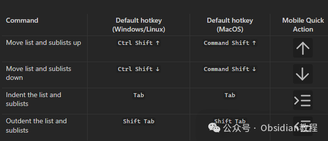
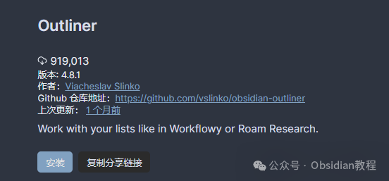

# Obsidian插件，Outliner解锁“丝滑大纲编辑”的新境界

说到 Obsidian 啊，熟悉我的朋友都知道，我真是用了几年都没换，别的笔记软件也不是没试过，什么 Notion、Evernote、Bear……试了一圈，最后还是觉得 Obsidian 最踏实，特别是那种“插件一上身，笔记全开挂”的感觉，谁用谁知道。而在众多插件里，有一个小而美、功能却很硬核的插件，简直是列表控的福音——**Outliner 插件** 。今天鬼哥就来好好唠唠它。

你如果以前用过 Workflowy 或 RoamResearch，肯定被它们那种“随心所欲缩进、展开、移动大纲”的操作感毒害过。那种感觉就像打字的时候手在飞，脑子在飘，信息组织简直像跳探戈一样丝滑。而 Obsidian 默认的列表体验嘛，怎么说呢，有点像穿着铠甲跳舞，动作有点拘谨。而这个时候，Outliner 插件就像是给铠甲加了马达，直接解锁“丝滑大纲编辑”的新境界。

## 📌Outliner 插件到底是个啥？

鬼哥一句话总结：**它是让你在 Obsidian 里像在 Workflowy 或 RoamResearch 那样玩转大纲的利器** 。

更具体一点，它增强了 Markdown 的列表体验，比如：

  * 可以用快捷键快速移动整段列表（含子项）；
  * 按下 Tab 或 Shift+Tab，直接缩进/反缩进列表，孩子带着走；
  * 支持垂直缩进线，让层级结构一目了然；
  * 按 Enter 有智能行为，空项直接退回上一层；
  * 支持鼠标拖拽，操作像玩乐高；
  * 还能增强 Ctrl+A 的行为，一次选当前项，两次选整段。

说实话，这玩意装上之后，鬼哥做知识整理和写项目文档的效率都提高了不止一个档次。再搭配 Zoom 插件（能放大聚焦某一段列表），那体验，堪称“知识森林的无人机视角”。

## 🎮插件主要功能详解（鬼哥版解析）

### ✅ 列表移动操作（Move Up/Down）

平时我们写列表，如果想把一整段列表往上搬，光靠鼠标或者剪切粘贴，不光烦，而且容易搞乱结构。Outliner 提供了快捷键，默认是：

  * ⬆️ `Ctrl + Shift + ↑`（Mac：Cmd + Shift + ↑）：整段往上移
  * ⬇️ `Ctrl + Shift + ↓`（Mac：Cmd + Shift + ↓）：整段往下移

特别适合写项目计划、会议纪要、清单型笔记的时候，比如“待办事项”想调一下优先级，一按快捷键就搞定，不会破坏原有层级。

### ✅ 智能缩进（Tab/Shift+Tab）

这个就是鬼哥最喜欢的功能之一，按 `Tab` 可以把当前项缩进，`Shift + Tab` 就是反过来。重点是它会连子列表一起带走！就像带孩子搬家，一个都不落下。

### ✅ 样式美化 & 垂直缩进线（Vertical Indent Lines）

你要是也有鬼哥这种“层级强迫症”，那开启这个功能会很爽。

  * 插件设置里可以打开“垂直缩进线”，默认是关闭的。
  * 这玩意配合 Obsidian 的默认主题用特别合适。

视觉清晰度直接拉满，特别是那种三层四层嵌套的笔记，再也不会眼花缭乱了。

### ✅ 智能 Enter 键

这个功能也是小而美：

  * 如果当前列表项是空的，再按 Enter 会自动回退一层；
  * 如果当前项下面有子列表，按 Enter 会继续在当前层级写；
  * Shift + Enter 可以插入一个“普通的空行”。

鬼哥平时整理读书笔记的时候，这种智能换行体验真的让人上瘾，连 Enter 键都变聪明了。

### ✅ 光标粘附（Stick cursor to content）

默认开启，它的作用是让光标不要跳到列表前面的圆点上，而是始终“黏”在文字内容里。你可能一开始感觉不到，但用久了会发现操作顺滑了很多，比如：

  * 删除文字不会误删 bullet 点；
  * 光标不再跳到奇怪的位置；
  * 多行选择更自然了。

对键盘党来说，这种细节的打磨简直是“为效率而生”。

### ✅ Fold/Unfold 折叠功能

这个插件也扩展了列表的折叠行为：

  * `Ctrl + ↑` / `Ctrl + ↓`（Mac：Cmd + ↑/↓）：快速折叠/展开当前项

写很长的列表文档时，这功能能让你聚焦某一部分，避免“信息过载”。

### ✅ Ctrl+A/Cmd+A 增强行为

小细节大提升：

  * 第一次按只选当前项
  * 再按一次，选中整个列表块

像我这种重度结构化思维的人，这种“选中粒度”的控制简直太贴心了！

### ✅ 拖拽（Drag-and-Drop）

也支持鼠标拖动整个列表块，完全像在 Workflowy 那种“所见即所得”的体验。这个对喜欢可视化编辑的朋友来说会特别加分。

## 📦Outliner 插件怎么装？

Obsidian 用户两种安装方式：

### 🎯方法一：Obsidian 内部一键安装

  1. 打开 Obsidian 设置 > 第三方插件
  2. 关闭“安全模式”
  3. 点击“浏览社区插件”
  4. 搜索 `Outliner`
  5. 点击安装，然后启用即可！

### 

**离线安装** 如果你无法在线安装插件，别担心，我已经把热门插件下载好了点击下方公众号，回复关键字：**Obsidian** ，获取Obsidian资料合集。

## 💡Outliner 带来了什么好处？

总结一下它的“爽点”：

  * 写大纲类笔记特别丝滑，效率翻倍；
  * 键盘党的天堂，所有结构操作都能靠快捷键搞定；
  * 拖拽 + 折叠 + 层级线 = 管理长文档利器；
  * 再搭配 Zoom 插件，笔记体验直逼 Workflowy；
  * 提升写作专注力，不容易被“列表结构”卡住节奏；
  * 更适合 GTD / 子弹笔记 / 日记 / 项目管理 等场景。

简单说，它让 Obsidian 变成了一个更适合结构化思维的工具，而不仅仅是一个纯文本编辑器。

这玩意鬼哥是长期开启状态，每次写清单、做复盘、理任务，全靠它撑场子。特别是我这种重度“分层狂魔”，没有它还真写不动笔记。强烈推荐大家试试看，尤其是那些用惯了 Roam 或 Workflowy 的老用户，一定会感觉“原来 Obsidian 也能这么丝滑”。

喜欢结构感笔记的你，Outliner 不容错过！

### 点击下方公众号，回复关键字：**Obsidian** ，获取Obsidian资料合集。

****-END****-****

**ok，今天先说到这，如果你想更深入的了解Obsidian，现在只要购买我们的《Obsidian实操案例课》，便可免费加入「玩转效率笔记」社群，与一群人交流效率提升的经验，实现自我管理的目标。**
