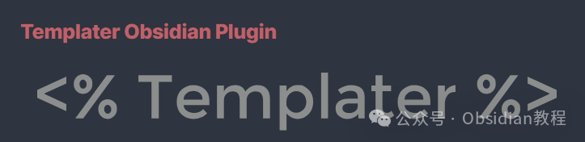
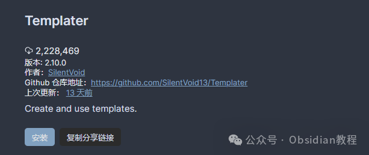

# Obsidian插件，Templater打造你的高效笔记模板系统

今天咱们聊聊 Obsidian 里一个超级实用的插件——**Templater** 。

如果你经常在 Obsidian 里写笔记，总觉得重复输入某些格式、内容、变量特别烦人，那 Templater 绝对是你的救星！

Obsidian 作为一个 Markdown 笔记工具，本身的灵活性已经很高，但它自带的模板功能有点“基础”。

而 **Templater 不仅能插入变量、函数的结果，还能直接运行 JavaScript 代码，甚至操作系统命令** 。听上去是不是很酷？没错，它的强大之处在于让你的笔记可以“编程化”——动态生成内容，而不是简单的静态模板。

不过鬼哥也得提醒一句：**Templater 允许执行任意 JavaScript 代码和系统命令，意味着你需要确保代码来源可靠，别随便运行不明代码！** （要是被黑了别找鬼哥啊 😂）

## **一、Templater 的核心能力**

Templater 不仅仅是让你快速插入模板，它还能干很多事，比如：

  * **插入动态变量** （比如日期、时间、文档标题等）
  * **运行 JavaScript 代码** （比如自动填充内容、计算数值等）
  * **创建交互式模板** （比如自动从某个 API 获取数据、填充笔记）
  * **调用 Obsidian 内部 API** （比如自动创建新笔记、修改某个笔记内容）

一句话，Templater 让你的 Obsidian 变得更加自动化、高效，减少手动输入，提高生产力！

## **二、如何安装 Templater**

### **1\. 在 Obsidian 插件市场安装**

  1. 打开 Obsidian，点击左下角的 **“设置”** （⚙️）。
  2. 在 **“社区插件”** 里，点击 **“浏览”** ，搜索 **Templater** 。
  3. 找到后，点击 **“安装”** ，然后启用插件。

  

******离线安装：** 如果你无法在线安装插件，别担心，我已经把热门插件下载好了点击下方公众号，回复关键字：**Obsidian** ，获取Obsidian资料合集。

### **2\. 设置模板存放目录**

安装完插件后，我们需要告诉 Templater **你的模板存在哪里** ：

  1. 打开 Obsidian **设置** ，找到 **Templater** 选项。
  2. 在 **“Template Folder Location”** 里，选择一个你存放模板的文件夹，比如 `Templates`。

到这里，Templater 就准备就绪了！🎉

## **三、创建你的第一个 Templater 模板**

**1\. 纯文本模板**

先来个最基础的模板，在 `Templates` 文件夹里创建一个新模板，比如 `daily-note.md`，然后填入以下内容：
    
    
    # {{title}}  
      
    创建时间：<% tp.date.now("YYYY-MM-DD HH:mm") %>  
      
    ---  
    ## 今日待办  
    - [ ] 任务 1  
    - [ ] 任务 2  
      
    ## 日记  
    

每次使用这个模板时，`<% tp.date.now("YYYY-MM-DD HH:mm") %>` 会自动填充当前时间，而 `{{title}}` 会变成你的文件名。

**2\. 使用 JavaScript 动态生成内容**

假设你每天都要记录天气，咱们可以写个模板，让它自动获取天气数据（需要你自己找个 API）：
    
    
    ## 今日天气  
    <%*  
    let city = "Beijing";    
    let weather = await tp.system.fetch(`https://api.weather.com/v1/city/${city}`);  
    tR += `今天 ${city} 的天气是：${weather.temp}°C，${weather.condition}`;  
    %>  
    

每次运行这个模板，它都会自动查询天气数据，而不是让你手动输入！

## **四、一些实用的 Templater 技巧**

**1\. 快速插入模板**

要使用 Templater 创建的新模板，你可以：

  * 使用 **快捷键** （可以在 Obsidian 设置里配置）
  * 在笔记里输入 `tp` 相关命令

比如，你可以用 `tp.date.now("YYYY-MM-DD")` 生成当前日期，而不用手打。

**2\. 让模板更加智能**

Templater 还能判断**当前笔记是不是某个文件夹下的** ，从而自动填充不同内容：
    
    
    <%*  
    if (tp.file.folder(true) === "Journal") {  
        tR += "这是日记模板！";  
    } else {  
        tR += "这是默认模板！";  
    }  
    %>  
    

这样，你可以根据笔记的存放位置，自动选择不同的模板！

**3\. 自动创建新笔记**

有时候，你可能希望每天都创建一个新的笔记，比如 **每日笔记** 。可以用这样的模板：
    
    
    <%*  
    let fileName = "Daily/" + tp.date.now("YYYY-MM-DD") + ".md";  
    let newFile = await tp.file.create_new(fileName);  
    tR += `已创建新笔记：[${fileName}](${fileName})`;  
    %>  
    

这个代码会自动在 `Daily/` 目录下创建一个新的日记文件，并填充内容。

## **五、与其他插件联动**

Templater 还能跟 **Dataview、MetaEdit、QuickAdd** 等插件配合，让你的 Obsidian 更加强大，比如：

  * **与 Dataview 结合，自动填充查询数据**
  * **配合 QuickAdd，创建更智能的模板**
  * **用 MetaEdit 自动修改笔记的元数据**

比如，你可以用它自动填充 YAML 头信息：
    
    
    ---  
    title: <% tp.file.title %>  
    date: <% tp.date.now("YYYY-MM-DD") %>  
    tags: [日记, Obsidian]  
    ---  
    

这样，每次创建笔记时，`title` 会自动变成笔记的文件名，`date` 变成当天日期，再也不用手动填啦！

## **六、安全性提醒**

Templater 允许执行 JavaScript 代码和系统命令，所以有几点一定要注意：

  1. **不要运行来源不明的代码** ，有可能会损坏你的文件或泄露信息。
  2. **慎用系统命令** ，Templater 可以执行 shell 命令（`tp.system.exec("your-command")`），如果不小心运行了恶意命令，后果可能很严重。
  3. **代码尽量自己写** ，如果必须使用别人的代码，先看看逻辑是否合理。

Templater 绝对是 Obsidian 里最值得安装的插件之一！它极大地提升了笔记的**自动化能力** ，减少了重复输入的工作，让你的笔记更加智能化。如果你是个喜欢折腾的人，那 Templater 绝对是 Obsidian 里的“必备神器”！

如果你还没用过，赶紧去安装试试吧！

###   

### 点击下方公众号，回复关键字：**Obsidian** ，获取Obsidian资料合集。

  

****-END****-****

**ok，今天先说到这，如果你想更深入的了解Obsidian，现在只要购买我们的《Obsidian实操案例课》，便可免费加入「玩转效率笔记」社群，与一群人交流效率提升的经验，实现自我管理的目标。**
