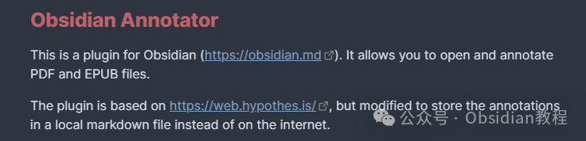
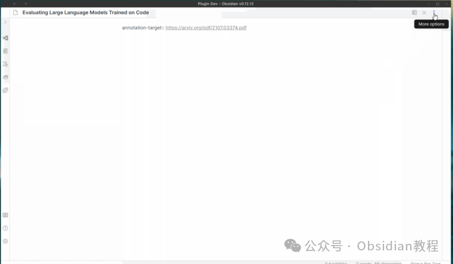
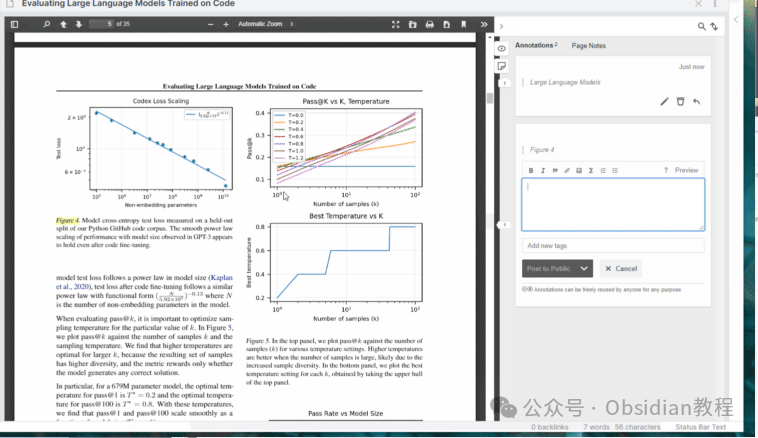
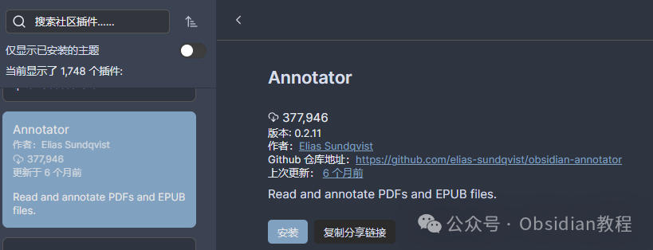
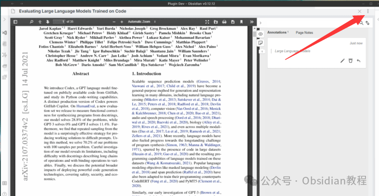
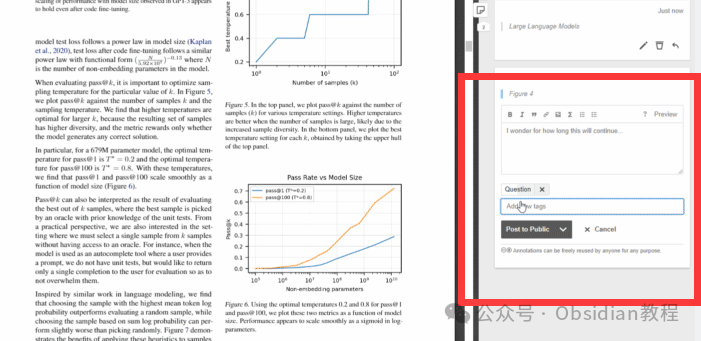
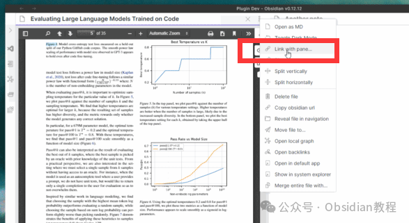

# Obsidian插件：Annotator在Obsidian中直接打开并标注PDF和EPUB文件

嗨，我是鬼哥，10年+老程序员一枚。  
今天咱们来聊聊Obsidian的一个神奇插件——Obsidian Annotator。  
绝对是那些常常需要阅读和标注PDF或EPUB文件的朋友们的福音。  
先别急着安装，咱们先来搞清楚这个插件到底有啥魔力，以及它能给我们带来啥样的便利。  

### **插件简介**

  
Obsidian Annotator是为Obsidian量身打造的PDF和EPUB文件标注插件。简单来说，这个插件让你能够在Obsidian中直接打开并标注PDF和EPUB文件，牛不牛？  

  
要知道，平常我们标注文档可都是通过其他软件，完了再把标注结果整合到笔记里，这就相当于折腾了一大圈。Obsidian Annotator完美地解决了这个问题，把整个过程简化了，省时省力。  
插件的核心功能基于Hypothes.is，不过人家做了个重要的修改——把标注存储在本地的Markdown文件里，而不是上传到互联网。这对注重隐私的朋友们来说还是很不错的。**  
**

### **功能演示**

  
插件的使用其实相当简单，直观。你只需要在Obsidian的笔记前端属性（frontmatter）里加上一个annotation-target属性，指定你的PDF或EPUB文件的路径，无论是保存在你的vault里还是在线的链接都行。  

然后你在笔记窗口右上角点击“更多选项”，就会看到一个“annotate”的新选项

  

  

**已知问题**

  

不过，鬼哥也得提醒你们，这插件在某些方面还是有点小问题的。  
比如说它在iOS 16.3或更高版本上不工作（这个问题可以在GitHub上的#289号问题跟进）。  
有就是，如果你在不同平台上修改了标注内容，阅读器有时候不会显示这些修改过的标注内容。  

### **安装和使用方法**

  
好了，说了这么多，咱们还是来看看怎么安装和使用这个插件吧。  
**在线安装**  
**  
**

  1. 打开Obsidian，进入设置页面。
  2. 点击“社区插件”，然后点击“浏览”。
  3. 在搜索栏输入“Annotator”，找到插件后点击“安装”。
  4. 安装完成后，返回设置页面，启用Annotator插件。

### 

###   
**2.离线安装：****  
****很多同学无法直接在线安装obsidian插件，这里我已经把obsidian所有热门插件下载好了**  
只需要关注下方公众号，后台回复：**插件** 即可获取

**  
**  

#### **设置annotation-target**

  
首先，在你的Obsidian笔记的前端属性（frontmatter）里加上annotation-target属性，值为你的EPUB/PDF文件的路径。  
路径可以是vault中的文件（比如Pdfs/mypdf.pdf），也可以是网络链接（比如https://arxiv.org/pdf/2104.13478.pdf）。

  *   *   * 

    
    
    ---annotation-target: https://arxiv.org/pdf/2104.13478.pdf---

  
如果你没有安装Dataview插件，那么这个步骤是必需的。  
如果你安装了Dataview插件，还可以用Dataview的语法来指定标注目标，这样你可以用Obsidian风格的链接，而不是纯文本路径。  

#### **选择注释模式**

  
打开你的笔记，在右上角点击“更多选项”（三个点的图标），然后你会看到一个新的选项“annotate”，点击它就能进入注释模式了。  

#### **开始标注**

  
标注文本的方法非常简单，鼠标选中你想要标注的文字即可。将来插件还可能增加彩色高亮和图像/区域高亮的功能，不过这些功能需要先在Hypothes.is里实现。  

### **在Markdown中的标注**

  
切换回普通的Obsidian Markdown编辑模式，只需要选择“更多选项”→“Open as MD”即可。  
每个标注都有一个关联的引用块（block reference）。要小心修改这些引用块，特别是PREFIX、HIGHLIGHT和POSTFIX部分的修改，太大的改动可能会让Hypothes.is无法识别对应的文本。  
注释内容（COMMENT区域）可以随意编辑，但要确保它仍然属于引用块。标签（TAGS区域）应该是一个逗号分隔的Obsidian标签列表（如#tag1, #tag2, #tag3）。  

### **暗黑模式**

  
插件内置了暗黑模式支持。要切换暗黑模式，只需在标注时选择“更多选项”→“Toggle Dark Mode”即可。在插件的设置选项卡中，还可以调整暗黑模式的行为。  

### **链接到标注**

  
一个指向标注块引用的Obsidian链接，在点击时会打开相应的文件并滚动到关联的高亮部分。如果文件已经在一个面板中打开，那么链接会导致现有面板滚动到相应位置。  

### 

说实话，鬼哥用了这个插件之后，真的感觉笔记效率提升了不少。尤其是读那些长篇大论的PDF论文时，标注和笔记一气呵成，整个过程流畅无比。插件虽然还有一些小问题，但瑕不掩瑜，总体来说还是相当实用的。  
所以，如果你也是Obsidian的重度用户，并且需要频繁处理PDF和EPUB文件，那么这个Obsidian Annotator插件绝对值得一试。  
  
  
1******扫码购买****《 Obsidian实战教程》****从入门到精通， 链接您的每一个思维瞬间。**  

