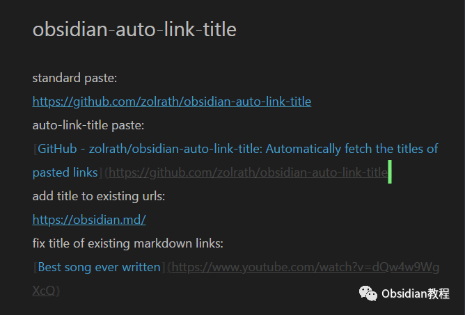
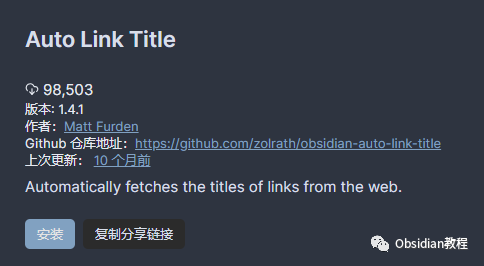

# Obsidian插件：Auto Link Title自动获取粘贴链接的网页标题，并将其转换成Markdown格式的链接

Auto Link Title插件的主要功能是自动获取粘贴链接的网页标题，并将其转换成Markdown格式的链接。接下来，我会详细介绍这个插件的功能、使用方法以及一些注意事项。

### 1插件介绍

Auto Link Title插件为Obsidian用户提供了一种便捷的方式来处理网络链接。

这个插件能够在用户粘贴链接时，自动访问链接所指向的网页，提取网页的标题，并将其转换成带有标题的Markdown链接。这样不仅提高了工作效率，还使笔记内容更加整洁和易读。

2基本功能

**1\. 自动提取新链接的标题**  

当你复制并粘贴一个网络链接到Obsidian笔记中时，例如 https://github.com/zolrath/obsidian-auto-link-title，插件会自动访问该链接，提取网页标题，并将其转换成Markdown格式的链接，例如：

  * 

    
    
    [zolrath/obsidian-auto-link-title: Automatically fetch the titles of pasted links](https://github.com/zolrath/obsidian-auto-link-title)

******2\. 为现有的原始URL添加标题**  
如果你已经在笔记中有一个原始的URL链接，可以使用快捷键 Ctrl+Shift+E（Windows）或 Cmd+Shift+E（OS X）来转换这个链接。  
例如，如果你的文本光标位于 https://github.com/zolrath/obsidian-auto-link-title，按下快捷键后，链接会被转换成带有标题的Markdown格式。

### 

3高级功能

#### **1\. 覆写现有Markdown链接的标题**

####   

#### 使用同样的快捷键，你还可以覆写现有Markdown格式链接的标题。如果光标位于一个已有的Markdown链接，例如 [some plugin](https://github.com/zolrath/obsidian-auto-link-title)，按下快捷键后，原有的标题会被新提取的标题所替换。

  

### 4安装插件

### **1.在线安装**（需要科学上网） ：****

### ****  
****

### 点击“社区插件”下的“浏览”按钮，在左上角的搜索框中搜索“ Auto Link Title”，然后点击“安装”按钮。

###   
启用插件：安装成功后，点击“启用”以启用插件。  

  
**2.离线安装：****  
****因为网络原因很多同学无法直接在线安装obsidian插件，这里我已经把obsidian所有热门插件下载好了**  
只需要关注下方公众号，后台回复：**插件** 即可获取

  

5移动端使用

在移动端使用时，需要通过“长按并粘贴”来触发URL的粘贴。不过，需要注意的是，由于技术限制，某些功能在移动端可能不如桌面端那样流畅

### 6注意事项

Gboard的限制：如果你在移动设备上使用Google的Gboard键盘，可能会遇到无法触发粘贴事件的问题，因为Gboard的剪贴板助手功能实现方式会阻止插件的正常工作。

字符集支持问题：在移动端使用时，由于代理服务器的限制，可能无法正确显示某些字符集。

### 7结语

Auto Link Title插件为Obsidian用户提供了一个高效且实用的工具，以优化链接处理和笔记整理工作。它简化了链接的插入过程，并且通过自动提取标题，使笔记内容更加丰富和有序。使用这个插件，你可以节省大量编辑链接标题的时间，让你专注于内容创作。

通过本文的介绍，希望你对Auto Link Title插件有了更深入的了解，并能够在你的Obsidian使用中得到更大的效益。

  
  
  
1**扫码购买****《 Obsidian实战教程》****从入门到精通， 链接您的每一个思维瞬间。****  
**

