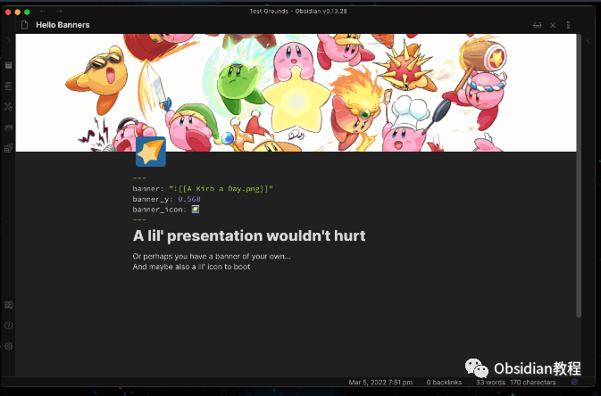
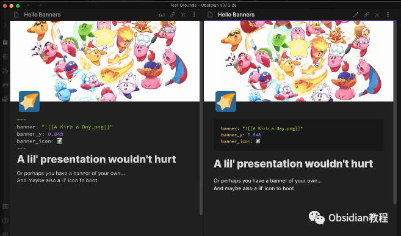
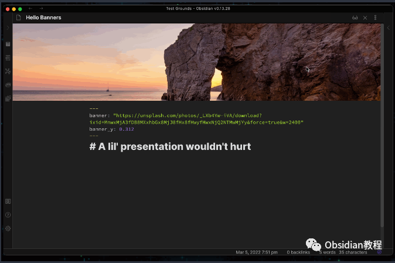
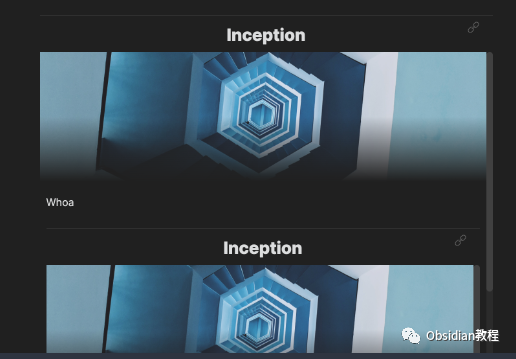
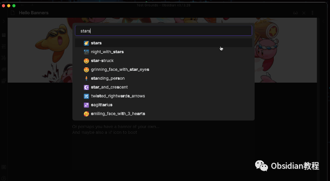
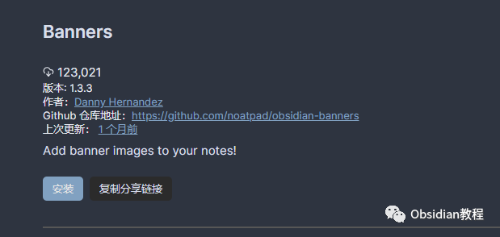
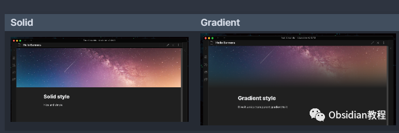

# Obsidian插件：Banners，让笔记更加生动有趣

Obsidian是一款强大的知识管理工具，它通过插件扩展其功能，使得用户可以根据自己的需要定制个性化的笔记体验。其中一个有趣的插件是“Banners”，它允许用户在笔记中添加和管理横幅图片。

  

本文将深入探讨Banners插件的使用方法、高级功能、设置选项以及安装步骤。

  

1**插件简介** Banners插件让Obsidian的笔记更加生动有趣。它使用户能够为笔记添加横幅（Banner）图片，这些图片可以是本地图片或者网络图片的URL。此外，用户还可以调整横幅的位置、锁定横幅、添加或更改横幅上的表情符号图标。

### 

  

2**基本使用方法**   

#### **2.1 添加和更改横幅图片**

  

  * 本地图片：在打开的笔记中，使用“添加/更改横幅图片”命令，选择本地图片作为横幅。
  * 网络图片URL：复制图片URL后，运行“从剪贴板粘贴横幅”命令，将URL作为横幅图片。

#### **2.2 调整横幅位置**

  
可以通过拖动横幅图片来重新定位图片。此外，使用“锁定/解锁横幅位置”命令可以固定横幅的位置。  

#### **  
**

#### **2.3 添加和更改图标**

  
使用“添加/更改表情符号图标”命令，选择一个表情符号作为横幅图标。点击预览中的图标即可更改现有表情符号。  

#### **2.4 移除横幅或图标**

  

  * 移除横幅：运行“移除横幅”命令。
  * 移除图标：使用“移除图标”命令。

  

### 3高级功能

Banners插件通过笔记的YAML前端数据（Frontmatter）来存储横幅信息。你可以手动输入这些信息，或者使用其他插件输入。可用的字段包括：  

  * banner: 横幅图片的源路径（URL或内部图片链接）。
  * banner_x和banner_y: 横幅的中心位置，取值范围0-1。
  * banner_lock: 确定横幅是否锁定。
  * banner_icon: 横幅图标，可以是表情符号或任意字符串。

### 

4设置选项

####   

#### **4.1 横幅设置**

**  
**

  * 横幅高度：指定每个笔记的横幅图片高度。
  * 横幅样式：更改横幅在笔记中的外观，目前有“实心”和“渐变”两种样式。
  * 在内部嵌入中显示横幅：选择是否在文件内的内联内部嵌入中显示横幅。
  * 预览内部横幅高度：设置嵌入中横幅图片的高度。

####   

#### **4.2 图标设置**

  

  * 水平对齐和垂直对齐：在笔记的边界内对齐图标，或相对于横幅底部边缘对齐。
  * 使用Twemoji：使用Twitter的表情符号集替换设备上的标准表情符号。

####   

#### **4.3 实验性功能**

  

  * 允许在移动设备上通过拖动调整横幅位置。

  

### 5安装方法

**安装插件：**  

### **1.在线安装**（需要科学上网） ：****

### ****  
****

### 点击“社区插件”下的“浏览”按钮，在左上角的搜索框中搜索“LanguageTool Integration”，然后点击“安装”按钮。

  
启用插件：安装成功后，点击“启用”以启用插件。  

**2.离线安装：****  
****因为网络原因很多同学无法直接在线安装obsidian插件，这里我已经把obsidian所有热门插件下载好了**  
只需要关注下方公众号，后台回复：**插件** 即可获取6结论Banners插件为Obsidian用户提供了一个富有创意的方式来个性化他们的笔记体验。通过添加、管理横幅图片，用户可以使他们的笔记更加生动和吸引人。  

无论是用于个人知识管理还是专业的工作笔记，Banners插件都是一个值得尝试的有趣扩展。  
  
  
1**扫码购买****《 Obsidian实战教程》****从入门到精通， 链接您的每一个思维瞬间。****  
**  
往 期精彩[1.](http://mp.weixin.qq.com/s?__biz=MzkyMDUyMDM2Mg==&mid=2247484437&idx=1&sn=56d072590a221e82421f806bd14f9d01&chksm=c190d7d0f6e75ec6a112fc672ce1daca289b70893334e5c5bbd4d406836c641ef294bbdeace2&scene=21#wechat_redirect)[Obsidian插件：Charts 允许用户在 Obsidian 中直接创建和管理各种类型的图表。](http://mp.weixin.qq.com/s?__biz=MzkyMDUyMDM2Mg==&mid=2247484669&idx=1&sn=c4033480c602e9c45fa07a8d84f81950&chksm=c190d738f6e75e2e27bd25433801662da495ea63daad3617467045389ed81a57ccec4a179714&scene=21#wechat_redirect)[2.Obsidian插件：LanguageTool高级语法和拼写检查工具](http://mp.weixin.qq.com/s?__biz=MzkyMDUyMDM2Mg==&mid=2247484668&idx=1&sn=b550336ee49febb33c60447a9af2cb51&chksm=c190d739f6e75e2f5c4380b23c127a7a74f5be9b236e5690b9a0486113de804a4e1ef053298b&scene=21#wechat_redirect)  
[3.Obsidian插件：Full Calendar一款强大的日历管理工具](http://mp.weixin.qq.com/s?__biz=MzkyMDUyMDM2Mg==&mid=2247484667&idx=1&sn=71771d53ce789f60774ef370afde63cf&chksm=c190d73ef6e75e28d4a84c3b1f209f14e77e207bcb92d48c70874374b120951c37a9fda71659&scene=21#wechat_redirect)  

点分享

点点赞

点在看

  

