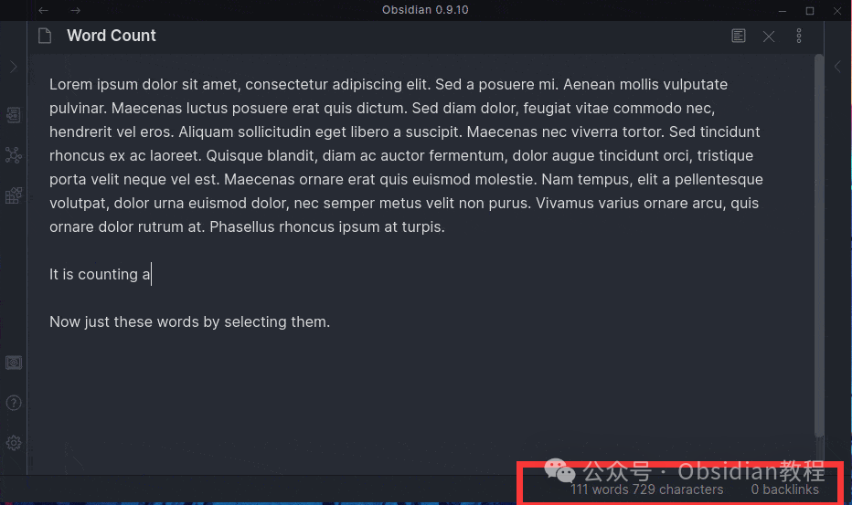
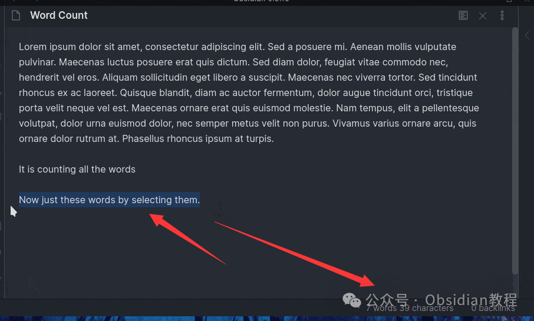

# Obsidian插件：Better Word Count统计文档的字数、字符数、句子数等

嗨，我是鬼哥，10年+老程序员一枚。最近发现了一个非常实用的Obsidian插件——Better Word Count。  
这款插件可不是简单的字数统计，它有许多令人惊艳的功能，绝对是Obsidian用户的福音。  
如果你和我一样对文字工作有很高的需求，那这个插件绝对能提高你的效率。话不多说，咱们直接进入正题。  

#### **插件概述**

  
Better Word Count插件的功能和Obsidian自带的Word Count插件类似，但它有个非常实用的改进：当你选中文本时，它会只统计所选文本的字数，而不是整个文档的字数。  
因此，我强烈推荐你关闭内置的Word Count插件，因为这个插件是为了替代它而设计的。  
此外，这款插件还具有存储你工作区统计数据的能力，非常适合需要详细统计数据的用户。  

#### **功能特点**

  
这个插件的功能非常强大，主要包括以下几点：  

  1. 存储统计数据：可以存储你整个工作区的统计数据。
  2. 多语言支持：支持所有语言的文字统计。
  3. 多样化的统计显示：可以显示各种不同的统计数据，包括：
     * 当前文件的字数、字符数、句子数、脚注数和Pandoc引文数。
     * 工作区中的总字数、字符数、句子数、脚注数、Pandoc引文数和文件数。
     * 今天输入的字数、字符数、句子数、脚注数和Pandoc引文数。
  4. 高度可定制的状态栏：状态栏可以根据你的需求进行定制，显示你所需的统计数据。

####   

### **安装和使用方法**

  
好了，说了这么多，咱们还是来看看怎么安装和使用这个插件吧。  
**在线安装**  
**  
**

  1. 打开Obsidian，进入设置页面。
  2. 点击“社区插件”，然后点击“浏览”。
  3. 在搜索栏输入“Better Word Count”，找到插件后点击“安装”。
  4. 安装完成后，返回设置页面，启用Better Word Count插件。

### **2.离线安装：****  
****很多同学无法直接在线安装obsidian插件，这里我已经把obsidian所有热门插件下载好了**  
只需要关注下方公众号，后台回复：**插件** 即可获取  
**注意：** 关闭内置Word Count插件：为了避免冲突，建议你关闭Obsidian内置的Word Count插件。

  
**配置插件：** 在插件设置中，你可以根据自己的需求定制状态栏的显示内容和格式。

####   

#### **插件的好处**

  

  1. 精确统计：可以对选中文本进行精确统计，避免了整个文档统计的不便。
  2. 多样统计：除了常规的字数统计外，还可以统计字符数、句子数、脚注数和引文数，非常全面。
  3. 数据存储：可以存储工作区的统计数据，方便对比和分析。
  4. 高度定制：状态栏可以根据你的需求进行定制，显示你需要的统计数据。

####   

#### **能解决的问题**

  

  1. 提高效率：精确的字数统计让你在写作和编辑时更加高效。
  2. 详细统计：全面的统计功能让你对自己的写作有更清晰的了解和控制。
  3. 数据分析：存储统计数据，帮助你进行长期的数据分析和对比。

  
总结下来，Better Word Count插件不仅功能强大，而且非常实用，是Obsidian用户不可或缺的利器。用过之后，我真心觉得它能大大提升我的工作效率。如果你还在用内置的Word Count插件，不妨试试这个替代方案，你一定会喜欢上它。  
  
  
1******扫码购买****《 Obsidian实战教程》****从入门到精通， 链接您的每一个思维瞬间。**  

