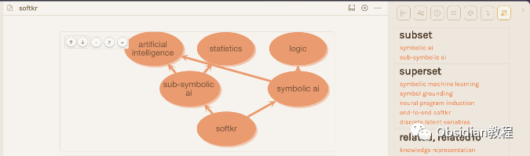
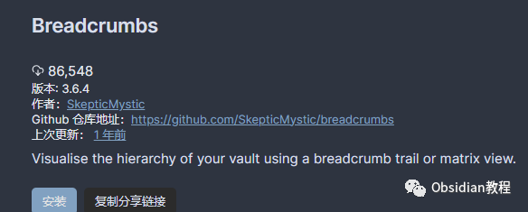
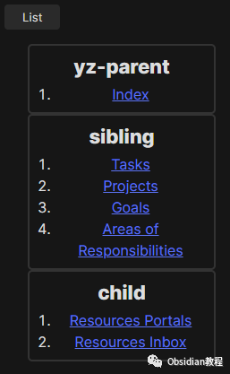

# Obsidian插件：Breadcrumb允许用户在笔记之间建立起层级和关联性

Obsidian是一款极具灵活性的笔记软件，而其众多插件更是为用户提供了额外的便利和功能。其中，Breadcrumb插件就是一个强大的工具，它允许用户在笔记之间建立起层级和关联性。  

接下来，我将为你详细介绍Breadcrumb插件的功能、使用方法和实际应用场景。

## 

1Breadcrumb插件简介

Breadcrumb插件为Obsidian添加了多种新视图，允许用户以层级元数据的方式组织笔记。这种层级结构的建立，依赖于特定的元数据标记，包括但不限于上级（parent）、同级（sibling）、下级（child）等关系。通过这些关系，用户可以清晰地理解和管理笔记之间的关系。

## 

3安装与设置

### **1.在线安装**（需要科学上网） ：****

### ****  
****

### 点击“社区插件”下的“浏览”按钮，在左上角的搜索框中搜索“ Breadcrumb”，然后点击“安装”按钮。

###   
启用插件：安装成功后，点击“启用”以启用插件。  

  
**2.离线安装：****  
****因为网络原因很多同学无法直接在线安装obsidian插件，这里我已经把obsidian所有热门插件下载好了**  
只需要关注下方公众号，后台回复：**插件** 即可获取

  
**配置元数据：** Breadcrumb插件需要用户在笔记中设置特定的元数据来表示层级关系。这些元数据可以通过两种方式添加：  
Frontmatter字段：在笔记顶部以YAML格式添加，如下例所示：

  *   *   *   *   * 

    
    
    ---parent: [[上级笔记]]sibling: [[同级笔记]]child: [[下级笔记]]---

内联元数据（需要Dataview插件支持）：在笔记正文中添加，例如：

  * 

    
    
    这是一篇关于金融的笔记。（parent:: [[金融基础]]）

## 

4Breadcrumb的主要功能

****

### **1\. 层级关系视图**

  

  * 列表/矩阵视图：显示当前笔记的上级、同级和下级笔记。可以在侧边栏打开，操作方式是通过命令面板（Ctrl+P）运行「Breadcrumbs: Open View」命令。
  * Breadcrumb Trail视图：显示从你的知识库顶部到当前笔记的路径。这有助于理解笔记之间的关联和路径。

### 

###   

### **2\. Juggl集成**

  
Breadcrumb与Juggl插件紧密集成。Juggl视图可以自动添加到当前笔记之上，展示笔记之间的关系图。

## 

5实际应用案例

**课程笔记组织：****  
**

  * 假设你正在学习金融课程，你可以创建多个笔记，如「金融基础」、「金融高级」等，并通过Breadcrumb插件建立它们之间的层级关系。
  * 例如，在「金融基础」笔记中，可以设置下级笔记为具体的课程内容，如讲座、小组工作等。

  
**项目管理：**  
在管理一个项目时，你可以为每个项目阶段创建一个笔记，并使用Breadcrumb插件来表示它们之间的顺序和依赖关系。  
比如，你可以将设计阶段设置为开发阶段的上级笔记。  
**知识框架构建：**  
对于复杂的知识体系，例如编程语言或历史事件，你可以通过Breadcrumb插件建立它们之间的层级和逻辑关系，以便更好地理解和记忆。

## 

6结语

Breadcrumb插件是Obsidian用户的强大助手，能够有效地帮助你管理和理解笔记之间的层级关系。无论是学习、工作还是个人知识管理，利用好这个插件，都能大大提升你的笔记效率和质量。  
  
  
1******扫码购买****《 Obsidian实战教程》****从入门到精通， 链接您的每一个思维瞬间。**  

