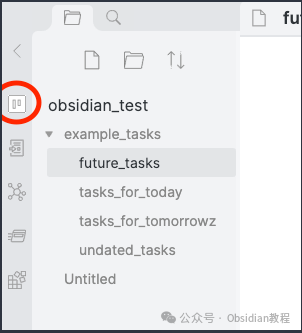
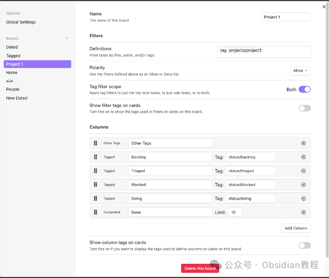
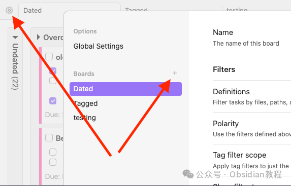
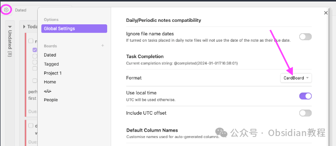

# Obsidian插件：CardBoard为Obsidian添加了看板式任务管理功能

Obsidian是一款功能强大的知识管理工具，其通过插件系统提供了极大的扩展性。其中，CardBoard插件为Obsidian添加了看板式任务管理功能，使得处理任务变得更加直观和高效。  
本教程将详细介绍如何在Obsidian中安装和使用CardBoard插件，包括基本功能、任务管理、看板定制以及与其他插件的兼容性等方面。

### 

1安装CardBoard插件

#### 

通过社区插件浏览器：  

###   

### **1.在线安装**（需要科学上网） ：****

### ****  
****

### 点击“社区插件”下的“浏览”按钮，在左上角的搜索框中搜索“ diagram”，然后点击“安装”按钮。

###   
启用插件：安装成功后，点击“启用”以启用插件。  

**  
****2.离线安装：****  
****因为网络原因很多同学无法直接在线安装obsidian插件，这里我已经把obsidian所有热门插件下载好了**  
只需要关注下方公众号，后台回复：**插件** 即可获取

  

### 2CardBoard基本使用

安装并启用CardBoard插件后，你可以通过以下两种方式访问看板：  

  * **应用栏图标：** 在Obsidian窗口左侧的应用栏中，你会看到CardBoard的图标。点击此图标可以打开看板界面。

  * **命令面板：** 通过快捷键Ctrl/Cmd + P打开命令面板，然后输入“Open CardBoard”，选择对应的命令打开看板。

  
如果你是第一次使用，CardBoard会提示你创建一个新的看板。你可以选择以下三种看板类型之一开始：  

  * **基于日期的看板：** 适用于需要按日期管理任务的情况。
  * **基于标签的看板：** 适用于通过标签组织任务的情况。
  * **空白看板：** 没有预定义列的空白看板，可以自定义添加所需的列。

  

### 2管理任务

在CardBoard中，任务以卡片形式出现在看板的列中。要使任务在看板上显示，它必须满足以下条件：  

  * 任务必须位于Markdown文件中。
  * 任务不能缩进，必须位于行的开始。
  * 任务使用通用标记（CommonMark）支持的无序列表格式，例如- [ ] 任务标题。

  
**任务卡片的内容取决于任务的具体格式，包括：**  

  * 任务下缩进的内容将作为任务体现在卡片上。
  * 缩进的任务将作为子任务显示。
  * 缩进的文本将作为笔记显示。
  * 任务行上或笔记属性中包含的标签（#tags）将显示在卡片顶部。
  * 如果指定了截止日期，则会在卡片底部显示。

###   

### **看板定制**

  
CardBoard支持高度定制化，包括日期基础列和标签基础列的混合使用、自定义卡片高亮颜色和标签样式等。  

你可以通过插件设置添加、编辑、重新排序或删除列，以及创建新的看板。  

  * 自定义标签和高亮颜色：你可以使用CSS片段来自定义标签样式和卡片的高亮颜色，以便于区分不同的任务或看板状态。

###   

### **兼容性和扩展性**

  
CardBoard与其他Obsidian插件如Dataview和Tasks兼容，能够理解和适应这些插件的任务格式。  
此外，CardBoard还提供了对日常笔记和周期性笔记的支持，使得基于日期的任务管理更加便捷。  

### **限制和替代方案**

  
虽然CardBoard为Obsidian用户提供了强大的看板式任务管理功能，但它可能在处理大型库或大型Markdown文件时表现不佳。  
如果CardBoard不满足你的需求，Obsidian社区还提供了其他优秀的任务管理插件，如Kanban、Tasks等。  
通过以上介绍，你应该对如何在Obsidian中安装和使用CardBoard插件有了全面的了解。  
CardBoard通过提供直观的看板界面和灵活的任务管理功能，极大地增强了Obsidian作为知识管理工具的能力。希望本教程能帮助你高效地管理任务，充分发挥Obsidian的潜力。  
  
  
1******扫码购买****《 Obsidian实战教程》****从入门到精通， 链接您的每一个思维瞬间。**  

