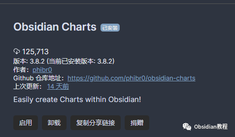
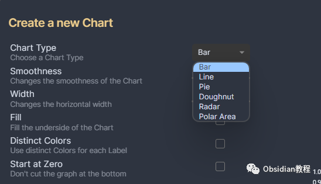
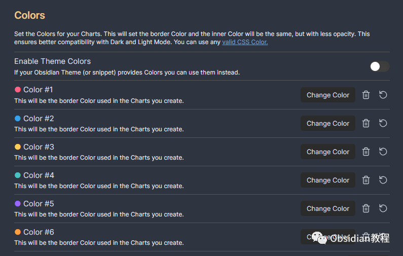

# Obsidian插件：Charts 允许用户在 Obsidian 中直接创建和管理各种类型的图表。

Obsidian Charts 插件允许用户在 Obsidian 中直接创建和管理各种类型的图表。这种可视化方式有助于分析和展示数据，使笔记更加直观和有吸引力。  
本片文章将详细介绍如何在 Obsidian 中使用 Charts 插件。

#### 

1安装步骤

### **1.在线安装**（需要科学上网） ：****

****  
****

  * 打开 Obsidian。
  * 进入“设置” -> “社区插件”。
  * 禁用“安全模式”。
  * 点击“浏览”按钮，搜索“Charts”插件。
  * 安装并启用插件。

  


####   


**2.离线安装：****  
****因为网络原因很多同学无法直接在线安装obsidian插件，这里我已经把obsidian所有热门插件下载好了**  
只需要关注下方公众号，后台回复：**插件** 即可获取1创建图表

** 开始使用：**在新的或现有的笔记中，你可以通过编写特定格式的代码块来创建图表。

**代码块语法：** 首先，你需要使用三个反引号 (```) 开始和结束一个代码块，并在第一行的反引号后指定图表类型。例如，```chart 表示一个图表代码块。

####   


#### **图表类型**

  
Charts 插件支持多种图表类型，包括但不限于：  


  * 柱状图（bar）
  * 折线图（line）
  * 饼图（pie）
  * 雷达图（radar）
  * 极坐标区域图（polarArea）

  




#### 

#### **图表数据格式**

  
图表的数据需要按照特定格式编写。一般来说，你需要定义一系列的“标签”（labels）和对应的“数据集”（datasets）。例如：
      
      *   *   *   *   *   *   *   * 
    
    
    
    type: bardata: {  labels: ['一月', '二月', '三月', '四月', '五月', '六月', '七月'],  datasets: [{    label: '示例数据',    data: [65, 59, 80, 81, 56, 55, 40],  }]}

  


#### **图表选项**

**  
**

  * 自定义外观：Charts 插件提供了多种自定义图表外观的选项。例如，你可以修改颜色、线条样式、字体等。
  * 响应式设计：图表设计是响应式的，意味着它们会根据 Obsidian 窗口的大小自动调整。

  




#### **高级功能**

**  
**

  * 交互式图表：部分图表支持交互功能，如点击图例以显示或隐藏数据集。
  * 数据动态更新：你可以通过引用笔记中的其他部分或外部数据源来动态更新图表数据。


####   


#### **实际应用示例**

**  
**

  * 追踪个人习惯：使用折线图或柱状图追踪你的日常习惯，如睡眠时间、阅读量或运动情况。
  * 项目进度展示：用折线图或雷达图展示项目的不同阶段和关键指标的进展。
  * 数据分析与展示：对收集的数据（如市场调查、用户反馈）进行可视化分析。


####   


#### **注意事项**

  


  * 数据准确性：确保输入的数据准确无误，错误的数据会导致图表显示不正确。
  * 性能考虑：过多或过复杂的图表可能会影响 Obsidian 笔记的性能。

  
通过以上步骤和提示，你可以有效地在 Obsidian 中使用 Charts 插件，为你的笔记添加有价值的视觉元素。实践中不断尝试不同的图表类型和格式，可以进一步提升你的数据展示能力。  
  
  
1**扫码购买****《 Obsidian实战教程》****从入门到精通， 链接您的每一个思维瞬间。****  
**  
往 期精彩[1.](http://mp.weixin.qq.com/s?__biz=MzkyMDUyMDM2Mg==&mid=2247484437&idx=1&sn=56d072590a221e82421f806bd14f9d01&chksm=c190d7d0f6e75ec6a112fc672ce1daca289b70893334e5c5bbd4d406836c641ef294bbdeace2&scene=21#wechat_redirect)[Obsidian插件：Full Calendar一款强大的日历管理工具](http://mp.weixin.qq.com/s?__biz=MzkyMDUyMDM2Mg==&mid=2247484667&idx=1&sn=71771d53ce789f60774ef370afde63cf&chksm=c190d73ef6e75e28d4a84c3b1f209f14e77e207bcb92d48c70874374b120951c37a9fda71659&scene=21#wechat_redirect)[2.Obsidian插件：Dictionary一款用于Obsidian软件的多语言词典插件](http://mp.weixin.qq.com/s?__biz=MzkyMDUyMDM2Mg==&mid=2247484666&idx=1&sn=b25fa3a8306a1b6433b4a80992f8a708&chksm=c190d73ff6e75e29223595bdb744efa35d6e904d2d17b297c60a5836b1be2549b7f85c51f794&scene=21#wechat_redirect)  
[3.Obsidian插件：Citation学术写作者的得力助手](http://mp.weixin.qq.com/s?__biz=MzkyMDUyMDM2Mg==&mid=2247484589&idx=1&sn=925c1cda10039f629ec64135cf01293b&chksm=c190d768f6e75e7e907221b8624378ff8abff315d787e51a1851ab1a1ef9b02c1cbc8b15b558&scene=21#wechat_redirect)  


点分享


点点赞


点在看
