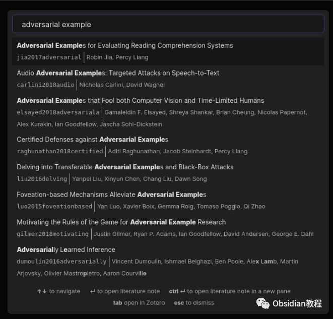
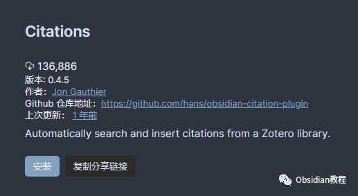

# Obsidian插件：Citation学术写作者的得力助手

点击下方公众号，回复关键字：**Obsidian** ，获取Obsidian资料合集。  
Obsidian的Citation插件是学术写作者的得力助手，它将你的文献管理器与Obsidian的编辑体验无缝集成。  
如果你的工作或研究需要引用大量学术文献，这个插件可以极大地简化你的引用管理流程。  

## 1Citation插件概览

Citation插件支持读取BibTeX / BibLaTeX .bib 格式和CSL-JSON格式的参考文献库。这意味着你可以直接在Obsidian中搜索、引用并管理你的学术参考文献。

## 

2安装与设置

要使用这个插件，我们首先需要在Obsidian中安装它。安装过程非常简单直接：

### **  
**

### **1.在线安装**（需要科学上网） ：****

  
1.在Obsidian的设置中，找到“第三方插件”选项，点击“社区插件”2.在搜索框中输入“Citation”，找到并安装它。3.安装完成后，激活该插件，在成功安装插件后，我们需要对其进行简单的配置，以符合我们的需求。  

**  
****2.离线安装：****  
****因为网络原因很多同学无法直接在线安装obsidian插件，这里我已经把obsidian所有热门插件下载好了**  
只需要关注下方公众号，后台回复：**插件** 即可获取  
插件安装后，你需要提供一个参考文献文件：  

  * 在Zotero的左侧边栏选择你想要导出的集合。
  * 点击 文件 -> 导出库...，选择 Better BibLaTeX 或 Better CSL JSON 作为格式。
  * 你可以选择 保持更新，以自动重新导出集合。
  * 如果你使用Zotero并安装了Better BibTeX插件：
  * 如果你使用其他参考文献管理器，请检查它们是否支持BibLaTeX或CSL-JSON格式的导出。
  * 在Obsidian的 设置 中找到 Citations 标签页，将导出的文件路径（.bib或.json）粘贴到 Citation export path 文本框中。

  
完成设置后，你应该能够在Obsidian内搜索你的参考文献了。

## 

3使用方法

目前，Citation插件提供四个简单的功能：  
打开文献笔记 (Ctrl+Shift+O)：为特定的参考文献自动创建或打开一个文献笔记。笔记的标题、文件夹和初始内容可以在插件设置中配置。  
插入文献笔记引用 (Ctrl+Shift+E)：插入一个链接到对应特定参考文献的文献笔记。  
在当前面板中插入文献笔记内容（默认没有热键）：将描述特定参考文献的内容插入当前面板。这对于更新已有的但缺少参考信息的文献笔记很有用。  
插入Markdown引用（默认没有热键）：为特定参考文献插入Pandoc风格的引用。（引用的确切格式可以在插件设置中配置。）

## 

4模板设置

你可以为文献笔记的标题和内容设置自己的模板。可以使用以下变量：  

  * {{citekey}}
  * {{abstract}}
  * {{authorString}}
  * {{containerTitle}}
  * {{DOI}}
  * {{eprint}}
  * {{eprinttype}}
  * {{eventPlace}}
  * {{page}}
  * {{publisher}}
  * {{publisherPlace}}
  * {{title}}
  * {{titleShort}}
  * {{URL}}
  * {{year}}
  * {{zoteroSelectURI}}

  
例如，你的文献笔记标题模板可以简单地设置为 @{{citekey}}，内容模板可以是：
      
      *   *   *   *   *   * 
    
    
    
    ---title: {{title}}authors: {{authorString}}year: {{year}}---{{abstract}}

## 

## 

5许可证

Citation插件遵循MIT许可证。  
通过使用Citation插件，你可以将Obsidian转变为一个强大的学术写作平台，不仅可以提高你的写作效率，还能让你更好地管理和引用文献。  
无论你是在撰写学术论文、书籍章节还是任何需要引用文献的文档，Citation插件都将是你不可或缺的工具。  
  
  
1**扫码购买****《 Obsidian实战教程》****从入门到精通， 链接您的每一个思维瞬间。****  
**  
往 期精彩[1.](http://mp.weixin.qq.com/s?__biz=MzkyMDUyMDM2Mg==&mid=2247484437&idx=1&sn=56d072590a221e82421f806bd14f9d01&chksm=c190d7d0f6e75ec6a112fc672ce1daca289b70893334e5c5bbd4d406836c641ef294bbdeace2&scene=21#wechat_redirect)[Obsidian 插件：使用Hider来精简你的用户界面](http://mp.weixin.qq.com/s?__biz=MzkyMDUyMDM2Mg==&mid=2247484587&idx=1&sn=4762b4fa1ee9e878f9649c385be320e6&chksm=c190d76ef6e75e78444313ca65acda9881ae76f69b4721ccca481286fc7c94286d6e6c9a3d2a&scene=21#wechat_redirect)[2.Obsidian插件：Quick Switcher++ 你的笔记导航专家](http://mp.weixin.qq.com/s?__biz=MzkyMDUyMDM2Mg==&mid=2247484586&idx=1&sn=a5c9ebcde2fbf0e03475e0b7ca36bca4&chksm=c190d76ff6e75e791195c959219724af0611245c75ad490aa7eacd7613330a15392d3bb4b220&scene=21#wechat_redirect)  
[3.Obsidian插件：Hover Editor将 Obsidian 的“页面预览”功能提升到一个全新的层次](http://mp.weixin.qq.com/s?__biz=MzkyMDUyMDM2Mg==&mid=2247484530&idx=1&sn=2e5eb91aedf095be338604660c04e678&chksm=c190d7b7f6e75ea119a474a11cbf90c3263a72ba692ed3964730e5a4de8a18e7199807236a63&scene=21#wechat_redirect)  

点分享

点点赞

点在看

  

