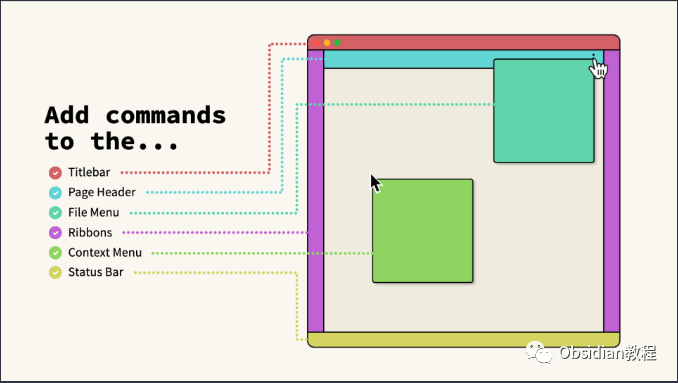
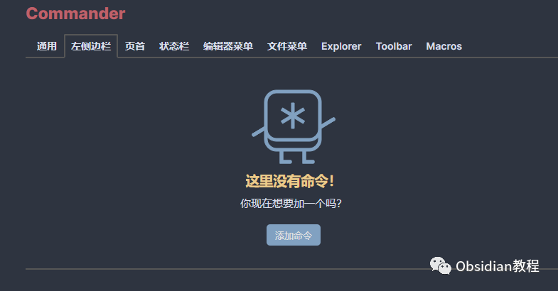
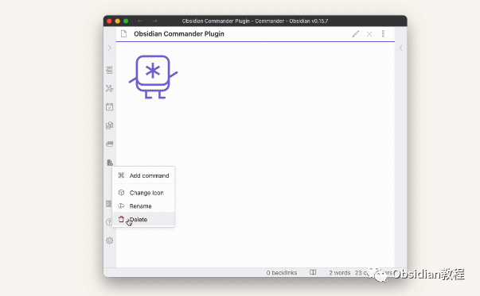
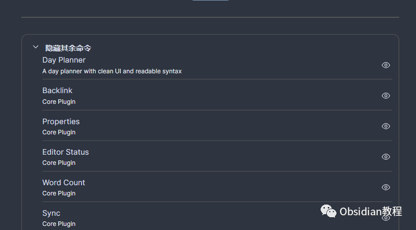
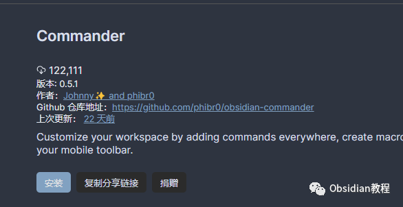
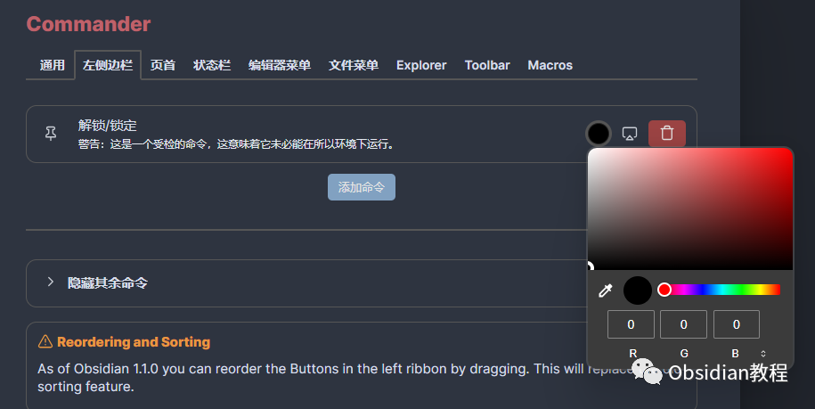
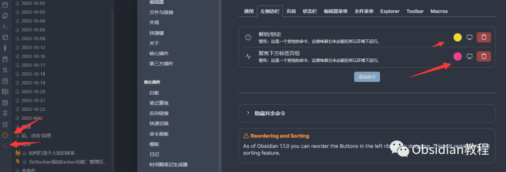

# Obsidian插件：Command自定义并优化Obsidian的用户界面

Obsidian是一个广受欢迎的知识管理和笔记应用，其强大之处在于其丰富的插件生态系统。  
Commander插件是Obsidian生态中的一员，它使用户能够自定义并优化Obsidian的用户界面。

本教程将深入探讨Commander插件的功能、安装方法以及使用技巧。  
  

## 1插件概述

Commander插件主要功能是允许用户对Obsidian的用户界面进行定制化的命令添加、编辑和管理。  

它的特点包括：  

  * 添加命令：用户可以根据自己的需要添加新的命令到Obsidian的用户界面。
  * 移除命令：提供移除已有命令的功能，包括由Obsidian或其他插件添加的命令。
  * 重新排序命令：通过插件设置菜单，用户可以重新排序命令。
  * 编辑命令：用户可以编辑现有的命令以更好地适应其工作流。
  * 隐藏命令：用户可以选择隐藏Obsidian或其他插件添加的命令。
  * 设备特定命令：对于使用同步功能的用户，可以选择命令在哪些设备上出现。

## 

2功能详解

### **添加和编辑命令**

  
Commander插件允许用户自由添加和编辑命令，这样用户可以根据自己的工作流和习惯来定制Obsidian的界面和功能。  

### **命令管理**

  
用户可以通过插件的设置界面来对命令进行排序和移除，这提供了一种灵活的方式来管理Obsidian的工作环境。  

### **隐藏命令**

  
对于那些不常用或者不需要的命令，Commander插件提供了隐藏功能，帮助用户保持界面的整洁。

### **设备特定命令**

  
这一功能特别适用于在多个设备上使用Obsidian的用户，可以根据每个设备的使用习惯和需求来定制命令的显示。

## 

3安装方法

### **1.在线安装**（需要科学上网） ：****

  

  * 在Obsidian的设置中打开“第三方插件”部分。
  * 点击“浏览社区插件”，搜索“Commander”插件。
  * 找到Commander插件后，点击安装。
  * 安装完成后，返回设置，启用该插件。

**2.离线安装：****  
****因为网络原因很多同学无法直接在线安装obsidian插件，这里我已经把obsidian所有热门插件下载好了**  
只需要关注下方公众号，后台回复：**插件** 即可获取

## **使用技巧**  

  
定制个性化命令：根据自己的笔记习惯和工作流程，添加和编辑个性化的命令。  

优化界面布局：通过隐藏不需要的命令，可以让Obsidian的界面更加简洁，提高工作效率。  

针对不同设备定制命令：如果你在多个设备上使用Obsidian，可以根据每个设备的特点和使用习惯定制命令。

## 

4如何改进这个插件

### **添加翻译**

**  
**

  * 如果你想帮助翻译这个插件到新的语言，可以参考locale/目录。复制英文（en.json）文件到你的语言文件，然后开始修改右侧的句子。

  
Commander插件为Obsidian用户提供了一个强大的界面定制工具，通过这个插件，用户可以更加自由地调整和优化自己的Obsidian使用体验。  
无论你是Obsidian的新手还是资深用户，Commander插件都值得一试。  
  
  
1**扫码购买****《 Obsidian实战教程》****从入门到精通， 链接您的每一个思维瞬间。****  
**  
往 期精彩[1.](http://mp.weixin.qq.com/s?__biz=MzkyMDUyMDM2Mg==&mid=2247484437&idx=1&sn=56d072590a221e82421f806bd14f9d01&chksm=c190d7d0f6e75ec6a112fc672ce1daca289b70893334e5c5bbd4d406836c641ef294bbdeace2&scene=21#wechat_redirect)[Obsidian插件：Charts 允许用户在 Obsidian 中直接创建和管理各种类型的图表。](http://mp.weixin.qq.com/s?__biz=MzkyMDUyMDM2Mg==&mid=2247484669&idx=1&sn=c4033480c602e9c45fa07a8d84f81950&chksm=c190d738f6e75e2e27bd25433801662da495ea63daad3617467045389ed81a57ccec4a179714&scene=21#wechat_redirect)[2.Obsidian插件：LanguageTool高级语法和拼写检查工具](http://mp.weixin.qq.com/s?__biz=MzkyMDUyMDM2Mg==&mid=2247484668&idx=1&sn=b550336ee49febb33c60447a9af2cb51&chksm=c190d739f6e75e2f5c4380b23c127a7a74f5be9b236e5690b9a0486113de804a4e1ef053298b&scene=21#wechat_redirect)  
[3.Obsidian插件：Full Calendar一款强大的日历管理工具](http://mp.weixin.qq.com/s?__biz=MzkyMDUyMDM2Mg==&mid=2247484667&idx=1&sn=71771d53ce789f60774ef370afde63cf&chksm=c190d73ef6e75e28d4a84c3b1f209f14e77e207bcb92d48c70874374b120951c37a9fda71659&scene=21#wechat_redirect)  

点分享

点点赞

点在看
