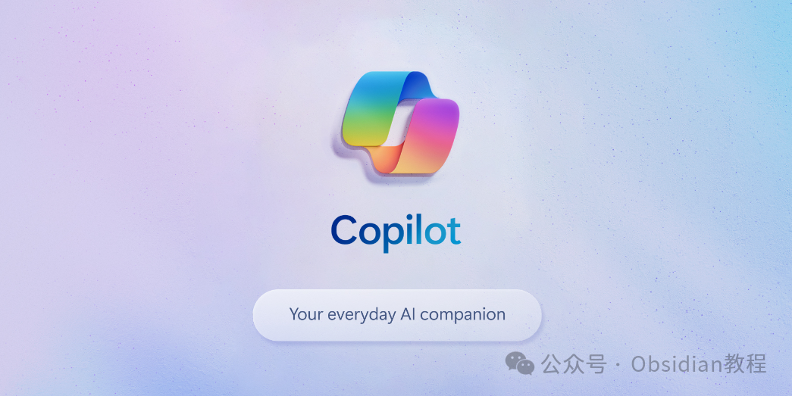
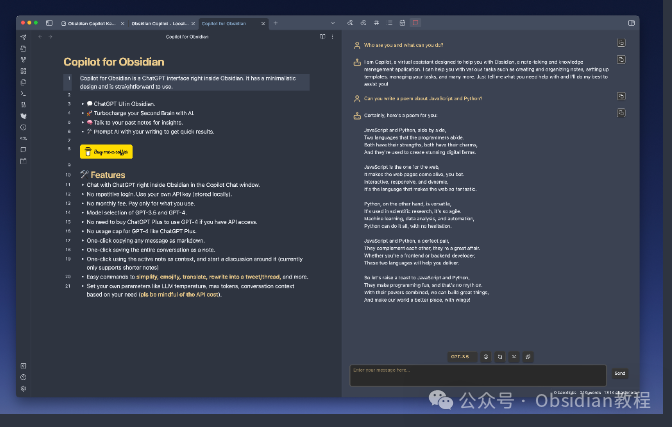
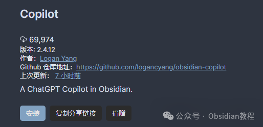
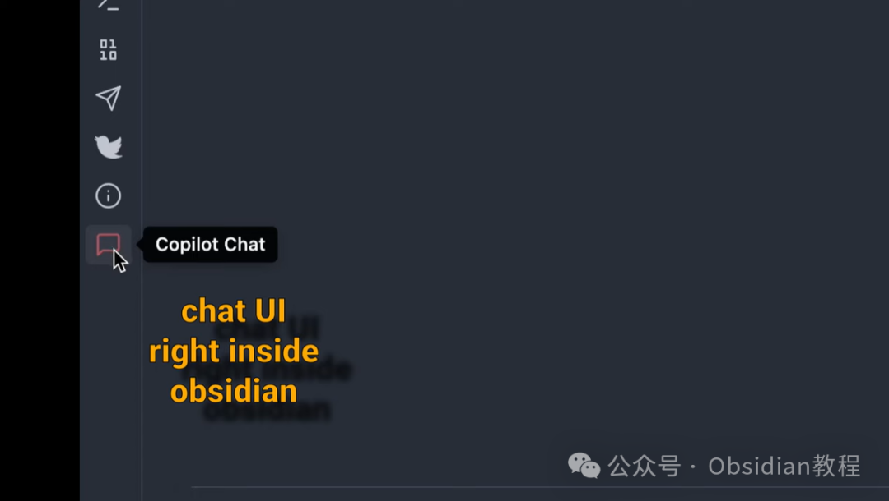
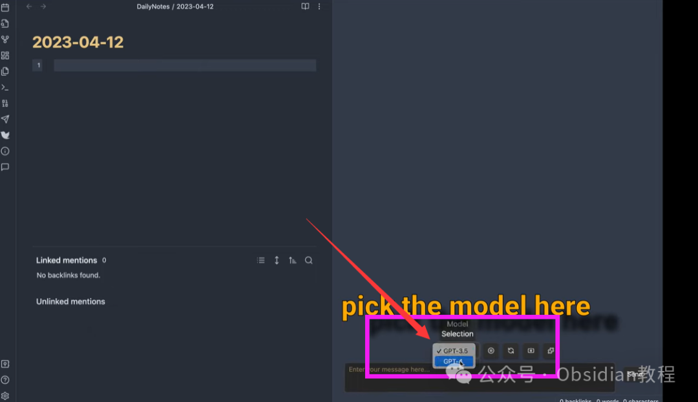
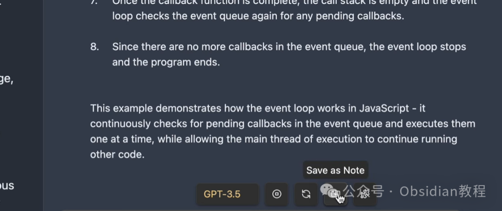
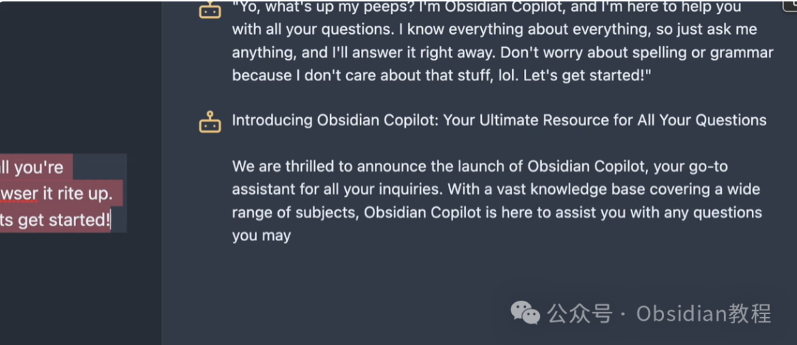
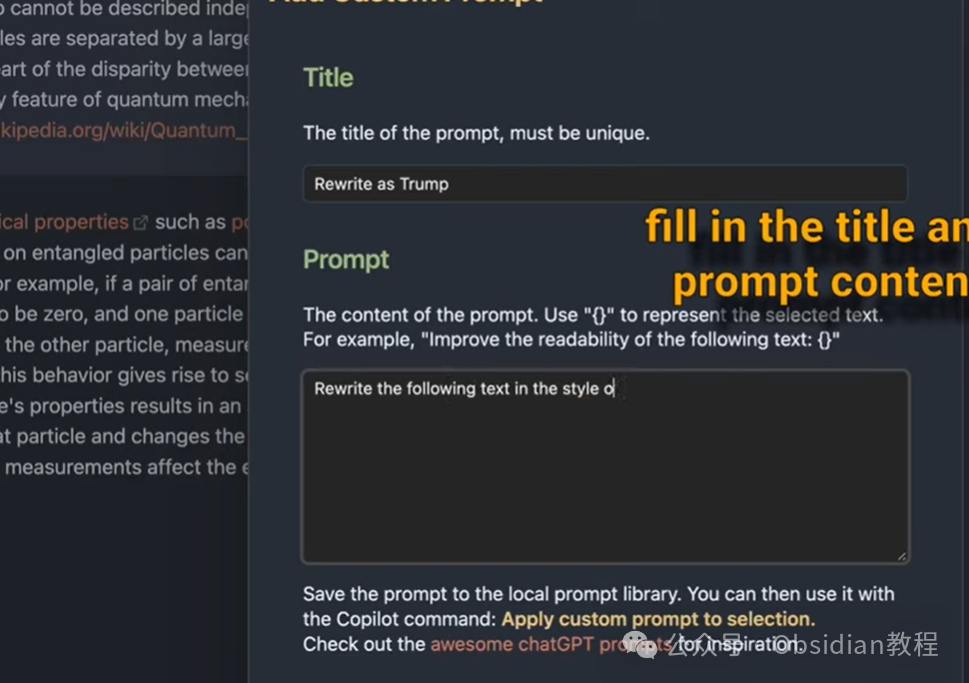

# Obsidian插件：Copilot，通过Copilot命令与AI进行交流，增强了笔记的功能性和交互性。

Copilot是一款免费且开源的插件，它将ChatGPT界面直接集成到Obsidian中。该插件设计简洁，使用直观。用户可以通过Copilot命令与AI进行交流，极大地增强了笔记的功能性和交互性。  

Copilot的目标是实现本地优先和注重隐私的AI助手。它具有本地向量存储功能，并且可以在完全离线的状态下使用本地模型进行聊天和问答。  
1功能特点  
**AI交互：** 在Obsidian内部通过Copilot聊天窗口与ChatGPT进行交流。**API使用：** 无需重复登录，使用自己的API密钥（本地存储），无月费，按使用付费。**模型选择：** 支持OpenAI、Azure和由LM Studio与Ollama提供支持的本地模型。**免费模型：** 支持OpenRouter.ai、LM Studio和Ollama的免费模型。**多样功能：** 包括简化文本、表情化、总结、翻译、调整语气、修复语法、重写为推文/线程、计算令牌等。**自定义提示：** 您可以添加、应用、编辑、删除在本地Obsidian环境中持久保存的自定义提示。  

### 2安装方法

通过社区插件浏览器：

###   

### **1.在线安装**（需要科学上网） ：****

### ****  
****

### 点击“社区插件”下的“浏览”按钮，在左上角的搜索框中搜索“ Copilot”，然后点击“安装”按钮。

###   
启用插件：安装成功后，点击“启用”以启用插件。  

  
**2.离线安装：****  
****因为网络原因很多同学无法直接在线安装obsidian插件，这里我已经把obsidian所有热门插件下载好了**  
只需要关注下方公众号，后台回复：**插件** 即可获取  

  * 下载最新发布的ZIP文件。
  * 将这些文件放置在您的库中的.obsidian/plugins/obsidian-copilot/目录下。
  * 在Obsidian设置的“社区插件”部分启用Copilot。  
  

### 3使用教程

**基本使用：****  
**

  * 在Obsidian左侧的工具栏点击聊天图标，将在右侧打开聊天面板。

  * 在聊天窗口输入内容，使用Copilot命令与AI进行交流。

  * 可以将任何消息以Markdown格式一键复制，或将整个对话保存为笔记。

4高级应用：

  * 使用“长笔记作为上下文”功能，创建针对激活的长笔记的本地向量索引，以便在模型上下文窗口之外与笔记进行对话。

  

  * 在“模式选择”菜单中切换到“QA”模式，围绕长笔记展开讨论。

  

### 5注意事项及常见问题

  * **聊天历史：** 默认情况下，聊天历史不会被保存。请使用“保存为笔记”功能来保存。
  * **新聊天：** 点击“新聊天”将清除所有之前的聊天历史。如果需要保存聊天，请先使用“保存为笔记”功能。
  * **API成本：** 使用GPT-4和长上下文时，请注意API成本。
  * **常见问题：** 包括模型访问问题、上下文未使用问题、使用Huggingface作为嵌入提供商时的响应问题等。

  

### 6结语

Copilot插件为Obsidian用户提供了一个强大的AI交互工具，不仅能够增强笔记的功能性，还能帮助用户更有效地组织和处理信息。无论是日常笔记的整理，还是专业知识的探索，Copilot都能提供极大的便利。  
如果您对隐私和数据安全有较高要求，Copilot的本地化特性将是一个不错的选择。同时，其多样化的功能和自定义选项能够满足不同用户的个性化需求。  
  
  
1******扫码购买****《 Obsidian实战教程》****从入门到精通， 链接您的每一个思维瞬间。**  

