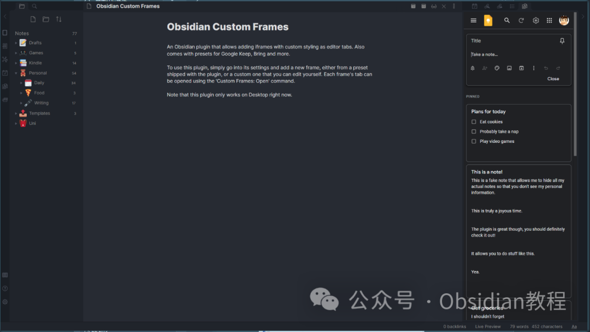
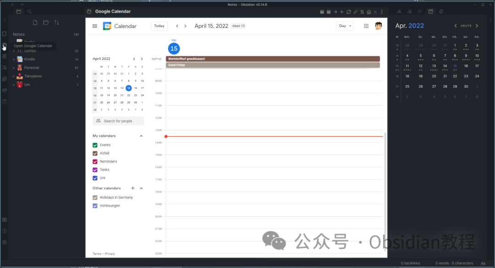
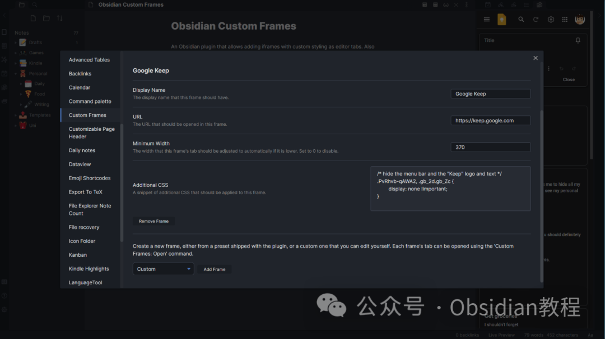

# Obsidian插件：Custom Frames允许用户将网页应用作为面板嵌入到Obsidian界面中

《Custom Frames》是一款Obsidian插件，专为提高用户在Obsidian中的网页浏览体验而设计。它允许用户将网页应用作为面板嵌入到Obsidian界面中，并提供了自定义样式和设置选项。  

这款插件的出现极大地丰富了Obsidian的功能，为用户带来了更加灵活多样的工作流程。  

### 1主要特点

  * **嵌入网页应用：** 通过iframe技术，将各种网页应用嵌入到Obsidian中，作为一个独立的面板使用。
  * **自定义样式：** 支持为嵌入的网页应用添加自定义CSS样式，使其更好地融入Obsidian的界面风格。
  * **内置预设：** 提供了一系列内置的网页应用预设，如Google Keep、Google Calendar、Todoist等，便于快速开始使用。
  * **Markdown模式：** 允许用户在Markdown文档中通过特殊的代码块语法直接嵌入自定义的网页面板。
  * **移动端适配：** 虽然在移动端由于技术限制部分功能可能无法使用，但插件提供了“在移动端禁用”选项，以确保在移动设备上的使用体验。

### 

### 2使用方法

#### **面板模式**

**  
**

  * **添加新面板：** 在插件设置中添加新的Custom Frame，可以选择内置预设或自定义编辑。
  * **打开面板：** 使用“Custom Frames: Open”命令打开一个Custom Frame作为面板。
  * **自定义设置：** 包括添加自定义CSS、添加工具栏图标、在编辑器中心显示面板等。

#### 3Markdown模式

在Markdown文档中，可以使用特殊的代码块语法来嵌入自定义框架：
      
      *   *   * 
    
    
    
    frame: YOUR FRAME'S NAMEstyle: height: 1000px;urlSuffix: #reminders

  
例如，使用Google Keep预设时，可以添加自定义样式和URL后缀，以显示特定内容。  

### **已知问题**

  
《Custom Frames》插件在使用过程中存在一些已知问题，例如：  

  * 弹出窗口和新标签页当前会在默认浏览器中打开，而不是在自定义框架中。
  * 某些链接可能无法在自定义框架中打开，尤其是在Obsidian 1.3.7之前的版本。

###   

### **发展路线图**

  
《Custom Frames》插件的未来发展计划包括：  

  * 允许为每个面板设置自定义图标。
  * 允许在Markdown代码块中显示自定义框架。
  * 添加为框架创建工具栏按钮的功能，使其在主视图中打开。
  * 允许创建在自定义框架中打开的外部链接。
  * 探索在iframe中执行自定义JavaScript的可能性（尚需考虑安全性）。
  * 增加全局设置，使弹出窗口在新的Obsidian窗口中打开而非默认浏览器。
  * 为Markdown模式添加更多选项，如前进和后退按钮。
  * 探索将选中的文本提取到笔记中的功能，类似于Note composer插件的工作方式。

### 

4使用场景

《Custom Frames》插件非常适合那些希望将Obsidian作为日常工作中心的用户。例如，你可以将Google Keep作为便签工具嵌入到Obsidian的侧边栏，同时在主工作区处理Markdown文件。或者，将Google Calendar嵌入到Obsidian中，方便查看和管理日程安排。

5结论

总体来说，《Custom Frames》插件通过提供灵活的网页嵌入功能，极大地增强了Obsidian的多功能性。用户可以根据自己的需求，将各种网页应用集成到Obsidian中，从而实现更高效、更个性化的工作流程。  
尽管存在一些技术限制和已知问题，但插件的持续发展和改进，将为用户带来更多便利和可能性。  
  
  
1******扫码购买****《 Obsidian实战教程》****从入门到精通， 链接您的每一个思维瞬间。**  

