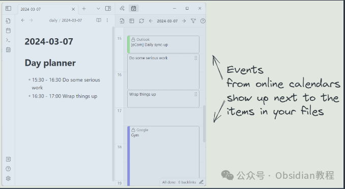
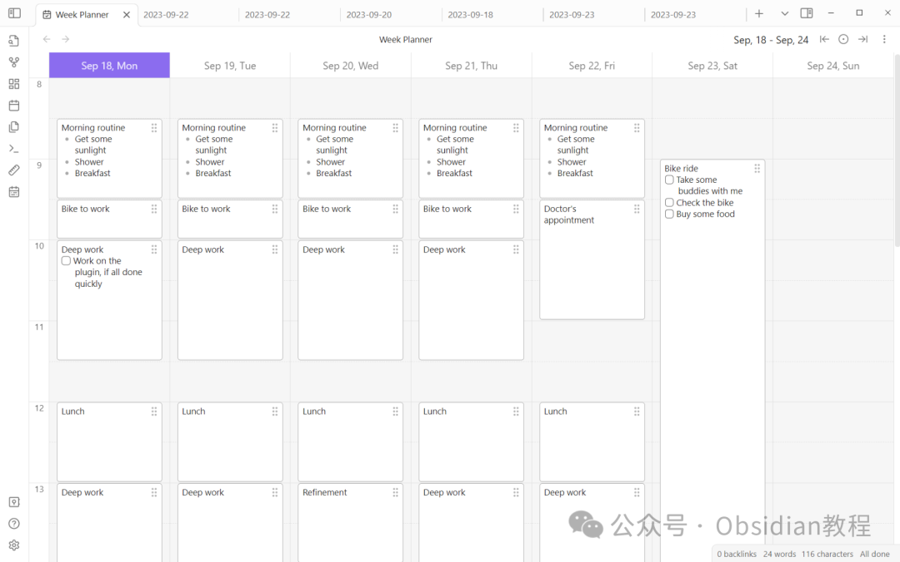
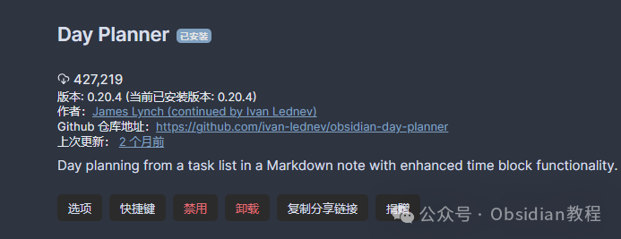
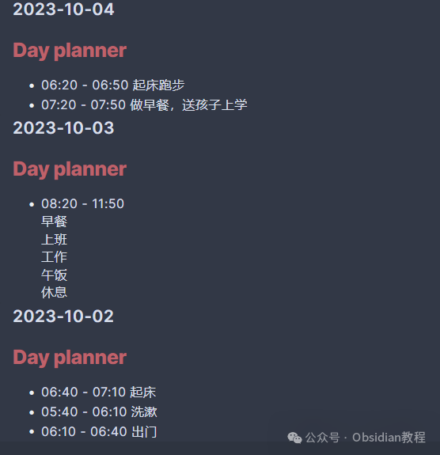

# Obsidian插件：Day Planner在笔记中规划和管理时间

嗨，我是鬼哥，10年+老程序员一枚。  
今天我们要聊聊 Obsidian 的一个超赞插件——Day Planner。  
这个插件可是我最近的新宠，简直就是时间管理神器。你有没有觉得每天的时间都像流水一样溜走了，却不知道都干了啥？来来来，跟我一起看看 Day Planner 是怎么帮你拯救时间的。  

### **什么是 Day Planner？**

  
Day Planner 是一个 Obsidian 的插件，用来帮你在笔记中规划和管理时间。它可以把你的任务变成时间线，让你对一天的安排一目了然。  
这个插件有三种模式，可以展示来自不同来源的任务：  

  1. 每日日记中的任务
  2. Obsidian-tasks 插件中的任务
  3. 在线日历中的事件

  

不管你是用哪种方式管理任务，Day Planner 都能帮你统统搞定。  

### **如何使用 Day Planner**

####   

**在线安装：**  

  1. 打开Obsidian，进入设置页面。
  2. 点击“社区插件”，然后点击“浏览”。
  3. 在搜索栏输入“Day Planner”，找到插件后点击“安装”。
  4. 安装完成后，返回设置页面，启用Day Planner插件。

  

### 

### **2.离线安装：****  
****很多同学无法直接在线安装obsidian插件，这里我已经把obsidian所有热门插件下载好了**  
只需要关注下方公众号，后台回复：**插件** 即可获取

  

接下来，运行以下命令来显示时间线侧边栏：Show the day planner timeline。这一步很重要，侧边栏就是你的任务指挥中心。  

#### **模式一：每日笔记中的任务**

  
如果你使用 Obsidian 自带的 '每日笔记' 插件或社区插件 'Periodic Notes'，Day Planner 可以直接从这些笔记中读取任务。这是最简单的模式，完全不需要额外设置。你只需要在每日笔记中写下任务，它们就会出现在时间线上：
      
      *   * 
    
    
    
    - [ ] 10:00 - 10:30 起床- [ ] 11:00 - 12:30 吃早餐

####   

#### **模式二：Obsidian-tasks 插件集成**

  
这个模式允许你在整个笔记库中查看任务，前提是这些任务添加了日期属性。你可以把 Day Planner 当作 tasks 插件的日历视图。  

要实现这个功能，你需要在 Dataview 的来源字段中添加标签或文件夹，例如 #task。然后在文件中添加任务和日期属性：
      
      *   *   *   *   *   * 
    
    
    
    ---tags: "#task"---  
    - [ ] 08:00 - 10:00 使用简写格式 ⏳ 2021-08-29- [ ] 11:00 - 13:00 使用 Dataview 属性格式 [scheduled:: 2021-08-29]

####   

#### **模式三：展示在线日历**

  
要显示 Google Calendar、iCloud Calendar 和 Outlook 等在线日历中的事件，你只需要在插件设置中添加一个 ICS 链接就行了。

###   

### **小贴士**

**  
**

  1. 拖拽演示：可以通过拖拽调整任务的时间。
  2. 添加任务时间：在任务前添加时间段，如 10:00 - 11:00，可以让任务在时间线上显示得更准确。
  3. 基本编辑：可以创建、移动、调整任务的大小，非常方便。

###   

### **使用感受**

  
鬼哥用了一段时间 Day Planner，感觉时间管理效率提高了不少。不仅能直观地看到每天的任务，还能灵活地调整安排。特别是集成在线日历后，工作和生活的安排都能一手掌握。  
用 Day Planner 规划一天，真的像是在给自己做一个小日程表，每天按图索骥，效率蹭蹭蹭地往上涨。  
总之，Day Planner 让时间管理变得直观又高效，不管你是用每日笔记、tasks 插件还是在线日历，都能轻松搞定。  
对于像鬼哥这样喜欢用笔记软件来管理一切的人来说，真的是不可或缺的小助手。试试看，你也会爱上它的。  
  
  
1******扫码购买****《 Obsidian实战教程》****从入门到精通， 链接您的每一个思维瞬间。**  

