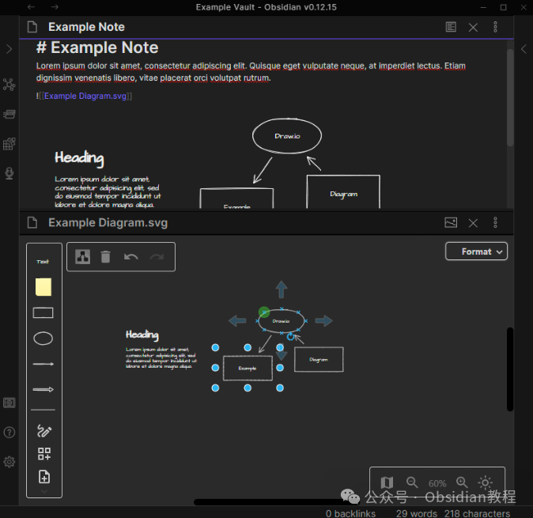
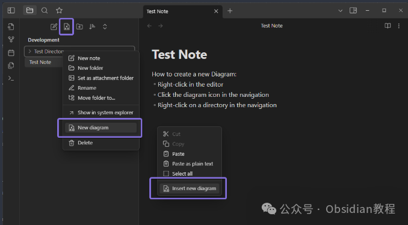
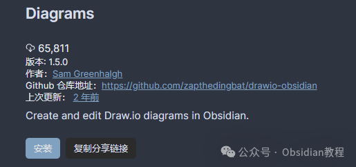
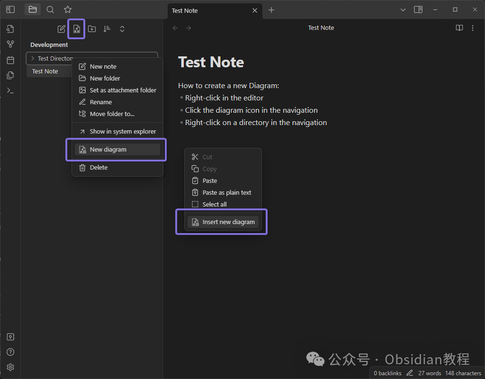

# Obsidian插件：Diagram高效图表工具支持在笔记中创建.编辑.保存图表

Draw.io diagram插件是为Obsidian用户设计的高效图表工具，它不仅支持在笔记中直接创建和编辑图表，还允许用户将图表作为独立文件保存和管理。  
这个插件非常适用于需要在笔记或文档中包含流程图、组织结构图、UML图或其他类型图表的用户。  

### 1功能特点

**多样的图表类型：** 支持广泛的图表类型，如流程图、组织结构图、UML图等，满足不同领域的需求。**高质量图表格式：** 图表以SVG格式保存，确保了图表的清晰度和兼容性。**兼容性：** 支持.drawio扩展名，方便与其他应用程序的兼容和交互。**灵活的编辑功能：** 提供丰富的编辑工具，方便用户定制和修改图表。  

### 2安装步骤

#### 

通过社区插件浏览器：  

###   

### **1.在线安装**（需要科学上网） ：****

### ****  
****

### 点击“社区插件”下的“浏览”按钮，在左上角的搜索框中搜索“ diagram”，然后点击“安装”按钮。

###   
启用插件：安装成功后，点击“启用”以启用插件。  

  
**2.离线安装：****  
****因为网络原因很多同学无法直接在线安装obsidian插件，这里我已经把obsidian所有热门插件下载好了**  
只需要关注下方公众号，后台回复：**插件** 即可获取  

  * 下载最新发布的ZIP文件。
  * 解压至Obsidian的插件文件夹。

### 

3使用方法

**创建新图表**

**  
**

  * 在笔记的适当位置，选择插入新图表的选项。
  * 在弹出的界面中，根据需要选择图表类型并开始设计。
  * 设计完成后，图表以SVG格式自动插入到笔记中。

#### 

#### **编辑现有图表**

**  
**

  * 直接点击笔记中的图表。
  * 选择编辑选项，对图表进行修改。
  * 完成修改后，图表将自动更新。

### 

### **图表编辑与管理**

  
Draw.io diagram插件提供了丰富的编辑选项，允许用户对图表进行详细的定制，包括改变尺寸、颜色、添加文本、连接线等。用户还可以对图表文件进行重命名、移动或复制，方便在不同的笔记中重复使用或参考。

### 

4扩展应用

Draw.io diagram插件的应用场景非常广泛：  

  * 项目管理：创建项目流程图、时间线、责任分配图等。
  * 学术研究：制作科研项目的数据流程图、实验设计图等。
  * 商务报告：制作组织结构图、业务流程图、市场分析图等。
  * 个人笔记：制作思维导图、学习笔记图表等。

  

### 5实践技巧

  * 模板利用：为常用图表类型创建模板，加速新图表的创建过程。
  * 互动性增强：将图表与Obsidian的链接、嵌入、标签等功能结合使用，提升笔记的互动性和深度。
  * 图表共享与协作：SVG格式的图表便于共享和协作，可以轻松导入到其他应用或与他人共同编辑。

### 

6结语

Draw.io diagram插件是一个强大且多功能的图表工具，非常适合需要在笔记中创建和管理各种类型图表的Obsidian用户。无论是业务、学术还是个人使用，这个插件都能显著提升您的笔记和文档的质量。  
希望本文能帮助您更好地理解和利用这个插件，从而使您的笔记更加生动、直观和有趣。  
  
  
1******扫码购买****《 Obsidian实战教程》****从入门到精通， 链接您的每一个思维瞬间。**  

