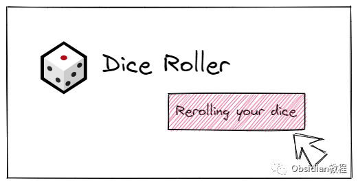
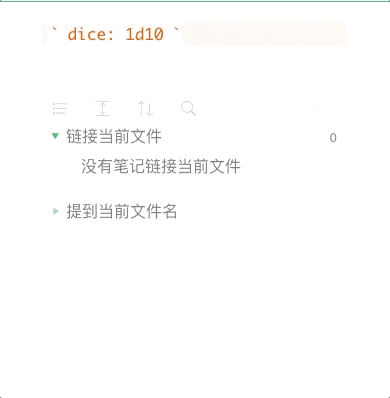
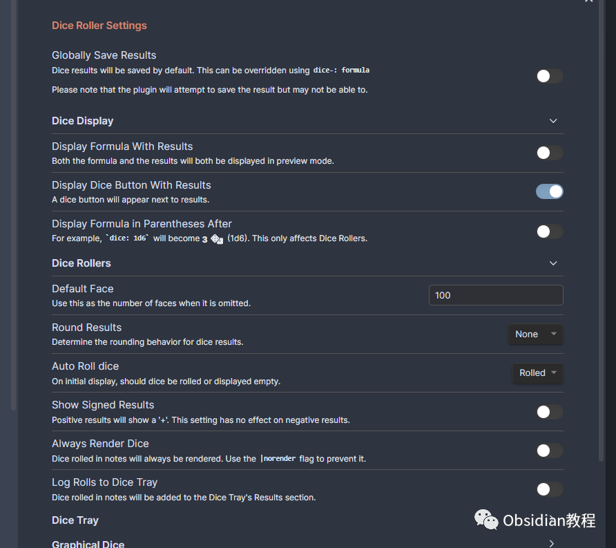
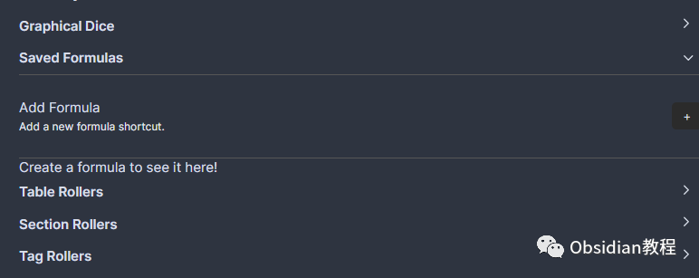

# Obsidian插件：Dice Roller一款内联骰子滚动插件。

Dice Roller 插件是为 Obsidian.md 开发的一款内联骰子滚动插件。  
它通过在笔记中插入特定代码块来实现骰子滚动功能。  
例如，输入dice: XdX，在预览模式下，这个代码块会被替换成骰子滚动的结果，点击结果可以重新滚动骰子。此插件非常适合需要随机性和概率计算的场景，如角色扮演游戏、决策分析等。  

### 1基本用法

  * 简单骰子滚动：在笔记中输入类似dice: 3d6的代码块，在预览模式下可以看到3个六面骰的滚动结果。
  * 重滚功能：点击显示的骰子结果可以重新进行滚动。

  

### 

### 2配置公式

可以在设置中添加骰子公式，为常用的骰子滚动定义别名，方便使用。支持所有下文定义的骰子类型。

  

### **骰子计算规则**

  

  * 基本操作：支持加、减、乘、除以及指数计算。
  * 操作顺序：完全支持运算顺序，可以嵌套使用括号。

###   

### **示例**

**  
**

  * dice: 1d2：滚动一个两面骰。
  * dice: 3d4 + 3：滚动三个四面骰，结果加3。
  * dice: 1d12 + 1d10 + 5：滚动一个十二面骰和一个十面骰，结果加5。

### 

3Dataview 集成

插件支持 Dataview 内联字段中的数字骰子。

###   

### **骰子面数**

**  
**

  * 设置面数：可以指定骰子的最小和最大面数，如dice: 1d[3,5]表示滚动一个面数在3到5之间的骰子。
  * 省略值：不指定次数时，默认滚动1次；不指定面数时，默认为100面。

###   

### **百分比骰子**

  

  * 标准百分比骰子：使用dice: Xd%表示滚动X个百面骰。

  * 自定义百分比：例如，dice: XdX%用于自定义百分比骰子。

### 

4骰子修饰符

插件支持多种修饰符，如果骰子被修饰，其提示信息将显示其被修改的方式。

###   

### **骰子修饰符示例**

**  
**

  * 保留最高：dice: 4d20k2保留4个二十面骰中最高的2个结果。
  * 掉落最低：dice: 4d20dl2掉落4个二十面骰中最低的2个结果。
  * 爆炸骰子：dice: 2d20!当滚出最大值时，再额外滚动一个骰子。
  * 重滚：dice: 2d20r重滚最小值的骰子。

###   

### **表格和列表滚动器**

**  
**

  * 表格滚动器：可以指定一个笔记中的表格，并从中随机返回一个结果。
  * 列表滚动器：类似地，可以从笔记中的列表中随机返回一个结果。

###   

### **骰子公式**

  
你可以在设置中创建骰子公式，为常用的骰子滚动定义别名。  

### **提示工具**

  
预览模式下的结果会显示一个提示工具，展示用于计算结果的公式。

###   

### **保存结果**

  
从版本6.1.0开始，骰子滚动的结果可以被保存，使用dice+: ...语法来保存结果。

###   

### **替换笔记内容**

  
使用dice-mod: <formula>语法可以让插件替换笔记内容为计算的骰子滚动结果。

###   

### **骰子标志**

  
在骰子公式中可以添加标志来修改骰子的行为，例如|nodice、|avg、|none等。

### 其他插件集成

  
支持与能够写 JavaScript 的插件（如 Dataview）交互，通过 Obsidian 应用对象访问 Dice Roller 插件。  

### 5安装步骤

### **1.在线安装**（需要科学上网） ：****

### ****  
****

### 点击“社区插件”下的“浏览”按钮，在左上角的搜索框中搜索“ Dice Roller”，然后点击“安装”按钮。

###   
启用插件：安装成功后，点击“启用”以启用插件。  

  
**2.离线安装：****  
****因为网络原因很多同学无法直接在线安装obsidian插件，这里我已经把obsidian所有热门插件下载好了**  
只需要关注下方公众号，后台回复：**插件** 即可获取

**设置选项**  

### 

  * 通用设置：包括全局保存结果、骰子显示设置等。
  * 骰子滚动器设置：控制骰子滚动器的行为，如默认面数、结果四舍五入等。
  * 表格滚动器设置：控制表格滚动器的行为。
  * 部分滚动器设置：控制部分滚动器的行为，如添加“复制内容”按钮等。
  * 标签滚动器设置：控制标签滚动器的行为。
  * 骰子视图设置：控制骰子视图的行为，如启动时自动打开骰子视图等。
  * 图形骰子设置：控制图形骰子的行为，如显示时间、骰子颜色等。

### 

6结论

Dice Roller 插件为 Obsidian 用户提供了一个强大且灵活的骰子滚动工具，不仅适合于游戏玩家，还适用于需要随机性和概率分析的各种场景。  
通过简单的安装和配置步骤，用户可以轻松地在笔记中添加和管理骰子滚动，使笔记内容更加动态和互动。  
  
  
1******扫码购买****《 Obsidian实战教程》****从入门到精通， 链接您的每一个思维瞬间。**  

