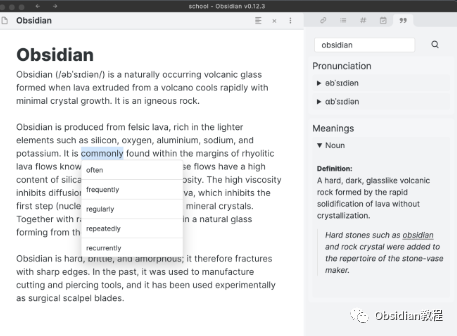
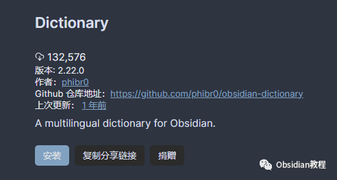
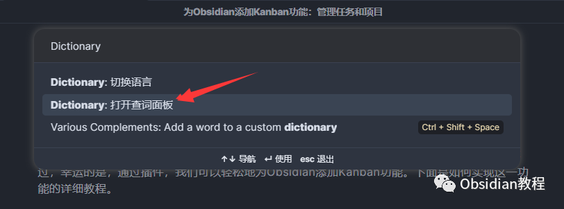
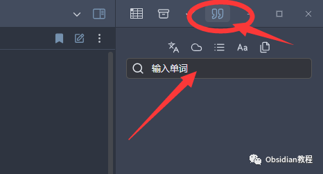
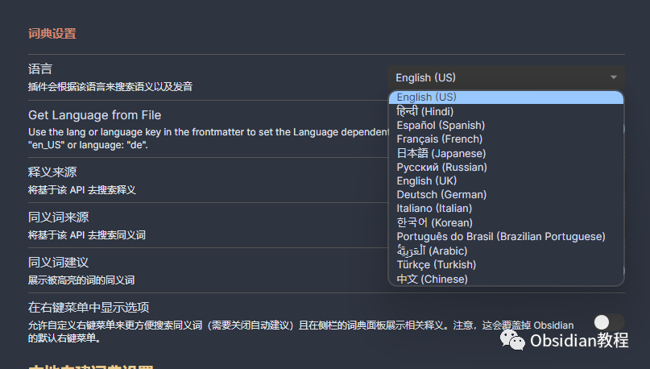
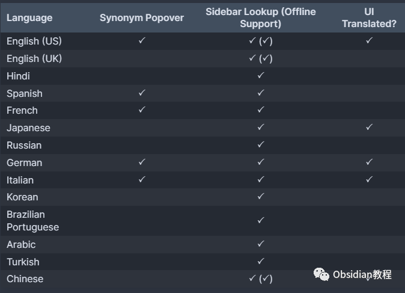
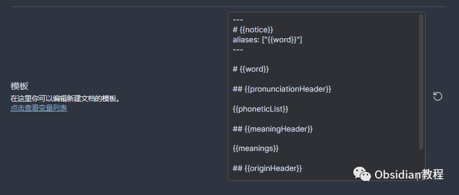

# Obsidian插件：Dictionary一款用于Obsidian软件的多语言词典插件

Obsidian Dictionary 插件为Obsidian用户提供了一种便捷的方式来查询单词定义、同义词和发音。这个插件支持多种语言，并提供侧边栏查找和弹出窗口同义词查找等功能。

#### 

1插件安装

### **1.在线安装**（需要科学上网） ：****

###   

  * ### 进入社区插件设置：在Obsidian中，打开“设置”（Settings），选择“社区插件”（Community Plugins）。

  * 禁用安全模式：点击“安全模式”（Safe Mode）旁边的切换按钮，将其关闭。  

  * 搜索并安装插件：点击“浏览”（Browse），在搜索框中输入“Obsidian Dictionary”，找到插件后点击“安装”（Install）。  

  * 启用插件：安装完成后，在社区插件列表中找到“Obsidian Dictionary”，点击旁边的切换按钮以启用插件。

**2.离线安装：****  
****因为网络原因很多同学无法直接在线安装obsidian插件，这里我已经把obsidian所有热门插件下载好了**  
只需要关注下方公众号，后台回复：**插件** 即可获取

#### 2基础使用

打开词典视图：使用快捷键 Ctrl + P 打开命令面板，搜索并运行“ Dictionary ”，词典视图会出现在Obsidian右侧边栏。  

设置默认语言：在“设置”下的“插件选项”中，找到“Obsidian Dictionary”，设置“默认语言”（Default Language）。  

#### 

3支持的语言

  * 支持情况：目前支持包括英语（美国和英国）、西班牙语、法语、德语、意大利语、日语、中文等多种语言。这些语言支持不同程度的同义词弹出窗口、侧边栏查找和用户界面翻译。

  

  * 离线支持：从2.13.0版本起，该插件为英语和中文提供了实验性的离线支持。离线词典体积较大（约35MB），首次使用时需要下载。

  

#### 4使用多种语言

  * 设置YAML Frontmatter：为了使用默认语言之外的其他语言，您可以在YAML Frontmatter中添加lang或language键值。例如，对于英语（美国），使用en-US；对于中文，使用zh。

#### 

5隐私和API

  * 第三方API：该插件依赖第三方API来查找定义和同义词。您可以在设置中选择信任的API。
  * 高级同义词搜索：启用高级同义词搜索时，会有额外的API调用以分析选定单词的上下文，从而提高同义词的准确性。

#### 6模板变量

  * 编辑笔记模板：您可以在设置中编辑本地词典的笔记模板。支持的变量包括：{{notice}}、{{word}}、{{pronunciationHeader}}、{{meaningHeader}}、{{originHeader}}、{{phoneticList}}、{{meanings}} 和 {{origin}} 等。

  

#### 7总结

Obsidian Dictionary 插件是Obsidian用户的强大工具，特别是对于那些需要频繁查找单词定义和同义词的用户。通过简单的安装和配置，它可以极大地提高您的学习和工作效率。  
  
  
1**扫码购买****《 Obsidian实战教程》****从入门到精通， 链接您的每一个思维瞬间。****  
**  
往 期精彩[1.](http://mp.weixin.qq.com/s?__biz=MzkyMDUyMDM2Mg==&mid=2247484437&idx=1&sn=56d072590a221e82421f806bd14f9d01&chksm=c190d7d0f6e75ec6a112fc672ce1daca289b70893334e5c5bbd4d406836c641ef294bbdeace2&scene=21#wechat_redirect)[Obsidian插件：Citation学术写作者的得力助手](http://mp.weixin.qq.com/s?__biz=MzkyMDUyMDM2Mg==&mid=2247484589&idx=1&sn=925c1cda10039f629ec64135cf01293b&chksm=c190d768f6e75e7e907221b8624378ff8abff315d787e51a1851ab1a1ef9b02c1cbc8b15b558&scene=21#wechat_redirect)[2.](http://mp.weixin.qq.com/s?__biz=MzkyMDUyMDM2Mg==&mid=2247484586&idx=1&sn=a5c9ebcde2fbf0e03475e0b7ca36bca4&chksm=c190d76ff6e75e791195c959219724af0611245c75ad490aa7eacd7613330a15392d3bb4b220&scene=21#wechat_redirect)[Obsidian插件：Various Complements让你的笔记体验更加流畅](http://mp.weixin.qq.com/s?__biz=MzkyMDUyMDM2Mg==&mid=2247484588&idx=1&sn=5178cf500b580690bb827800dac71299&chksm=c190d769f6e75e7fe74e7760db3c658e81ea504c8d6a9f31f0a1e7fe57972206e6285ae3a626&scene=21#wechat_redirect)3.[Obsidian 插件：使用Hider来精简你的用户界面](http://mp.weixin.qq.com/s?__biz=MzkyMDUyMDM2Mg==&mid=2247484587&idx=1&sn=4762b4fa1ee9e878f9649c385be320e6&chksm=c190d76ef6e75e78444313ca65acda9881ae76f69b4721ccca481286fc7c94286d6e6c9a3d2a&scene=21#wechat_redirect)

点分享

点点赞

点在看
