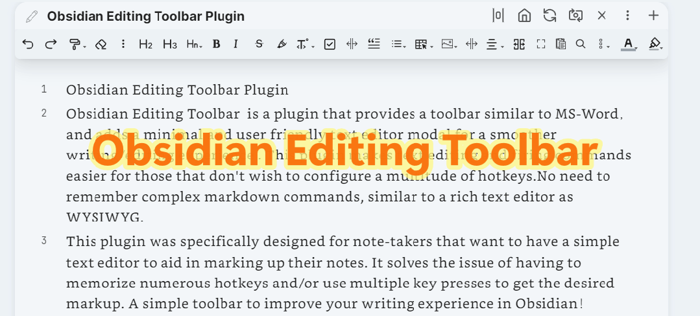
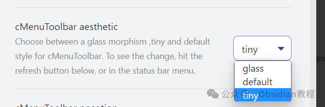
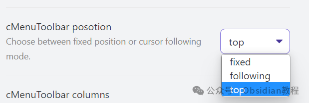
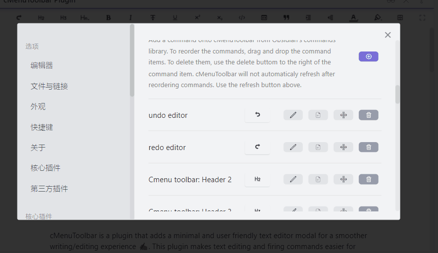
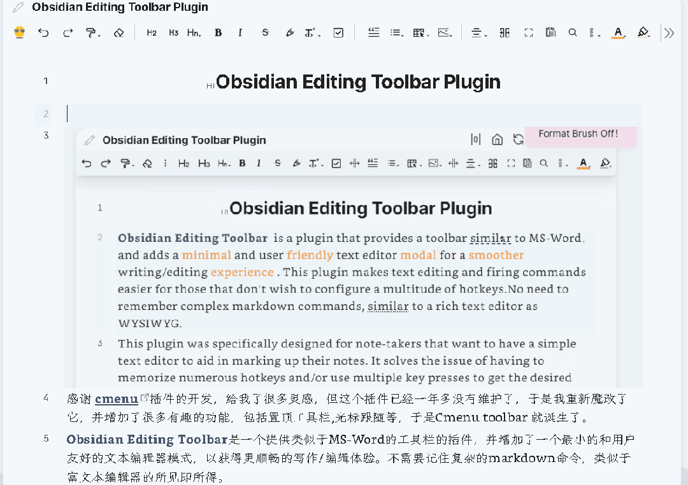
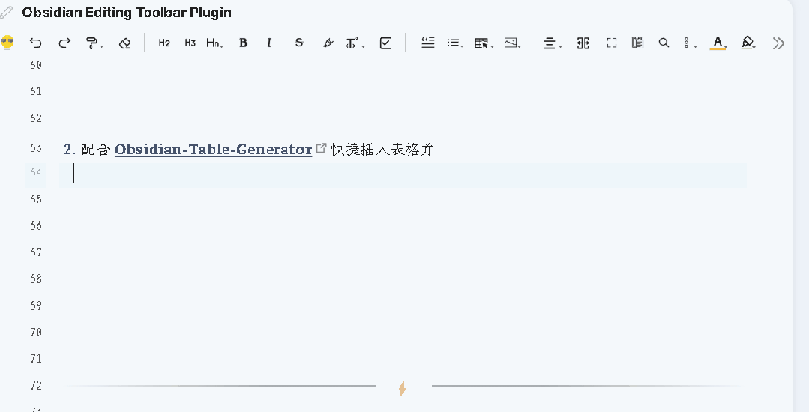

# Obsidian插件：Editing Toolbar 让笔记编辑变得更加简单和直观

今天要跟大家聊聊 Obsidian 的一个非常实用的插件——Editing Toolbar。对于那些不想记住复杂的 Markdown 命令或者大量快捷键的朋友，这个插件绝对是你们的福音。  

## **Obsidian Editing Toolbar 插件介绍**

  
Obsidian Editing Toolbar 是一个让 Obsidian 编辑体验更接近 MS-Word 的插件，同时提供了一个极简且用户友好的文本编辑模式。它解决了记住众多快捷键和多次按键才能实现所需标记的问题，让笔记编辑变得更加简单和直观。  
就像一个所见即所得（WYSIWYG）的富文本编辑器一样，这个插件让文本编辑和命令执行变得更简单。

> 这个插件的灵感来自 cmenu 插件，但 cmenu 已经有一年多没有维护了，所以我对其进行了重新修改，并添加了很多有趣的功能，包括顶部工具栏和光标跟随等，从而诞生了 Obsidian Editing Toolbar。

### 

  

### **主要功能**

####   

#### **1\. 新的工具栏样式**

  
Editing Toolbar 提供了一个类似于 MS-Word 的工具栏，让你无需记住复杂的 Markdown 命令，直接在工具栏上点击相应的按钮即可完成文本格式的编辑。  

  

#### **2\. 工具栏位置选项**

  
工具栏的位置可以自定义，你可以选择在顶部显示，也可以选择工具栏跟随光标移动。  

  

#### **3\. 多窗口、多标签支持**

  
插件适配了 Obsidian 0.14+ 版本，支持多窗口、多标签的使用。  

#### **4\. 内置命令**

  
插件内置了一些常用命令，例如：  

  * 改变字体颜色
  * 改变背景颜色
  * 缩进列表
  * 取消缩进
  * 编辑器撤销/重做
  * 插入分隔线（---）
  * 左对齐、右对齐、居中对齐、两端对齐的 HTML 代码插入
  * 全屏聚焦模式（默认快捷键 Ctrl+Shift+F11）
  * 工作区全屏聚焦模式（默认快捷键 Ctrl+F11，只隐藏左右侧边栏）
  * 1-6 级标题设置（默认快捷键 Ctrl+1, Ctrl+2,...Ctrl+6）

####   

#### **5\. 自定义命令图标和命令名称**

  
你可以自定义命令的图标和名称，添加子菜单，以及对菜单进行拖动和排序。  

#### 

  

#### **6\. 格式刷功能**

  
内置了两种格式刷功能，分别用于字体颜色和背景颜色的格式刷（中键或右键可以取消格式刷状态）。  

#### **7\. 自适应工具栏图标宽度**

  
工具栏图标宽度会根据内容进行自适应缩放。  

### **安装方法**

  
**1.在线安装**  
如何安装 Obsidian 插件，通常可以通过以下步骤进行安装：

  1. 打开 Obsidian 的设置页面。
  2. 导航到“社区插件”部分。
  3. 点击“浏览”按钮，搜索“Obsidian Editing Toolbar”。
  4. 找到插件后，点击“安装”按钮。
  5. 安装完成后，返回插件列表，启用该插件。

###   
**2.离线安装：****  
****很多同学无法直接在线安装obsidian插件，这里我已经把obsidian所有热门插件下载好了**  
只需要关注下方公众号，后台回复：**插件** 即可获取

### 

###   

  

### **与其他插件的配合使用**

  
Obsidian Editing Toolbar 插件推荐与 Enhanced Editing Plugin 一起使用，以增加更多实用的编辑命令。另外，还可以与以下插件配合使用：  

  * emoji toolbar：快速插入表情符号。

  

  * Obsidian-Table-Generator & ob-table-enhance：快速插入和编辑表格。

  
以上插件都可以从示例库中获取。  

## **总结**

  
我个人对 Obsidian Editing Toolbar 插件非常满意。它不仅简化了复杂的编辑操作，还大大提高了笔记的书写效率。  
无论你是新手还是老手，这个插件都能为你的 Obsidian 使用体验带来显著提升。赶紧去试试吧，你一定会爱上它的！

> **对obsidian感兴趣的同学，可以链接我微信：hls404 拉你进入“obsidian交流社群”。**

  
**热门推荐**  
**  
**

  * [Obsidian插件：Better Word Count统计文档的字数、字符数、句子数等](http://mp.weixin.qq.com/s?__biz=MzkyMDUyMDM2Mg==&mid=2247485865&idx=1&sn=e34c00104214d18c4fa94789ab03124a&chksm=c190da6cf6e7537a7bbdaa5be8071e072261cba86faeeeae9f1e29afe57c27150ae5a3588fa0&scene=21#wechat_redirect)  

  * [ Obsidian插件：Annotator在Obsidian中直接打开并标注PDF和EPUB文件](http://mp.weixin.qq.com/s?__biz=MzkyMDUyMDM2Mg==&mid=2247485853&idx=1&sn=10ae2c37607dd3bff27a2012e051ef77&chksm=c190da58f6e7534e2226647327b95c64331fb1cfca8127cd1cc443f1d4efd989d01ab784ad53&scene=21#wechat_redirect)  

  * [Obsidian插件：Homepage指定打开某个笔记、画布或工作区，直接进入工作状态](http://mp.weixin.qq.com/s?__biz=MzkyMDUyMDM2Mg==&mid=2247485834&idx=1&sn=e34796fff1f6ff07e51ea3ef84f4cb88&chksm=c190da4ff6e75359785cafd0797224c4f3be68781de3530ae1712ed4b28f99bcbf114ddb8162&scene=21#wechat_redirect)

