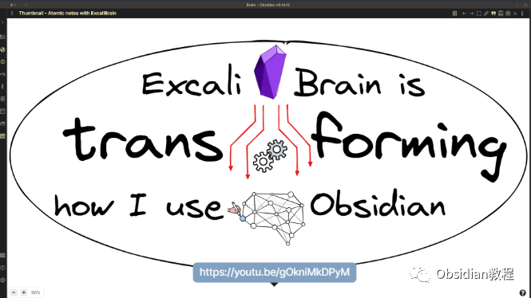
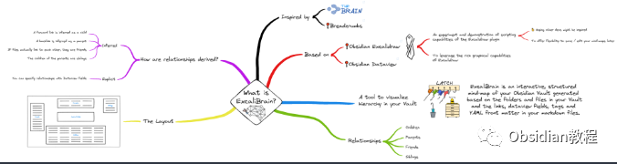

# Obsidian插件：ExcaliBrain丰富您的知识管理体验

Obsidian 作为一款功能丰富的知识管理工具，通过其强大的插件系统提供了无限的扩展可能。  
ExcaliBrain 插件就是这样一款能够极大丰富您的知识管理体验的插件。  

接下来的内容将详细介绍如何在 Obsidian 中使用 ExcaliBrain 插件，包括安装步骤、基本配置、实际使用方法以及与其他插件的协同工作方式。

## 

1ExcaliBrain 插件概述

ExcaliBrain 插件灵感来源于 TheBrain 和 Breadcrumbs，主要功能是在您的 Obsidian Vault（库）中创建一个交互式、结构化的思维导图。  
这个导图是基于您的 Markdown 文件中的链接、Dataview 字段、标签和 YAML 前置元数据生成的。  

### **ExcaliBrain 的关键特性**

  
识别五种笔记间关系：  

  * 子节点（Children）
  * 父节点（Parents）
  * 朋友节点（Friends）
  * 其他朋友（Other Friends，横向关系）
  * 兄弟节点（Siblings）

  
关系推导逻辑：  

  * 通过 Dataview 字段显式定义的关系。
  * 未使用 Dataview 字段的推断关系，例如前向链接推断为子节点，反向链接推断为父节点。

  

### **必备前置插件**

  
ExcaliBrain 基于 Dataview 和 Excalidraw 插件构建，因此在使用 ExcaliBrain 之前，需要先安装这两个插件。  

## 2安装 ExcaliBrain 插件

### **禁用安全模式：** 在 Obsidian 的“设置/社区插件”中，禁用“安全模式”（请注意阅读安全警告）。  
**安装 Dataview 和 Excalidraw：**

### ****  
**安装 ExcaliBrain：****  
****因为网络原因很多同学无法直接在线安装obsidian插件，这里我已经把obsidian所有热门插件下载好了**  
只需要关注下方公众号，后台回复：**插件** 即可获取  
**配置插件：**  
根据个人需求对 ExcaliBrain 进行配置，确保其能正确解析您的 Markdown 文件。

## 

3ExcaliBrain 插件的使用

**建立和管理笔记间的关系：**  

  * 在笔记中使用 Dataview 字段来明确指定笔记间的关系。
  * 通过 ExcaliBrain 生成的思维导图来查看和理解这些关系。

  

**利用思维导图进行知识管理：****  
**

  * ExcaliBrain 提供的导图是交互式的，您可以通过点击导图上的节点来查看相关联的笔记。
  * 这帮助您更加直观地理解和管理知识结构。

**与 Hover Editor 插件的结合：**  
结合使用 Hover Editor，可以在不离开当前笔记的情况下快速浏览和编辑其他笔记，提高工作效率。

## 

4遇到问题时如何寻求帮助

**观看教程视频：**  
在 YouTube 上寻找关于 ExcaliBrain 的教程视频，这些视频通常提供实用的操作演示。  
  
**访问 GitHub 页面：**  
对于遇到的问题、想法或需要报告的漏洞，请访问 ExcaliBrain 在 GitHub 上的页面进行反馈。

## 

5总结

ExcaliBrain 插件为 Obsidian 用户提供了一个强大的视觉化工具，通过将笔记以思维导图的形式展现出来，极大地丰富了用户的知识管理体验。  
结合 Dataview 和 Excalidraw 的功能，ExcaliBrain 不仅能够提供复杂的知识结构可视化，还能够增强用户对于笔记间关系的理解和操作。无论您是初学者还是资深用户，ExcaliBrain 都能成为您在 Obsidian 知识管理旅程中不可或缺的工具。  
随着知识库的不断扩大，ExcaliBrain 能够帮助您更加有效地组织和浏览信息，确保您的知识管理过程既高效又有趣。  
通过上述教程的指导，您可以轻松地安装、配置和开始使用 ExcaliBrain 插件，开启您在 Obsidian 中更富有创造性和洞察力的知识管理之旅。  
  
  
1**扫码购买****《 Obsidian实战教程》****从入门到精通， 链接您的每一个思维瞬间。****  
**

