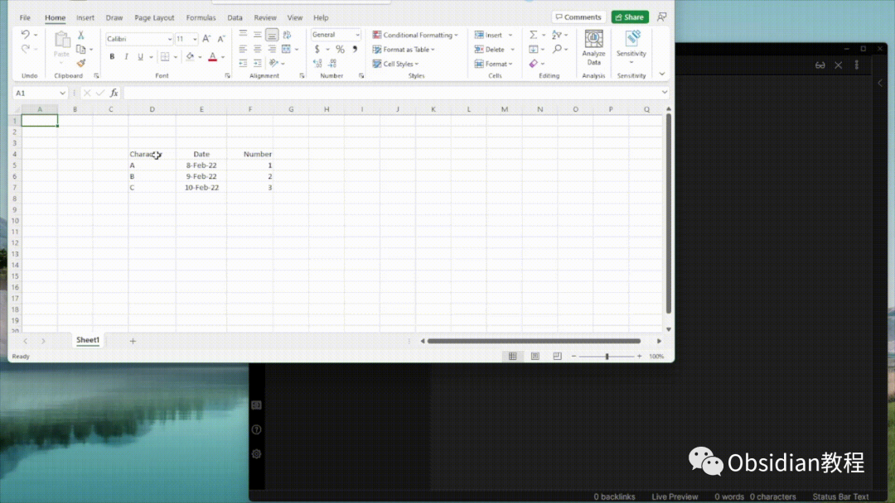
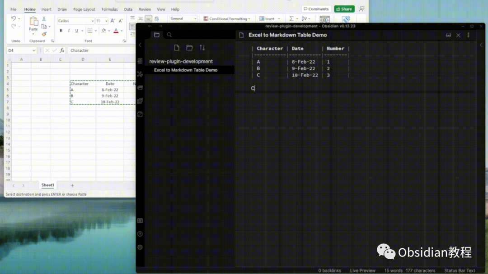
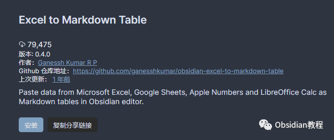

# Obsidian插件：Excel to Markdown Table将表格数据转换成Markdown格式

今天我们来聊一聊一个非常实用的插件——“Excel to Markdown Table”。这个插件能帮你轻松地把Excel、Google Sheets、Apple Numbers、LibreOffice Calc等表格软件中的数据转换为Markdown表格，并直接粘贴到Obsidian中。对于日常需要整理和记录数据的人来说，这简直是一个效率神器。

### 插件功能与特点

“Excel to Markdown Table”插件的主要功能就是将表格数据转换成Markdown格式。无论你是处理简单的两列数据，还是复杂的多列表格，它都能让你快速把数据搬到Obsidian中，并且格式整洁、易于管理。下面我们来看看它支持的几种操作方式：

#### 多种粘贴方式

  1. **普通粘贴** ：直接使用 Ctrl/Cmd + V 粘贴，就像你平常复制粘贴任何内容一样。这种方式适用于粘贴两列或多列的表格数据。

  2. **热键粘贴** ：按下 Ctrl/Cmd + Alt + V 进行粘贴，这个方式专门用于粘贴只有一列的表格。如果你希望使用自己习惯的热键，也可以在设置中重新定义。

  3. **命令面板** ：你可以通过 Ctrl/Cmd + P 打开命令面板，然后选择“Excel to Markdown”，同样适用于单列表格的粘贴操作。

这三种粘贴方式非常灵活，可以根据你自己的需要来选择最合适的方法。

### 插件安装教程

#### 在线安装

  1. 在Obsidian中，进入设置，点击“社区插件”部分。
  2. 点击“浏览”按钮，进入插件市场，搜索“Excel to Markdown Table”。
  3. 点击安装，安装完成后，返回插件列表，点击启用即可。

#### 离线安装

如果由于网络问题你无法在线安装插件，不用担心。我已经为大家准备好了常用的Obsidian插件，点击下方公众号，回复关键字：**Obsidian** ，获取Obsidian资料合集。

### 使用教程

#### 基本操作

  1. **复制数据** ：首先，在你的表格软件中（例如Excel或Google Sheets）选中要复制的数据，然后复制到剪贴板。
  2. **选择粘贴方式** ：根据你需要的格式，选择上述的任意一种粘贴方式。
  3. **粘贴到Obsidian** ：在Obsidian的编辑器中进行粘贴，你会看到表格内容被自动转换为Markdown格式，并按表格的形式出现在你的笔记中。

#### 高级操作

  * **自定义热键** ：如果默认的热键不适合你，可以去Obsidian的设置里调整热键，符合你自己的使用习惯。
  * **格式调整** ：虽然插件会自动将数据转换为Markdown格式，但你依然可以手动调整表格的内容，比如添加表头、调整列宽等，以便更好地融入到你的笔记系统中。

### 实际应用场景

这个插件非常适合在以下几个场景中使用：

  1. **会议记录** ：在会议中，我们经常需要记录大量的数据信息，使用Excel或Google Sheets可以快速整理这些数据，之后通过这个插件将它们转换成Markdown表格，方便后期整理和回顾。

  2. **数据整理** ：如果你是做数据分析的，经常需要整理大量的数据，使用这个插件能够迅速将这些信息转化为便于查看和分析的Markdown格式，减少了手动输入的繁琐。

  3. **学习笔记** ：在学习过程中，很多资料和统计数据需要整理成表格。这时，Excel到Markdown的转换插件能够帮助你清晰地将这些内容保存在笔记中。

### 插件的优势与不足

#### 优势

  * **提高效率** ：将表格数据快速转换成Markdown格式，避免了手动输入的繁琐，节省了大量的时间。
  * **格式统一** ：使用Markdown格式后的表格更加简洁、清晰，易于阅读和维护，尤其对于喜欢整洁格式的用户来说，简直是一个福音。
  * **灵活性高** ：支持多种粘贴方式，能够满足不同用户的需求，无论是简单粘贴还是通过热键快速操作，都很方便。

#### 不足

  * **格式限制** ：对于非常复杂的表格，或者有特殊格式要求的表格，插件的转换效果可能会受到限制，无法完美地处理所有情况。
  * **依赖剪贴板** ：必须先将数据复制到剪贴板中，这对于某些用户来说可能不够便捷，尤其在需要处理大量表格的情况下。

### 结语

总体来说，“Excel to Markdown Table”插件是一个极大提升Obsidian使用体验的工具，尤其适用于那些需要整理大量数据的用户。无论是会议记录、数据整理还是学习笔记，这个插件都能够帮助你轻松应对。

如果你还没有尝试过这个插件，那么现在就去安装它吧！相信它能够帮助你更加高效地管理笔记和项目，提升你的工作和学习效率。

希望今天的分享对你有帮助，别忘了留言告诉我你的使用感受哦！我们下次再见！

### 点击下方公众号，回复关键字：**Obsidian** ，获取Obsidian资料合集。

****-END****-****

**ok，今天先说到这，如果你想更深入的了解Obsidian，现在只要购买我们的《Obsidian实操案例课》，便可免费加入「玩转效率笔记」社群，与一群人交流效率提升的经验，实现自我管理的目标。** 如果你对Obsidian有热情，这个课程绝对不容错过！
