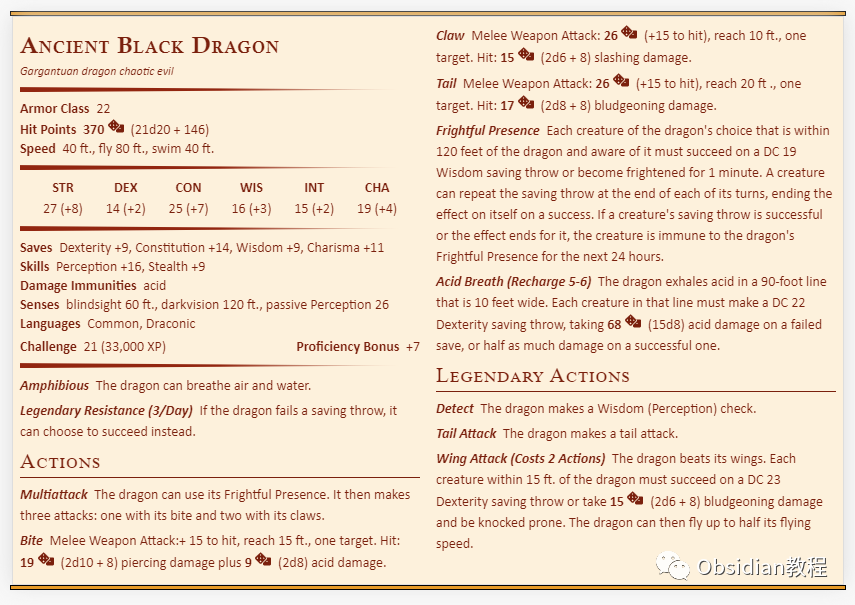
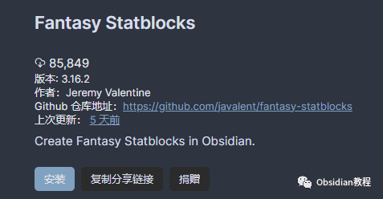
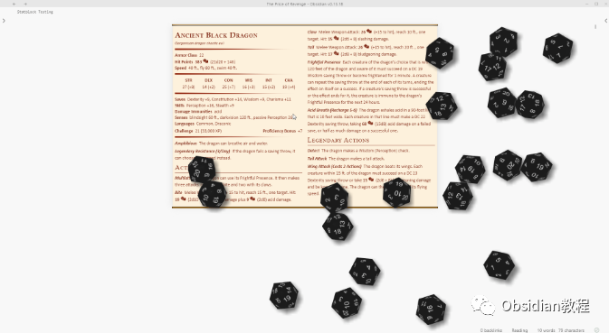
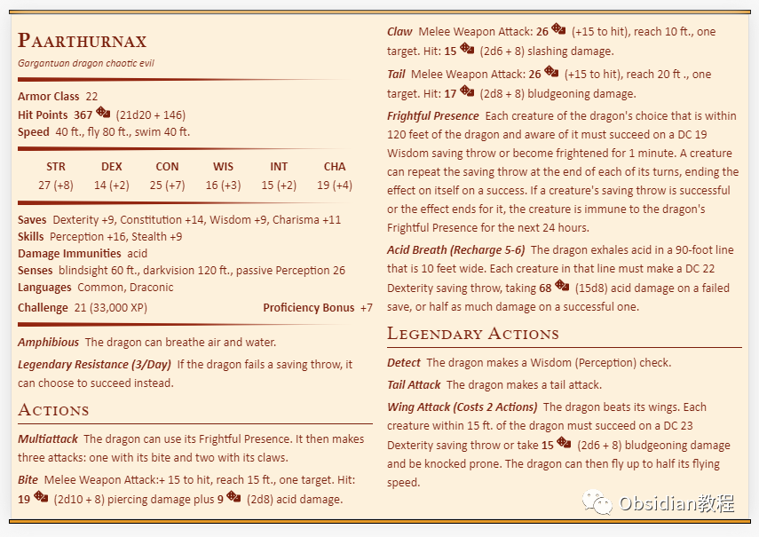
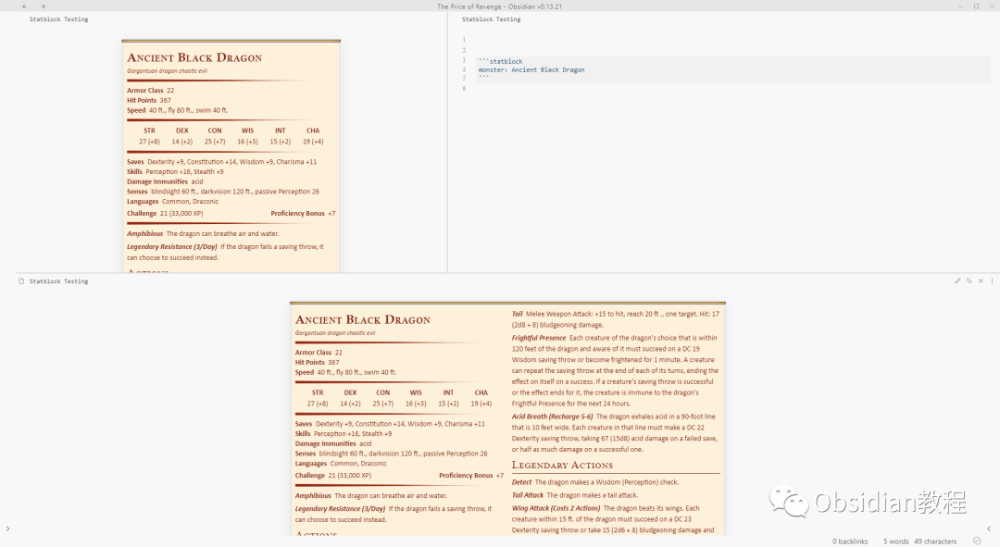

# Obsidian插件：Fantasy Statblocks 在 Obsidian 中创建、管理和查看幻想生物图鉴

Fantasy Statblocks 是一款用于在 Obsidian 中创建、管理和查看幻想生物图鉴的插件。  
这个插件提供了丰富的功能，包括自定义生物属性、集成骰子滚动插件以及导出PNG等。下面我将详细介绍这个插件的安装、使用方法以及高级功能。  

### 1安装方法

### **1.在线安装**（需要科学上网） ：****

### ****  
****

### 点击“社区插件”下的“浏览”按钮，在左上角的搜索框中搜索“ Fantasy Statblocks”，然后点击“安装”按钮。

###   
启用插件：安装成功后，点击“启用”以启用插件。  

  
**2.离线安装：****  
****因为网络原因很多同学无法直接在线安装obsidian插件，这里我已经把obsidian所有热门插件下载好了**  
只需要关注下方公众号，后台回复：**插件** 即可获取

  

### 

### 2使用方法

  
定义生物属性: 使用以下语法在笔记中定义一个生物属性块（statblock）。
      
      *   * 
    
    
    
    monster: <SRD/自创怪物名称>...

所有字段都是可选的，未提供的字段将不会被渲染。  
集成骰子滚动插件: 如果你安装并启用了骰子滚动插件（Dice Roller plugin），你可以在生物属性块中集成骰子滚动功能。
      
      *   * 
    
    
    
    dice: true...

  

覆盖和扩展字段: 你可以通过在生物属性块中组合使用 monster 字段与其他字段来覆盖或扩展特定的SRD怪物属性。例如：
      
      *   *   *   *   * 
    
    
    
    monster: Ancient Black Dragonname: Paarthurnaxtraits+:  - name: Appended Trait    desc: This trait will be appended to the existing traits list.

  

使用图片: 可以使用 image 参数在生物属性块中添加图片，该图片应位于你的保险库中。
      
      *   * 
    
    
    
    image: [[链接到图片的Wikilink]]...

  

自定义 CSS: 你可以使用 CSS 代码片段来自定义生成的生物属性块的样式。

### 

3高级功能

自定义布局: 从 Fantasy Statblocks v2.0.0 开始，你可以在设置中创建自定义布局。你可以添加、管理布局块以及使用 JavaScript 回调来解析怪物属性。  
自定义骰子滚动: 你可以为特定的属性块启用骰子滚动解析，甚至提供自定义的 JavaScript 回调函数来确定如何解析骰子滚动字符串。  

导出为 PNG: 插件提供了一个选项，允许将渲染的生物属性块导出为 PNG 文件。  
集成其他插件: 你可以在其他支持 JavaScript 的插件中，如 Dataview、Templater 或 CustomJS，编程方式访问生物图鉴。  
导入和创建生物: 你可以通过多种方式向生物图鉴中添加自定义怪物，包括在笔记的前言中创建、直接在设置中创建或者从各种常见来源导入。  
自动解析笔记: 插件可以自动解析指定文件夹中的文件来查找并添加怪物到图鉴。  

### 4实际应用示例

假设你想创建一个“古代黑龙”的生物属性块，并想将其加入到你的生物图鉴中。你可以按照以下步骤操作：  
在一个新笔记中写下以下代码块：
      
      *   *   *   *   * 
    
    
    
    image: [[Ancient Black Dragon.jpg]]name: Ancient Black Dragonsize: Gargantuantype: dragon...

  

  * 配置生物的各种属性，如 AC（护甲等级）、HP（生命值）、速度、语言等。
  * 如果需要，通过 traits, actions, reactions 等字段添加特质、行动和反应。
  * 保存并关闭笔记。在笔记渲染出的生物属性块中，点击右上角的菜单图标，并选择“保存到图鉴”。
  * 完成后，这个生物将被添加到你的生物图鉴中，可供以后引用和使用。

通过以上步骤，你不仅能够创建一个详尽的生物属性块，还可以将其永久保存在你的生物图鉴中。  
这样做可以极大地提升你在 Obsidian 中进行幻想世界构建或角色扮演游戏准备的效率和乐趣。  
  
  
1******扫码购买****《 Obsidian实战教程》****从入门到精通， 链接您的每一个思维瞬间。**  

