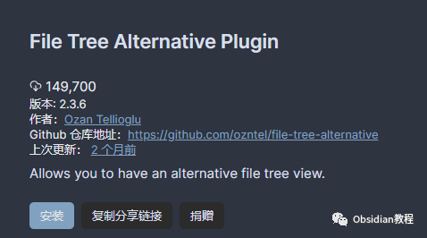
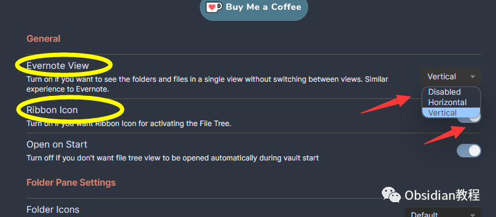
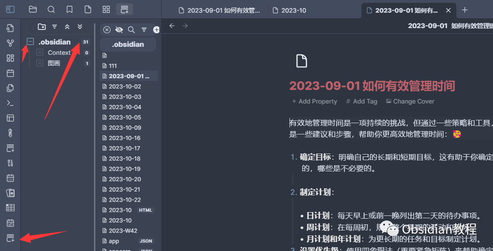
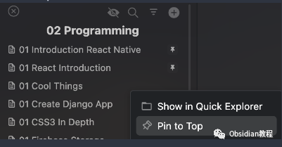

# Obsidian插件：File Tree Alternative Plugin，高效文件树管理体验

点击下方公众号，回复关键字：**Obsidian** ，获取Obsidian资料合集。  
Obsidian 作为一款高效的知识管理工具，其默认的文件浏览器将所有文件和文件夹展示在单一视图中。  
而 File Tree Alternative 插件为我们提供了一个新的视角，它使得我们能够分开查看文件和文件夹，为信息组织和检索提供更多可能。  
下面，我们将深入探讨如何安装和使用 File Tree Alternative 插件，以及如何利用它优化你的知识管理体验。  

## 1前期准备

要使用这个插件，我们首先需要在Obsidian中安装它。安装过程非常简单直接：

### **  
**

### **1.在线安装**（需要科学上网） ：****

  
1.在Obsidian的设置中，找到“第三方插件”选项，点击“社区插件”2.在搜索框中输入“File Tree Alternative”，找到并安装它。3.安装完成后，激活该插件，在成功安装插件后，我们需要对其进行简单的配置，以符合我们的需求。  

**2.离线安装：****  
****因为网络原因很多同学无法直接在线安装obsidian插件，这里我已经把obsidian所有热门插件下载好了**  
只需要关注下方公众号，后台回复：**插件** 即可获取

## **步骤二：配置插件设置**

  
在安装插件后，需要对其进行基本的配置以满足你的个性需求。  
**通用设置：****  
**

  * 选择 Evernote 视图，以同时查看文件和文件夹，或关闭此视图以分开查看。 你可以选择水平或垂直拆分视图。
  * 如果不小心关闭了插件视图，可以通过点击 Ribbon Icon 来重新激活。

**文件夹面板特性：**  

  * 你可以看到每个文件夹下的笔记数量。双击文件夹名称或使用右键菜单可以聚焦到特定的文件夹，再次双击则会返回上一级。
  * 插件会记住上次展开的文件夹和聚焦状态，方便你下次快速定位。
  * 自定义文件夹图标，展开/折叠所有文件夹功能也很实用。

**文件列表面板特性：****  
**

  * 插件列出所有文件，包括子文件夹下的文件。 你可以选择只显示选中文件夹下的文件。
  * 将喜爱的文件固定到列表顶部，方便快速访问。

  * 星标你的文件，或将外部文件拖放到文件列表中以添加到当前活动文件夹路径。
  * 开启搜索功能，通过文件名快速过滤文件，使用 all: 和 tag: 语法在搜索框中执行全局搜索或标签搜索。

  
**样式设置：****  
**插件支持自定义样式设置，你可以通过安装 Style Settings 插件来自定义大小、颜色等。

##   

## **步骤三：高效使用 File Tree Alternative 插件**

  
理解插件布局：

  * 探索插件的不同视图和功能，熟悉它如何帮助你更好地组织和查找文件。

  
定制你的文件树：

  * 根据你的需求定制文件夹图标，设定你想要排除的文件夹和文件类型，优化你的文件树结构。  

  
利用搜索和排序功能：

  * 快速定位和排序你的文件，节省更多时间用于内容创作和知识整理。

  
持续关注插件更新：

  * 插件作者会定期更新插件，通过 [更新发布页面](Release Updates) 查看每个版本的详情和新特性。

  
File Tree Alternative 插件是一个强大的文件树管理工具，通过合理的配置和使用，它能够极大地提升你在 Obsidian 中的信息组织和检索效率。  
  
  
1**扫码购买****《 Obsidian实战教程》****从入门到精通， 链接您的每一个思维瞬间。****  
**  
往 期精彩[1.Obsidian 插件:Make.md赋能创作者的终极体验](http://mp.weixin.qq.com/s?__biz=MzkyMDUyMDM2Mg==&mid=2247484437&idx=1&sn=56d072590a221e82421f806bd14f9d01&chksm=c190d7d0f6e75ec6a112fc672ce1daca289b70893334e5c5bbd4d406836c641ef294bbdeace2&scene=21#wechat_redirect)[2.Obsidian插件:让链接插入更加灵活的 Paste URL into selection](http://mp.weixin.qq.com/s?__biz=MzkyMDUyMDM2Mg==&mid=2247484436&idx=1&sn=7176e8eba90c95d2ebe936d98f82e937&chksm=c190d7d1f6e75ec76c4a41782639e3f49d415b8aa40c8ad7b58106ff17ab3ddb358dfd208275&scene=21#wechat_redirect)  
[3.Obsidian插件:Note Refactor 在 Obsidian 中轻松地提取选定部分的笔记到新的笔记中。](http://mp.weixin.qq.com/s?__biz=MzkyMDUyMDM2Mg==&mid=2247484435&idx=1&sn=c4ecdb98cdcd329ab4a18c9571818096&chksm=c190d7d6f6e75ec00580be3a0b5014ab489ba49b1905a5299a9bf14c2cbdc75eb2d6d83bea57&scene=21#wechat_redirect)  

点分享

点点赞

点在看

  

