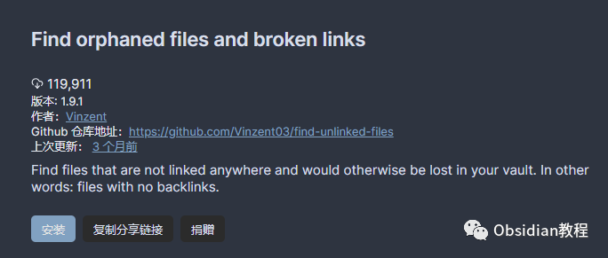

# Obsidian插件：Find orphaned files and broken links提高你的笔记管理效率

“Find orphaned files and broken links”插件是一款专为Obsidian设计的工具，用于帮助用户找出库中的孤立文件、损坏的链接以及空白文件。  
这个插件能够提高你的笔记管理效率，确保你的笔记库保持整洁有序。本文将详细介绍该插件的工作原理、使用方法、附加功能以及兼容性。

### 

1插件功能概述

#### **1.1 发现孤立文件**

  
该插件会检查整个库，寻找没有任何反向链接的文件。这些文件被认为是孤立的，因为它们在库中没有任何引用。  

#### **1.2 发现损坏的链接**

  
插件会创建一个包含损坏链接的文件列表。这些损坏的链接是指尚未创建的链接文件。  

#### **1.3 发现空白文件**

  
此外，插件还能识别出内容为空的文件，即使这些文件只包含前端数据（Frontmatter）。

### 

2  
使用方法

  * 执行命令“Find orphaned files”，插件将在库的根目录创建一个名为“Find orphaned files plugin output.md”的文件，并在新面板中打开该文件。

### 

3 插件安装步骤

**禁用安全模式：** 在 Obsidian 的“设置/社区插件”中，禁用“安全模式”（请注意阅读安全警告）。  
**安装插件：**  

### **1.在线安装**（需要科学上网） ：****

### ****  
****

### 点击“社区插件”下的“浏览”按钮，在左上角的搜索框中搜索“ Find orphaned files and broken links”，然后点击“安装”按钮。

###   
启用插件：安装成功后，点击“启用”以启用插件。  

  
**2.离线安装：****  
****因为网络原因很多同学无法直接在线安装obsidian插件，这里我已经把obsidian所有热门插件下载好了**  
只需要关注下方公众号，后台回复：**插件** 即可获取

  

### 4附加功能

#### **4.1 自定义忽略设置**

**  
**

  * 忽略特定文件：用户可以设置插件忽略特定的文件。
  * 忽略特定目录：用户可以选择忽略库中的特定目录。
  * 忽略带有特定标签的文件：可以设置插件忽略带有某些特定标签的文件。
  * 忽略含有特定链接的文件：用户可以设置忽略那些包含特定链接的文件。
  * 忽略特定文件类型：允许用户设置忽略特定类型的文件。

####   

#### **4.2 自定义输出文件名称**

  
用户可以自定义插件输出文件的名称。

####   

#### **4.3 自动移动特定扩展名文件到系统回收站**

####   

#### 该功能会检查输出文件中的每个链接。如果链接的扩展名在设置中的列表里，它会将文件移动到系统回收站。这对于删除许多未使用的媒体文件非常有用。

请注意，“禁用有效链接”设置需要被禁用。

### 

5兼容性

自定义插件只适用于Obsidian v0.9.7及更高版本。  

### 6结论

“Find orphaned files and broken links”插件是Obsidian用户管理笔记库的强大工具。它通过自动识别孤立文件、损坏的链接和空白文件，帮助用户保持笔记库的整洁和有序。通过其附加的定制功能，用户可以根据自己的需求调整插件的行为，更有效地管理他们的笔记内容。  
对于任何希望提高笔记库组织效率的Obsidian用户来说，这个插件都是一个值得尝试的有用工具。  
  
  
1**扫码购买****《 Obsidian实战教程》****从入门到精通， 链接您的每一个思维瞬间。****  
**

