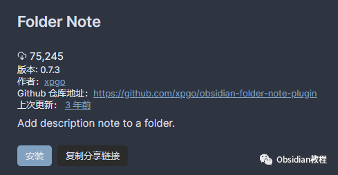

# Obsidian插件：Folder Note使Obsidian保险库形成一个层级化的笔记系统

Obsidian的Folder Note插件为用户提供了一种在文件夹中添加和管理笔记的功能，使得Obsidian的保险库能够形成一个层级化的笔记系统。  
这款插件不仅增强了文件夹的功能，还使得用户能够以更直观、更有组织的方式浏览和管理笔记。  

以下是关于Folder Note插件的详细介绍。  

### **插件的主要特点**

  

  * 简便地显示和管理文件夹笔记：通过点击文件夹就能轻松访问或删除对应的笔记。
  * 支持三种不同的文件夹笔记方法：包括Inside-Folder、Outside-Folder和Index-File。
  * 自动同步文件夹和文件夹笔记名称：插件会尝试保持文件夹名称和对应笔记名称的同步。
  * 自定义初始文件夹笔记内容：用户可以配置新文件夹笔记的初始内容。
  * 卡片和条形样式视图：提供优雅的文件夹内容概览。
  * ccard代码块：用于创建文件夹概览的优雅视图。

### 

1Folder Note插件的安装和设置

### **1.在线安装**（需要科学上网） ：****

### ****  
****

### 点击“社区插件”下的“浏览”按钮，在左上角的搜索框中搜索“ Folder Note”，然后点击“安装”按钮。

###   
启用插件：安装成功后，点击“启用”以启用插件。  

  
**2.离线安装：****  
****因为网络原因很多同学无法直接在线安装obsidian插件，这里我已经把obsidian所有热门插件下载好了**  
只需要关注下方公众号，后台回复：**插件** 即可获取

  

**配置插件：****  
**

  * 在设置面板中配置笔记文件方法、文件名和初始模板。
  * 设置文件夹笔记的隐藏/显示选项。
  * 配置是否自动重命名文件夹和文件夹笔记以保持同步。

### 

2插件功能

#### **创建和管理文件夹笔记**

**  
**

  * 添加描述性笔记：在文件资源管理器面板中CTRL+点击一个文件夹，即可添加描述性笔记。
  * 显示描述性笔记：点击文件夹即可显示其描述性笔记。
  * 删除描述性笔记：直接删除打开的笔记文件即可。

####   

#### **文件夹笔记的方法**

**  
**

  * 文件夹内部（Inside-Folder）：描述性笔记将放置在文件夹内部。
  * 文件夹外部（Outside-Folder）：描述性笔记将放置在文件夹外部。
  * 索引文件（Index-File）：使用特定的索引文件作为文件夹的描述性笔记。

####   

#### **自定义初始内容**

**  
**

  * 初始内容模板：可以使用特定关键字（如{{FOLDER_NAME}}）来设置新文件夹笔记的初始内容。
  * 卡片和条带样式视图：支持通过ccard代码块生成优雅的文件夹内容概览视图。

### 

  

3使用方法和技巧

  
**生成文件夹概览：****  
**

  * 插件能够自动生成用于显示文件夹概览的ccard代码块。
  * 您可以在设置页面的初始文件夹笔记模板中使用ccard代码块，或使用关键字（如{{FOLDER_BRIEF}}）生成代码块。

**  
****快捷命令：****  
**

  * 使用Ctrl+P打开Obsidian的命令面板，使用插件的命令如“插入文件夹概览”。

  
**高级配置：****  
**

  * 如果您想配置ccard代码块的内容和外观，请参考ccard语法说明。
  * 您可以配置样式、列数、图片前缀、文件夹路径、仅限笔记、最大概述长度等。

###   

### **插件的优点和局限性**

  

  * 优点：Folder Note插件使得管理和概览文件夹内容更加直观和高效，特别是对于含有大量文件和笔记的文件夹。
  * 局限性：文件夹笔记可能在创建时显示，需要再次点击以隐藏。如果遇到任何问题或需要改进，可以在GitHub仓库留言。

### 

4结论

Folder Note插件为Obsidian用户提供了一个强大的工具，用于将文件夹转换成层级化的笔记系统，并以优雅的方式展示文件夹内容。它适用于需要组织大量笔记或项目的用户，提高了文件夹管理的效率和可视化程度。  
通过本文的介绍，您应该能够顺利安装并有效使用Folder Note插件，无论是作为个人知识管理还是团队协作的一部分。  
  
  
1******扫码购买****《 Obsidian实战教程》****从入门到精通， 链接您的每一个思维瞬间。**  

