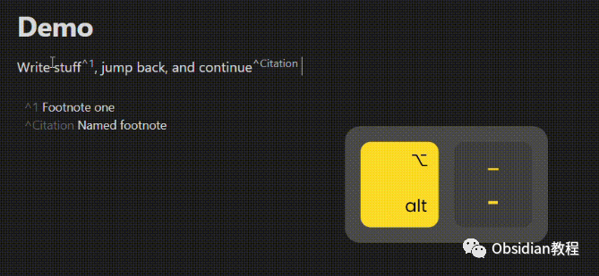
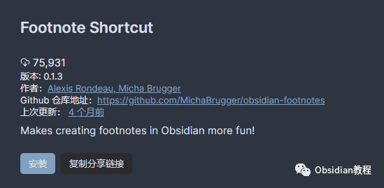
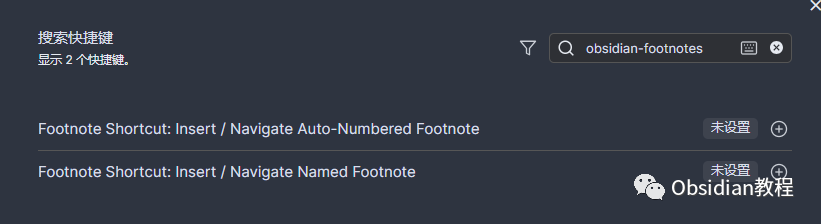
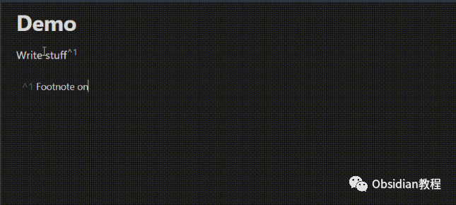
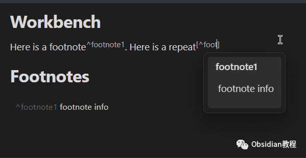
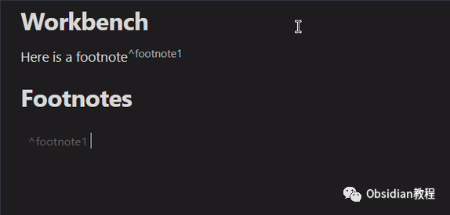

# Obsidian插件：Footnote Shortcut提高笔记制作效率

Obsidian的Footnote Shortcut插件，是一款用于提高笔记制作效率的工具，特别适合需要频繁使用脚注的用户。  

本文将详细讲解该插件的安装、功能、使用方法及相关技巧。

### 

1Footnote Shortcut插件的安装

### **1.在线安装**（需要科学上网） ：****

### ****  
****

### 点击“社区插件”下的“浏览”按钮，在左上角的搜索框中搜索“ Footnote Shortcut”，然后点击“安装”按钮。

###   
启用插件：安装成功后，点击“启用”以启用插件。  

  
**2.离线安装：****  
****因为网络原因很多同学无法直接在线安装obsidian插件，这里我已经把obsidian所有热门插件下载好了**  
只需要关注下方公众号，后台回复：**插件** 即可获取

  
安装并激活插件后，需要设置热键。在“设置” -> “热键”中搜索“Footnote”，然后自定义命令的热键。  
  

### 设置热键

  * 自动编号脚注热键：比如可以设置为Alt+0。
  * 命名脚注热键：例如设置为Alt+-。

  

### 2插件功能详解

#### **数字编号脚注**

**  
**

  * 场景1：没有现有编号脚注：
    * 当你的光标在需要添加脚注的地方（例如：Foo bar baz▊）时，按下自动编号脚注热键。
    * 插件会在光标位置插入一个新的脚注标记（例如：Foo bar baz[^1]）。
    * 同时，在文档的最后一行添加一个脚注详情标记（例如：[^1]: ），并将光标移至该标记之后（例如：[^1]: ▊）。

  * 场景2：已存在编号脚注：
    * 如果文本中已有一个或多个编号脚注，当你的光标在需要添加脚注的位置时（例如：Foo bar[^1] baz▊），按下自动编号脚注热键。
    * 插件会在光标位置插入下一个编号的脚注标记（例如：Foo bar[^1] baz[^2]）。

    * 同时，添加一个新的脚注详情标记（例如：[^2]: ），并将光标移至该标记之后（例如：[^2]: ▊）。

####   

#### **命名脚注**

  

  * 添加命名脚注：
    * 当光标在你想要添加命名脚注的位置时（例如：Foo bar baz▊），按下命名脚注热键。
    * 插件会在光标位置插入一个空的脚注标记（例如：Foo bar baz[^▊]）。
    * 输入你想要的名字（例如：Foo bar baz[^customName]），再次按下命名脚注热键。
    * 一个匹配的脚注详情标记（例如：[^customName]: ）会被添加到文档最后一行，光标随后移至该标记之后（例如：[^customName]: ▊）。

####   

#### **跳转功能**

**  
**

  * 跳转到脚注详情：当你在一个脚注详情行上时（例如：[^1]: ▊），按下任一脚注热键，光标会跳转到文本中这个脚注的首次出现位置（例如：[^1]▊）。
  * 返回到脚注位置：当你在一个脚注旁边时（例如：[^1]▊），按下任一脚注热键，光标会跳转到这个脚注的详情行（例如：[^1]: ▊）。

  

### 3使用技巧和最佳实践

  * 提高效率：使用Footnote Shortcut插件可以大大节省添加脚注的时间，特别是在需要频繁添加脚注的情况下。
  * 整理脚注：该插件可以帮助用户更好地管理和组织文档中的脚注，尤其是在长文档中。
  * 自定义设置：用户可以根据个人喜好调整热键设置，以便更加高效地使用该插件。

### 

4常见问题及解决方案

  * 热键不响应：请检查是否正确设置了热键，并确保没有与其他插件或Obsidian默认热键冲突。
  * 脚注添加错误：如果脚注编号或详情添加不正确，请检查是否有其他插件影响了Footnote Shortcut的工作。
  * 功能不全：如遇到某些功能不工作的情况，请尝试重新安装插件或检查插件设置。

### 

5结论

Footnote Shortcut插件为Obsidian用户提供了一个高效便捷的脚注管理工具。无论是学术写作、笔记整理还是日常记录，这款插件都能显著提升工作效率和体验。  
通过本文的介绍，您应该能够充分理解并有效地使用Footnote Shortcut插件，从而在Obsidian中更加轻松地处理脚注相关任务。  
  
  
1******扫码购买****《 Obsidian实战教程》****从入门到精通， 链接您的每一个思维瞬间。**  

