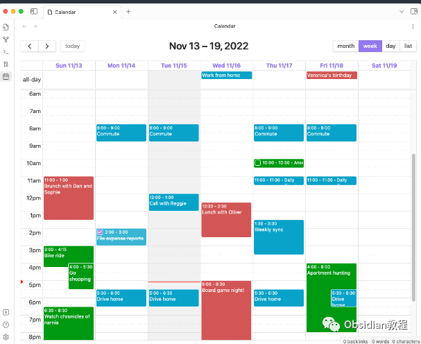
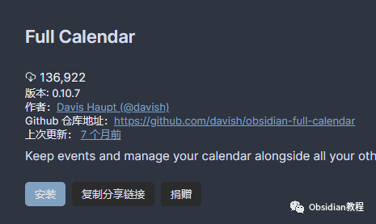
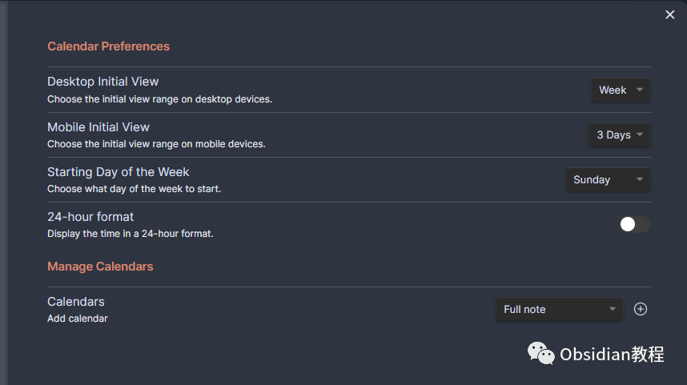
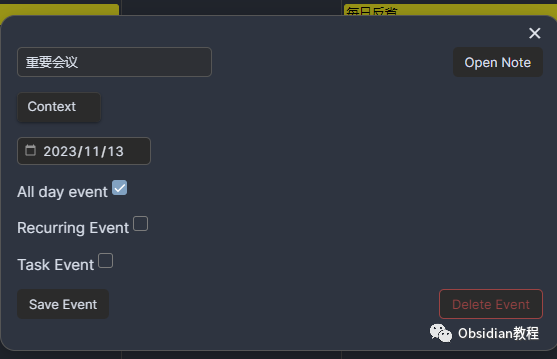
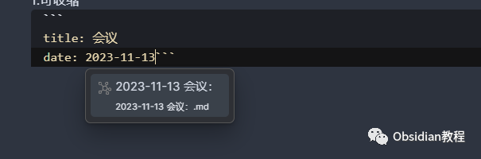
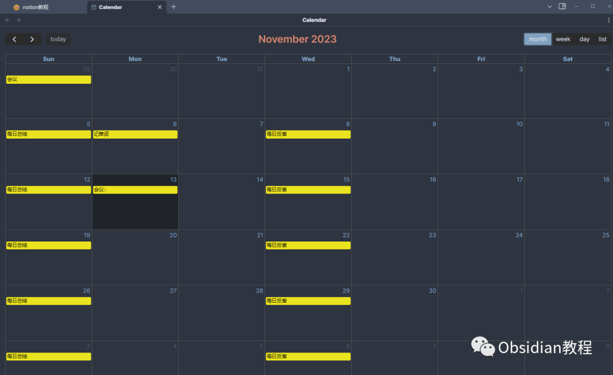
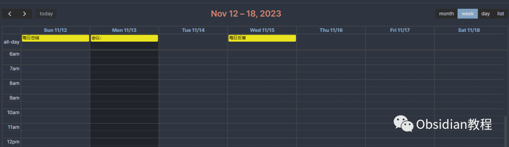
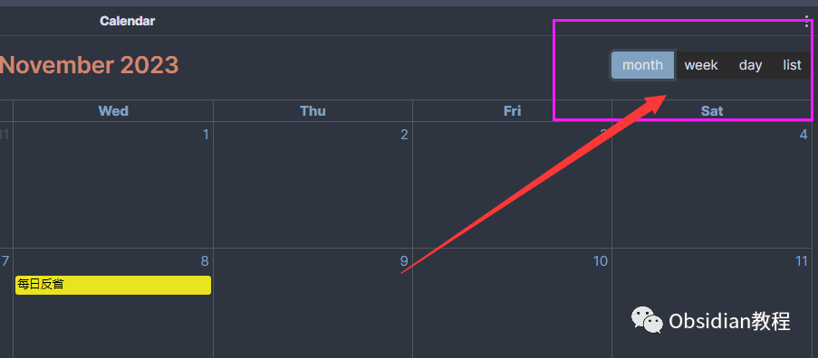
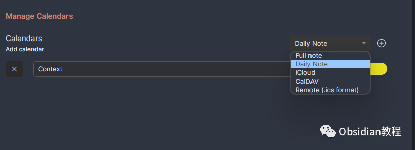

# Obsidian插件：Full Calendar一款强大的日历管理工具

Obsidian Full Calendar 插件是一款强大的日历管理工具，通过集成 FullCalendar 库，使用户能够在 Obsidian 软件中管理日程和事件。  

本教程将深入介绍该插件的安装、配置和使用方法，适合从初级到高级的用户。

## 

1安装 Full Calendar 插件

### **1.在线安装**（需要科学上网） ：****

  

  * 打开 Obsidian: 启动 Obsidian 软件。
  * 访问插件市场: 点击左下角的「设置」图标，然后选择「社区插件」选项。
  * 搜索插件: 在「社区插件」界面中搜索“Full Calendar”。
  * 安装插件: 找到 Full Calendar 插件后，点击「安装」按钮。
  * 启用插件: 安装完成后，点击「启用」以激活插件。

**2.离线安装：****  
****因为网络原因很多同学无法直接在线安装obsidian插件，这里我已经把obsidian所有热门插件下载好了**  
只需要关注下方公众号，后台回复：**插件** 即可获取  

## 

## **3.配置插件**  

  
访问插件设置，:在「设置」中找到 Full Calendar 插件的设置项。  

  * 日历配置: 根据个人需求配置日历视图、默认显示等选项。
  * 日历数据源: 可以选择从笔记前言（frontmatter）中提取事件，或是从每日笔记中读取事件列表。
  * 远程日历: 如果需要，配置 ICS 或 CalDAV 远程日历的链接，以实现日历的同步。

2使用方法

** 创建和管理事件**

创建事件: 在 Obsidian 中创建新笔记，使用特定的前言格式来定义事件。例如：

  *   * 

    
    
    title: 会议date: 2023-11-13

  

添加详细信息: 在笔记中添加事件的具体内容，如会议议程、重要点等。

  

链接笔记: 利用 Obsidian 的链接功能，将事件笔记与其他相关笔记相互链接。

### 查看和编辑日历

打开日历视图: 通过命令面板或侧边栏图标访问 Full Calendar 视图。

浏览日历: 在日历中查看不同日期的事件。  
编辑事件: 直接点击日历中的事件，快速打开对应笔记进行编辑。  

### 

### **同步远程日历**

  

  * 配置远程日历: 在插件设置中输入远程日历链接。
  * 查看远程事件: 在 Full Calendar 视图中，远程日历的事件将会显示。
  * 同步更新: 根据远程日历的设置，日历事件会定期同步更新。

##   

## **高级功能**

###   

###  自定义视图

  * 调整日历布局: 可以根据个人喜好调整日、周、月视图等。
  *   

  * 自定义颜色: 为不同类型的事件设置特定颜色，方便识别。

### **集成其他插件**

**  
**

  * 与任务管理插件结合: 将日历事件与任务管理插件如「Tasks」结合，实现更高效的时间管理。
  * 与笔记模板结合: 利用模板快速创建格式统一的事件笔记。

###   

### **导出和备份**

  * 导出日历: 可以将日历导出为标准格式，方便与其他应用程序共享。
  * 备份数据: 定期备份 Obsidian 库，包括日历数据，以防数据丢失。

##   

## **实践应用**

**  
**

  * 会议管理: 为每个会议创建独立笔记，记录详细内容和后续行动点。
  * 项目规划: 使用日历追踪项目的关键日期和里程碑。
  * 个人日程: 记录个人的日常活动、健身计划、学习日程等。

## 3结语

Obsidian Full Calendar 插件通过将日历功能整合到笔记中，提供了一种无缝的时间管理方式。它不仅增强了日程规划的灵活性，而且加强了事件与笔记之间的关联。适当配置和使用这款插件，将大大提升您的生产力和组织能力。  
  
  
1**扫码购买****《 Obsidian实战教程》****从入门到精通， 链接您的每一个思维瞬间。****  
**  
往 期精彩[1.](http://mp.weixin.qq.com/s?__biz=MzkyMDUyMDM2Mg==&mid=2247484437&idx=1&sn=56d072590a221e82421f806bd14f9d01&chksm=c190d7d0f6e75ec6a112fc672ce1daca289b70893334e5c5bbd4d406836c641ef294bbdeace2&scene=21#wechat_redirect)[Obsidian插件：Citation学术写作者的得力助手](http://mp.weixin.qq.com/s?__biz=MzkyMDUyMDM2Mg==&mid=2247484589&idx=1&sn=925c1cda10039f629ec64135cf01293b&chksm=c190d768f6e75e7e907221b8624378ff8abff315d787e51a1851ab1a1ef9b02c1cbc8b15b558&scene=21#wechat_redirect)[2.Obsidian插件：Various Complements让你的笔记体验更加流畅](http://mp.weixin.qq.com/s?__biz=MzkyMDUyMDM2Mg==&mid=2247484588&idx=1&sn=5178cf500b580690bb827800dac71299&chksm=c190d769f6e75e7fe74e7760db3c658e81ea504c8d6a9f31f0a1e7fe57972206e6285ae3a626&scene=21#wechat_redirect)  
[3.Obsidian 插件：使用Hider来精简你的用户界面](http://mp.weixin.qq.com/s?__biz=MzkyMDUyMDM2Mg==&mid=2247484587&idx=1&sn=4762b4fa1ee9e878f9649c385be320e6&chksm=c190d76ef6e75e78444313ca65acda9881ae76f69b4721ccca481286fc7c94286d6e6c9a3d2a&scene=21#wechat_redirect)  

点分享

点点赞

点在看
