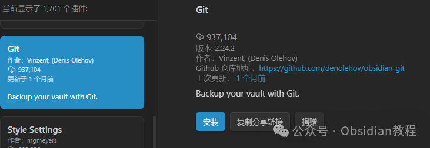
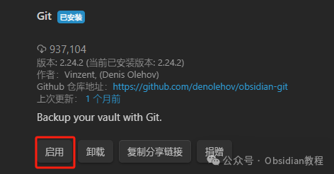
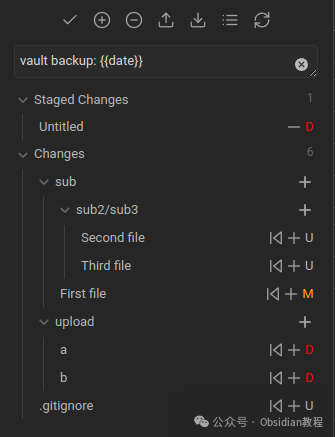
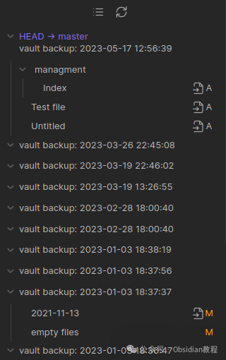

# Obsidian插件：Git 自动备份笔记，无需担心数据丢失

嗨，我是鬼哥，10年+老程序员一枚。

你们有时候会不会担心辛辛苦苦写的 Obsidian 笔记万一丢了咋办？

别担心，鬼哥今天要介绍一个神器——Obsidian Git 插件。

这个插件能把你的笔记库备份到远程 Git 仓库（比如 GitHub 的私有仓库），安全又方便。

下面鬼哥就带大家详细了解一下这个插件的使用方法，从安装到移动端的设置，再到一些小技巧和常见问题，包你看完之后爱上它！

**介绍**

Obsidian Git 插件可以自动或手动将你的 Obsidian 笔记库同步到一个远程 Git 仓库。无论是定期备份还是在多个设备之间同步笔记，这个插件都能帮你轻松搞定。只要你熟悉 Git 的基本操作，用这个插件绝对是小菜一碟。

**安装步骤**

安装的步骤其实非常简单：

### **1.在线安装**（需要科学上网） ：****

  
在Obsidian中安装插件是一个简单直接的过程：  

  1. 打开Obsidian，点击左下角的“设置”图标。
  2. 在设置菜单中，选择“第三方插件”选项。
  3. 点击“浏览”按钮，搜索“ Git ”。
  4. 找到插件后，点击“安装”。
  5. 安装完成后，切换插件的“启用”开关。  

### **2.离线安装：****  
****因为网络原因很多同学无法直接在线安装obsidian插件，这里我已经把obsidian所有热门插件下载好了**  

只需要关注下方公众号，后台回复：**插件** 即可获取

**特色功能**

#### **自动备份**

Obsidian Git 插件支持每隔一段时间自动备份你的笔记库，让你无需担心数据丢失。只需在设置中配置自动备份间隔时间，例如每 10 分钟备份一次，就能让你的笔记库保持最新状态。

#### **启动时拉取更改**

每次启动 Obsidian 时，插件会自动从远程仓库拉取最新的更改，这样你就能确保在不同设备上的笔记始终保持同步，避免手动同步的麻烦。

#### **快捷键操作**

为了提升操作效率，Obsidian Git 插件允许你为拉取和推送更改分配快捷键。只需按下设定的快捷键，就能轻松完成拉取和推送操作，非常方便快捷。

#### **Git 子模块管理**

如果你有多个仓库需要管理，可以通过启用 Git 子模块功能来实现。这样你就能在一个 Obsidian 笔记库中管理多个 Git 仓库，方便不同项目的分离和管理。

#### **源代码控制视图**

插件提供了一个源代码控制视图，允许你对单个文件进行暂存和提交操作。可以通过命令面板中的“Open Source Control View”命令打开这个视图，非常适合细粒度的版本控制。

#### **历史视图**

历史视图展示了提交记录及其修改的文件，基本上就是一个集成的 Git 日志。可以通过命令面板中的“Open History View”命令打开这个视图，让你轻松查看每次提交的详细信息。

#### **文件历史查看**

如果你想查看某个文件的历史版本，可以使用 Version History Diff 插件。这个插件能让你方便地查看文件的更改记录和差异，非常适合追踪文件的演变过程。

### **小技巧**

  1. 使用分支：为不同项目创建不同的分支，方便管理和切换。

  2. 合并冲突：如果遇到冲突，Obsidian Git 插件会提示你手动解决，可以使用命令行工具或 Git GUI 工具处理。

  3. 查看日志：通过 Git 日志命令查看提交历史，方便追踪和回滚到以前的版本。

### **常见问题**

  1. 身份验证失败：检查 SSH 密钥是否正确配置，确保公钥已经添加到 GitHub 账户中。

  2. 提交失败：确保所有文件都已正确保存，并检查 .gitignore 文件是否有误。

  3. 同步冲突：尽量避免在多个设备上同时编辑同一个文件，必要时手动解决冲突。

鬼哥用 Obsidian Git 插件已经有一段时间了，感觉非常稳妥可靠。每次备份和同步都很顺畅，再也不用担心笔记丢失的问题。

希望通过我的分享，大家都能安心使用 Obsidian 记录和管理自己的笔记，再也不怕数据丢失。

如果你有任何问题或使用心得，欢迎在评论区和鬼哥交流。

赶紧去试试吧，让 Obsidian Git 插件成为你笔记管理的好帮手！

  
  
  
1******扫码购买****《 Obsidian实战教程》****从入门到精通， 链接您的每一个思维瞬间。**  

