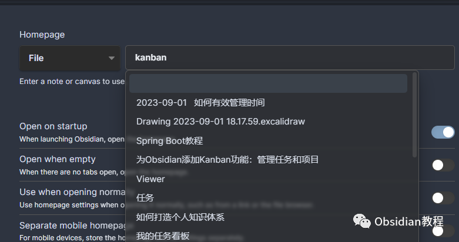
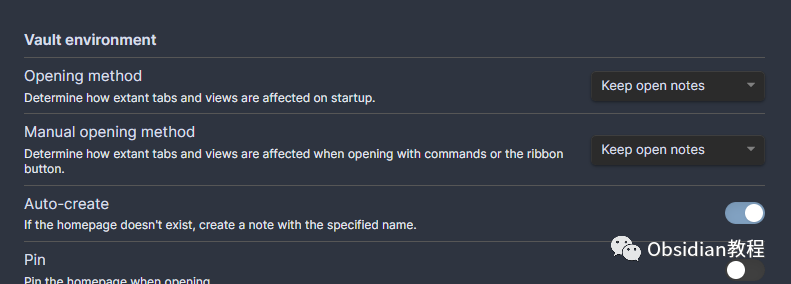
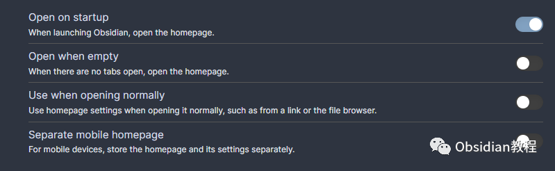
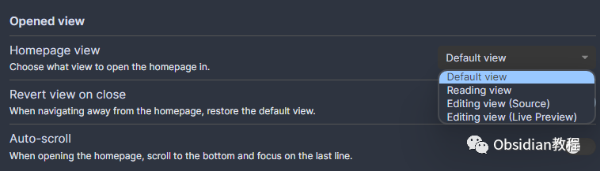
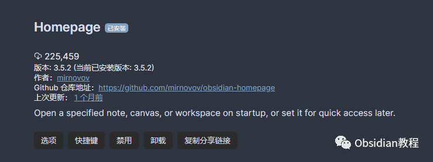

# Obsidian插件：Homepage为你的Obsidian打造独特的入口

### 点击下方公众号，回复关键字：**Obsidian** ，获取Obsidian资料合集。

  

Obsidian作为一款高度自定义的知识管理系统，提供了丰富的插件支持，以满足用户多样化的需求。在众多插件中，Homepage插件无疑是让用户体验更为舒适、高效的利器。

  

它能够让用户自定义Obsidian的启动界面，为每一次的笔记之旅设定一个清晰、便捷的起点。

  

接下来，我们将深入剖析这款插件的功能、特点、安装使用及一些使用建议。

  

1**功能与特点**  

**1. 自定义启动页**

  

Homepage插件允许用户设置一个特定的笔记、画布或工作区作为Obsidian的启动页，而非默认的最近打开的笔记。

  

用户可以选择任意笔记、画布或工作区作为启动页，也可以选择随机笔记，或使用每日或周期性笔记作为启动页。

  

### **2\. 多样化的启动选项**

  

除了设置启动页外，用户还可以决定启动时如何处理旧标签——保留它们、替换最后一个笔记，或关闭它们所有。

  

### **3\. 快速返回启动页**

  

用户可以通过"Open homepage"命令或点击专用的功能区按钮快速返回启动

页，非常方便。

  

### **4\. 多种视图支持**

  

用户可以选择在阅读、源代码、实时预览或默认视图中打开启动页，并在打开其他笔记时选择性地恢复视图。

  

### **5\. 与其他插件集成**

  

用户可以在打开启动页时运行任何Obsidian命令，与数百个插件进行集成，为用户创造无限可能。

  

### **6\. 创建高级着陆页**

  

借助于如Dataview等工具，用户可以创建具有高级功能的着陆页，如内容地图、音乐推荐、生日倒计时、日志记录等，为自己的Obsidian打造独特、丰富的入口页面

  

2**下载与安装**

  

首先，确保你已经安装了Obsidian软件。

### **  
**

### **1.在线安装**（需要科学上网） ：****

  
1.在Obsidian的设置中，找到“第三方插件”选项，点击“社区插件”2.在搜索框中输入“Homepage”，找到并安装它。3.安装完成后，激活该插件，在成功安装插件后，我们需要对其进行简单的配置，以符合我们的需求。

**2.离线安装：****  
****因为网络原因很多同学无法直接在线安装obsidian插件，这里我已经把obsidian所有热门插件下载好了**  
只需要关注下方公众号，后台回复：**插件** 即可获取

3**使用建议**

  

  * 充分利用集成功能：Homepage插件的集成功能非常强大，用户可以充分利用这一功能，与其他插件进行集成，创造出丰富、多彩的启动页。

  * 适当选择启动视图：根据个人习惯和需求，适当选择启动时的视图，以获得更好的使用体验。

  * 尝试高级着陆页：如果用户有一定的技术基础，可以尝试利用Dataview等工具，为自己的Obsidian创建高级的着陆页，提高知识管理的效率和乐趣。

  

通过合理、巧妙地利用Homepage插件，用户不仅可以为自己的Obsidian创造出独特、舒适的启动体验，还可以与其他插件进行深度集成，创造出无限可能。

  

无论是为了方便快捷的启动，还是为了创造个性化的着陆页，Homepage插件都是一个值得尝试和探索的好工具。

  
  
  
1**扫码购买****《 Obsidian实战教程》****从入门到精通， 链接您的每一个思维瞬间。****  
**  
往 期精彩[1.Obsidian插件:Annotator赋予用户在Obsidian环境中直接打开、阅读和注释PDF与EPUB文件的能力](http://mp.weixin.qq.com/s?__biz=MzkyMDUyMDM2Mg==&mid=2247484119&idx=1&sn=b1491121e681ce684988d100cf588dd0&chksm=c190d112f6e758048455acc822832f8db8750e60becfe3020bfdda9fba175a1e7a00f159a1d5&scene=21#wechat_redirect)  
[2.Obsidian插件: Recent Files追踪最近打开过的文件](http://mp.weixin.qq.com/s?__biz=MzkyMDUyMDM2Mg==&mid=2247484118&idx=1&sn=005a8e8df6fdedc65652ee1539bc2a0e&chksm=c190d113f6e758050ec859a87dcd29facc1dd509ba896fcf3bc5971af04f033334727222ded6&scene=21#wechat_redirect)  
[3.Obsidian插件:Remotely Save为Obsidian设计的非官方同步插件](http://mp.weixin.qq.com/s?__biz=MzkyMDUyMDM2Mg==&mid=2247484117&idx=1&sn=591d2150d0297403d12d8f78f79c0a4a&chksm=c190d110f6e758065927e3c3018d60b6d364cd205d2a85e7eda856bb4cb9fdc7839617f93870&scene=21#wechat_redirect)  

点分享

点点赞

点在看
