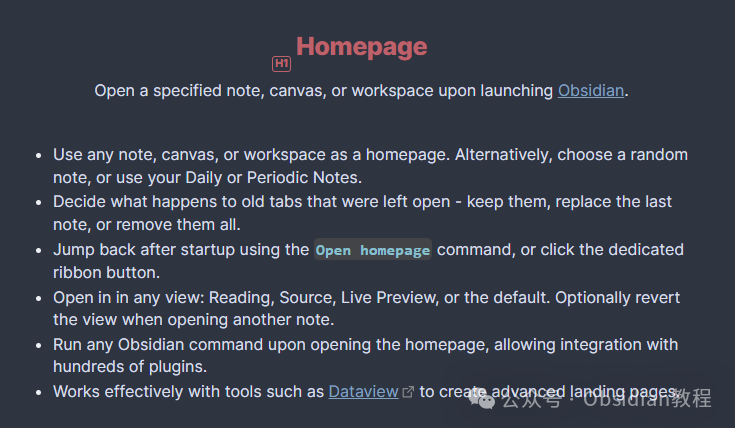
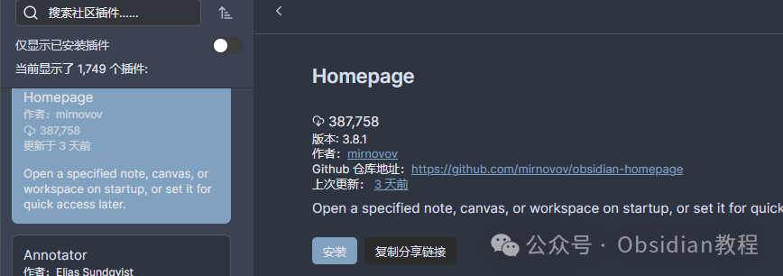

# Obsidian插件：Homepage指定打开某个笔记、画布或工作区，直接进入工作状态

嗨，我是鬼哥，10年+老程序员一枚。  
今天咱们聊聊Obsidian这个强大的笔记工具。  
要说Obsidian，那可是鬼哥的心头好，尤其是它的各种插件，真的是让人爱不释手。这次要给大家介绍的是一个能让你一打开Obsidian就直达目标的插件——Homepage。

### **Homepage插件简介**

  
我们都知道，Obsidian强大的地方就在于它的可扩展性，插件多到让人眼花缭乱。  
其中，Homepage这个插件，可以说是打开Obsidian的正确姿势。有了它，你可以指定打开某个特定的笔记、画布或者工作区，直接进入工作状态，再也不用每次手动找文件了，真的是省时省力。  
Homepage插件不仅方便，还能让你的Obsidian体验更上一层楼。  

### **下载和安装**

  
要安装Homepage插件，首先打开Obsidian，然后点击左侧的设置按钮，选择“社区插件”，然后在插件库里搜索“Homepage”。找到后点击“安装”，然后“启用”就可以了。安装过程非常简单，几步搞定，根本不需要复杂的操作。  

### **离线安装：****  
****很多同学无法直接在线安装obsidian插件，这里我已经把obsidian所有热门插件下载好了**  
只需要关注下方公众号，后台回复：**插件** 即可获取

###   

### **使用方法**

####   

#### **指定主页**

  
安装好插件后，我们需要进行一些设置。打开设置菜单，找到Homepage插件的设置页面。  
在这里，你可以指定打开的首页，可以是某个特定的笔记、画布或者工作区。比如，你每天的工作笔记可以设为主页，一打开Obsidian就能直接进入。  

#### **处理旧标签页**

  
Homepage插件还提供了处理旧标签页的选项。你可以选择保留之前打开的标签页，或者替换最后一个打开的笔记，也可以选择全部移除。这些选项让你可以根据自己的需求来决定启动时的标签页状态，保证每次打开都是你最需要的界面。  

#### **快速回到主页**

  
有时候，我们在Obsidian里打开了很多笔记，突然想回到主页怎么办？Homepage插件也考虑到了这一点。你可以使用“打开主页”命令，或者点击专用的工具栏按钮，快速回到指定的主页，方便快捷。  

#### **视图模式**

  
Obsidian的笔记有多种视图模式，比如阅读模式、源代码模式、实时预览模式等等。使用Homepage插件，你可以指定打开主页时的视图模式。  
比如，有些笔记你希望以阅读模式打开，有些则希望以源代码模式打开。这个功能让你的笔记查看更灵活、更个性化。  

#### **集成其他插件**

  
Homepage插件还能运行任何Obsidian命令，这就意味着你可以集成几百个插件的功能。比如，你可以在打开主页时运行Dataview插件的命令，创建一个高级的着陆页，让Obsidian变得更加智能和高效。  

### **实际应用场景**

  
鬼哥平时工作中，经常需要快速访问项目笔记和任务列表。有了Homepage插件，我可以把这些重要的笔记设为主页，一打开Obsidian就能立即进入工作状态，再也不用手动找文件了，真的是省时省力。  
另外，我还设置了每日笔记作为主页，这样每天打开Obsidian时，都会自动进入当天的笔记页面，方便记录和查看当天的工作安排。这个功能对于需要每日记录和计划的朋友来说，简直就是神器。  

### **总结**

  
Homepage插件真的是Obsidian用户的福音，它让我们可以在打开Obsidian时直接进入目标页面，无论是笔记、画布还是工作区，都能快速访问。  
同时，它还提供了灵活的选项来处理旧标签页，指定视图模式，以及运行Obsidian命令，集成其他插件的功能，极大地提升了我们的工作效率。  
总的来说，Homepage插件让Obsidian变得更加智能和高效，是每个Obsidian用户都应该尝试的插件。  
希望大家能像鬼哥一样，充分利用这个插件，提升自己的工作效率。  
  
  
1******扫码购买****《 Obsidian实战教程》****从入门到精通， 链接您的每一个思维瞬间。**  

