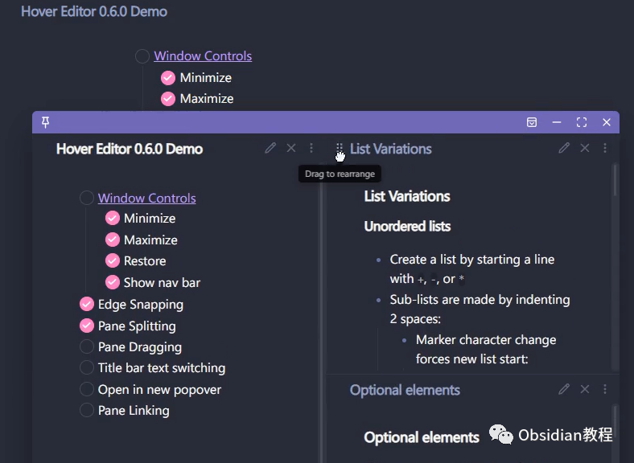
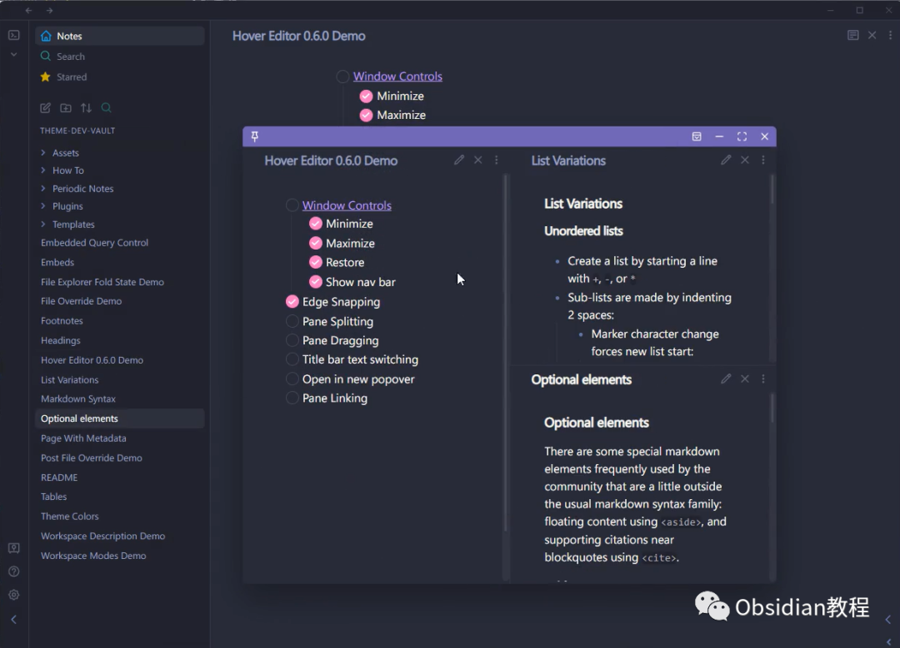
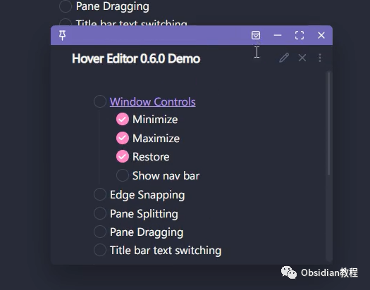
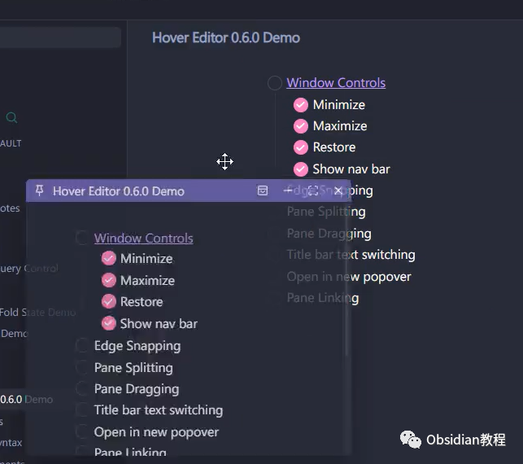
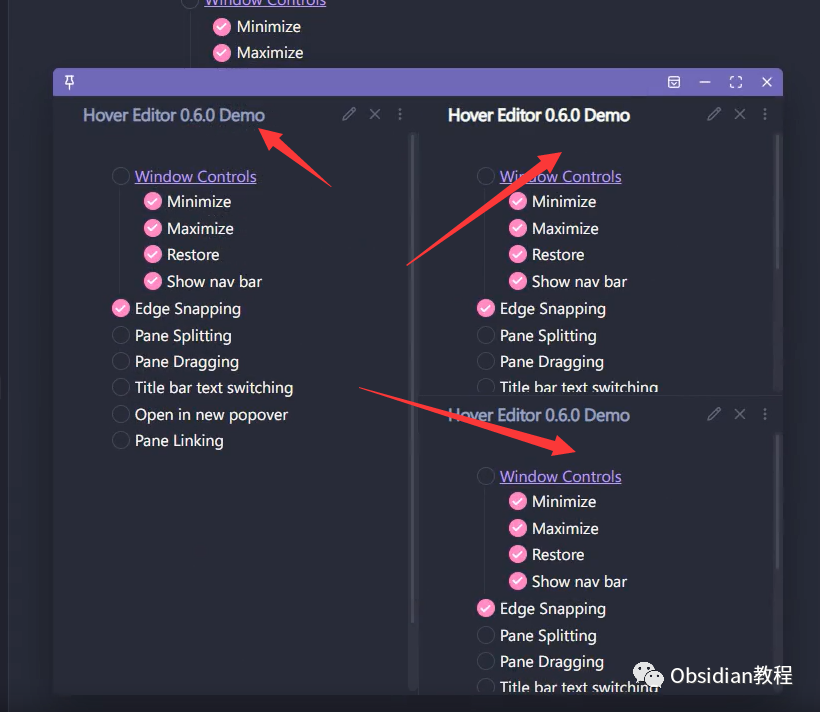
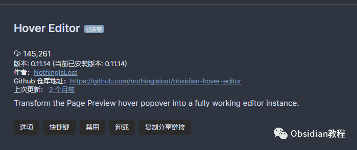
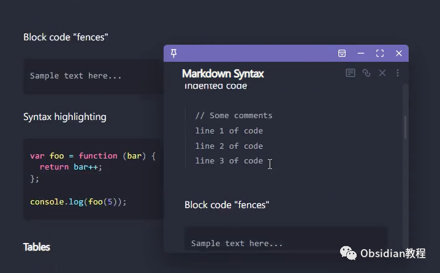

# Obsidian插件：Hover Editor将 Obsidian 的“页面预览”功能提升到一个全新的层次

点击下方公众号，回复关键字：**Obsidian** ，获取Obsidian资料合集。

  

Obsidian 的 Hover Editor 插件，将 Obsidian 的“页面预览”功能提升到一个全新的层次，使其成为一个功能齐全的编辑器实例。

  

无论是快速编辑、拖动、调整大小还是固定预览窗口，Hover Editor 都能为你轻松完成。

  

  

## 1**Hover Editor：超越预览的编辑器**   

Hover Editor 插件增强了核心的“页面预览”插件，将悬停弹出窗口转变为一个功能齐全的编辑器实例。这意味着你不仅可以预览页面，还可以直接在预览窗口中进行编辑。   
2**为什么选择 Hover Editor？**   

  * 强大的编辑功能：页面预览弹出窗口现在是一个真正的编辑器实例，支持大多数编辑功能，包括模式切换。

  
  

  * 灵活的操作：你可以拖动和调整预览窗口的大小，还可以固定它以防止自动关闭。

  

  * 多窗口支持：你可以同时打开多个预览窗口，每个窗口都可以独立操作。

  
  

  * 快捷键支持：打开预览窗口后，它将成为活动窗格并获得焦点，这意味着你可以使用快捷键，如 ctrl+e 进行操作。

##  3**开始使用：安装和配置**   

安装 Hover Editor：

### **  
**

### **在线安装**（需要科学上网） ：****

  
1.在Obsidian的设置中，找到“第三方插件”选项，点击“社区插件”2.在搜索框中输入“Hover Editor”，找到并安装它。3.安装完成后，激活该插件，在成功安装插件后，我们需要对其进行简单的配置，以符合我们的需求。  
**  
****2.离线安装：****  
****因为网络原因很多同学无法直接在线安装obsidian插件，这里我已经把obsidian所有热门插件下载好了**  
只需要关注下方公众号，后台回复：**插件** 即可获取  
**配置 Hover Editor：**  
在 Obsidian 的设置中，找到 Hover Editor 插件，选择你的默认编辑模式，例如：“打开阅读模式”、“打开编辑模式”或“匹配当前文档的模式”。

##  4**使用 Hover Editor：超越预览**

  

  * 悬停预览：将鼠标悬停在任何链接上，你会看到一个预览窗口弹出。
  * 编辑内容：在预览窗口中，你可以直接编辑内容，无需打开新的页面。
  * 调整大小和位置：你可以拖动预览窗口到任何位置，也可以调整其大小。
  * 固定预览窗口：如果你想长时间查看或编辑内容，可以固定预览窗口，防止其自动关闭。

  

## 5**高级功能：更多的操作**   

  * 导航栏：预览窗口现在有一个导航栏，包括文档标题和编辑控件。
  * 最小化：你可以双击顶部的拖动手柄来最小化预览窗口。
  * 自动滚动：当悬停包含标题或块引用的链接时，编辑器将打开并自动滚动到引用位置。

##   

Hover Editor 是一个强大而灵活的插件，它可以帮助你更好地预览和编辑内容。无论你是一个作家、研究员还是日常生活中的知识爱好者，Hover Editor 都是你的最佳选择。  
  
  
1**扫码购买****《 Obsidian实战教程》****从入门到精通， 链接您的每一个思维瞬间。****  
**  
往 期精彩[1.Obsidian 插件:Make.md赋能创作者的终极体验](http://mp.weixin.qq.com/s?__biz=MzkyMDUyMDM2Mg==&mid=2247484437&idx=1&sn=56d072590a221e82421f806bd14f9d01&chksm=c190d7d0f6e75ec6a112fc672ce1daca289b70893334e5c5bbd4d406836c641ef294bbdeace2&scene=21#wechat_redirect)[2.Obsidian插件:让链接插入更加灵活的 Paste URL into selection](http://mp.weixin.qq.com/s?__biz=MzkyMDUyMDM2Mg==&mid=2247484436&idx=1&sn=7176e8eba90c95d2ebe936d98f82e937&chksm=c190d7d1f6e75ec76c4a41782639e3f49d415b8aa40c8ad7b58106ff17ab3ddb358dfd208275&scene=21#wechat_redirect)  
[3.Obsidian插件:Note Refactor 在 Obsidian 中轻松地提取选定部分的笔记到新的笔记中。](http://mp.weixin.qq.com/s?__biz=MzkyMDUyMDM2Mg==&mid=2247484435&idx=1&sn=c4ecdb98cdcd329ab4a18c9571818096&chksm=c190d7d6f6e75ec00580be3a0b5014ab489ba49b1905a5299a9bf14c2cbdc75eb2d6d83bea57&scene=21#wechat_redirect)  

点分享

点点赞

点在看
