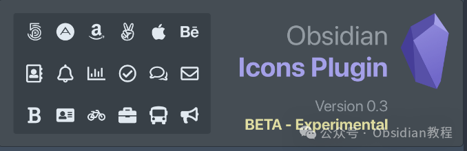
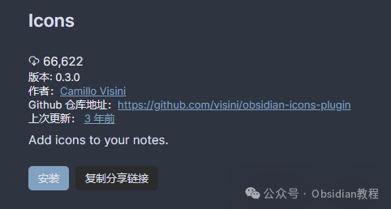
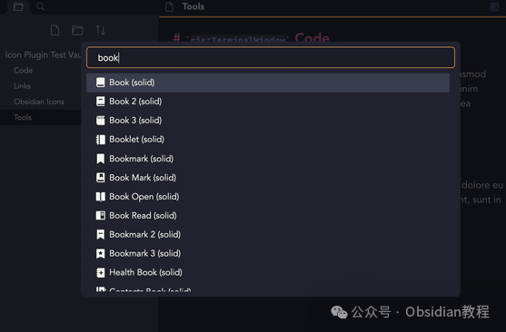
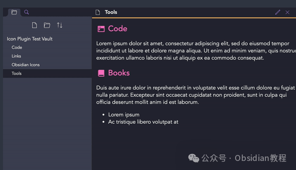
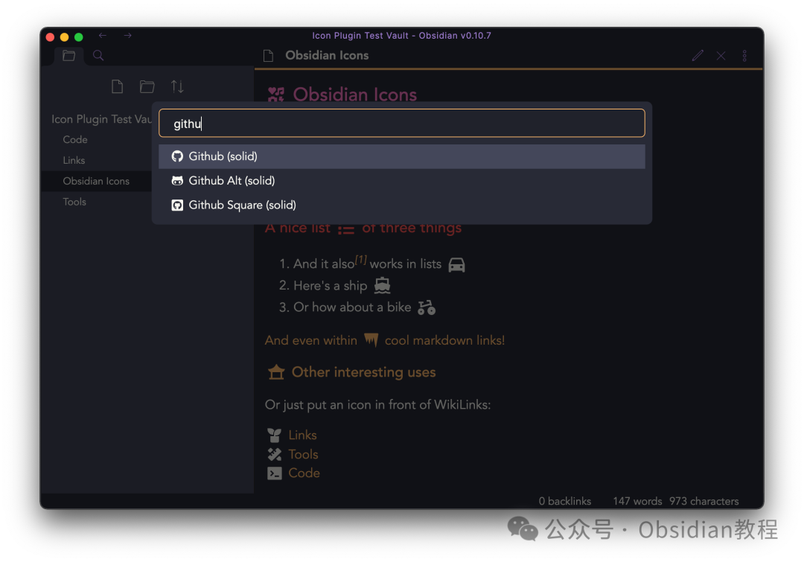
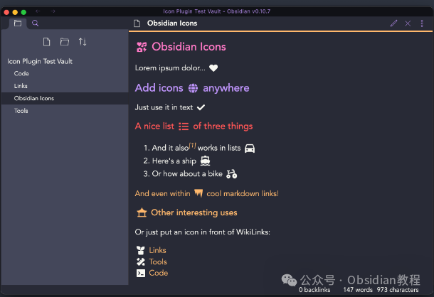

# Obsidian插件：Icons允许用户在笔记中插入各种图标，强大的视觉增强工具

Obsidian Icons插件是为Obsidian用户提供的一个强大的视觉增强工具。它允许用户在笔记中插入各种图标，从而使笔记内容更加生动和直观。  
这个插件尤其适合那些希望通过视觉元素来增强信息组织和呈现的用户。  

#### **图标集**

**  
**

  * Remix Icon：包含2172个图标，涵盖了多种类别，从通用符号到特定主题的图标，几乎可以满足所有需求。

  * FontAwesome（免费版）：提供1560个图标，是设计师和开发者广泛使用的图标集之一。

### 

1安装与配置

安装Icons插件非常简单，只需通过Obsidian的社区插件市场搜索并安装即可。在插件安装并启用后，您可以在插件设置中选择激活哪些图标集。

###   

### **1.在线安装**（需要科学上网） ：****

### ****  
****

### 点击“社区插件”下的“浏览”按钮，在左上角的搜索框中搜索“ Icons”，然后点击“安装”按钮。

###   
启用插件：安装成功后，点击“启用”以启用插件。  

  
**2.离线安装：****  
****因为网络原因很多同学无法直接在线安装obsidian插件，这里我已经把obsidian所有热门插件下载好了**  
只需要关注下方公众号，后台回复：**插件** 即可获取  

  * 下载最新发布的ZIP文件。
  * 解压至Obsidian的插件文件夹。

### 

2使用教程

使用Icons插件的基本步骤相当直观。您只需在笔记中添加相应的Markdown代码，插件便会在预览模式下显示选定的图标。

####   

#### **添加图标**

**  
**

  * 打开任意笔记。
  * 输入图标对应的Markdown代码。例如，您可以输入来插入一个火箭图标。

  * 切换到预览模式查看图标。

#### **高级使用**

  
您还可以根据需要自定义图标的大小和颜色，甚至将图标用于链接和按钮等更复杂的Markdown结构中。

### **自定义图标**

  
为了使图标更好地融入您的笔记风格，您可能需要对图标的外观进行一些调整。通过CSS片段，您可以轻松实现这一点。

#### **  
**

#### **创建CSS片段**

**  
**

  * 进入设置，选择“外观”部分。
  * 启用“CSS片段”并打开对应文件夹。
  * 创建一个名为icons.css的新文件。
  * 在文件中添加CSS规则来自定义图标。例如：

      
      *   *   *   * 
    
    
    
    .obsidian-icon {    color: blue;    font-size: 24px;}

  * 保存文件并在Obsidian中重新加载CSS片段。

### 

3结语

Obsidian Icons插件通过为Obsidian用户提供丰富的图标资源，极大地丰富了笔记的视觉表现和信息组织能力。  
它不仅适用于视觉设计师和内容创作者，也适合任何希望提升笔记美观度和阅读体验的普通用户。  

通过这个插件，Obsidian的使用体验将得到进一步提升，帮助用户更有效地管理和展示他们的想法和信息。  
  
  
1******扫码购买****《 Obsidian实战教程》****从入门到精通， 链接您的每一个思维瞬间。**  

