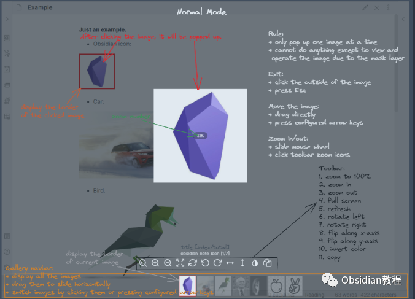
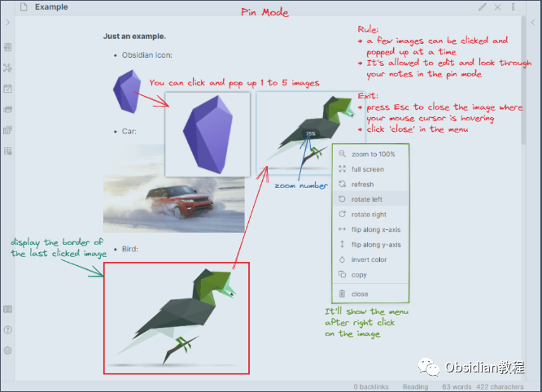
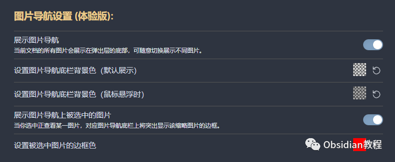
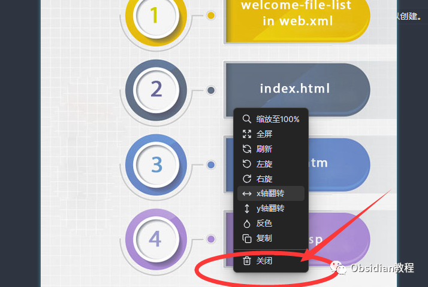
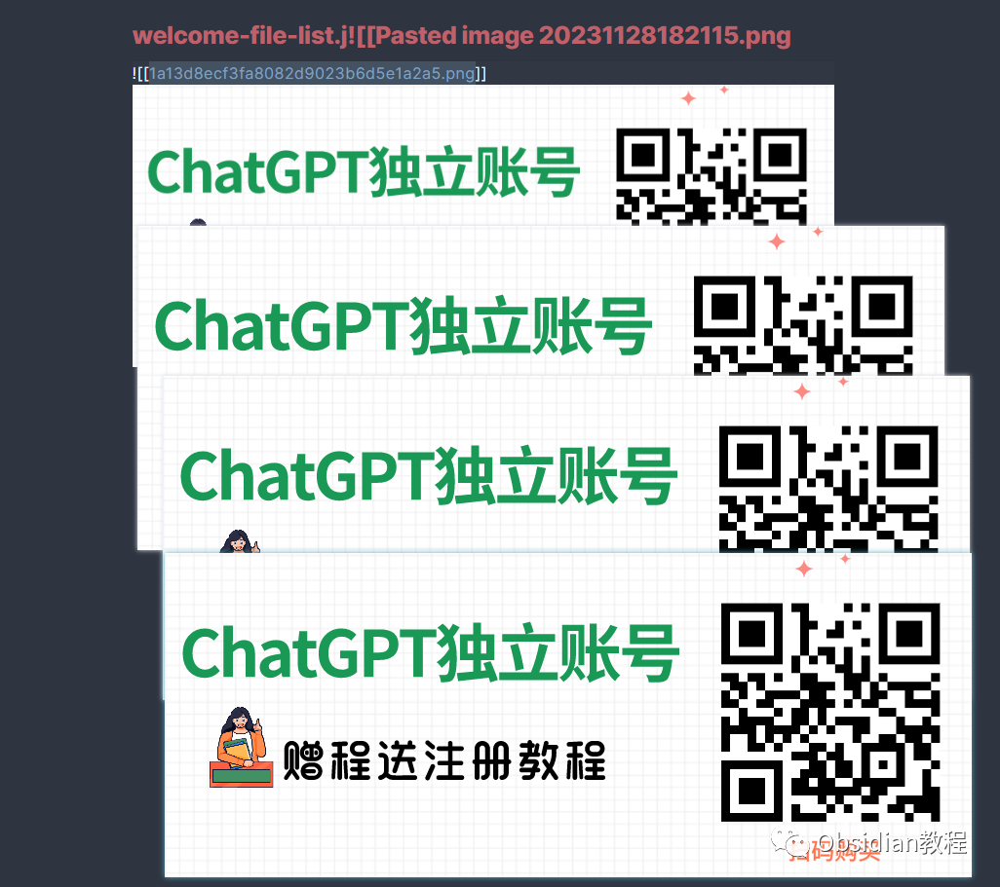
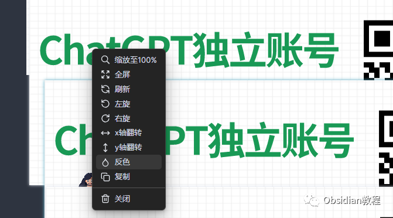
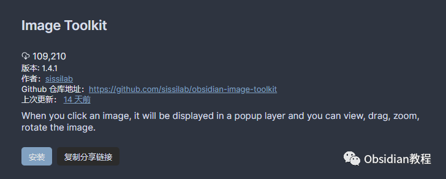

# Obsidian插件：Image Toolkit一款提升图像交互体验的插件

Image Toolkit 是 Obsidian 中一款提升图像交互体验的插件。  
通过该插件，用户可以在点击图片时弹出预览，并执行缩放、移动、旋转、翻转、反色和复制等操作。  
  
接下来，我们将详细解析这款插件的功能、安装方法及使用场景。

## 

1基础功能

### **图像预览与操作**

**  
**

  * 缩放：使用鼠标滚轮或点击工具栏的缩放图标来放大或缩小图像。
  * 移动：通过拖动鼠标光标或按键盘箭头键移动图像。
  * 全屏预览：全屏模式下查看图像。
  * 旋转与翻转：点击底部工具栏图标进行图像的旋转和翻转。
  * 反色处理：对图像进行颜色反转。
  * 复制图像：复制图像到剪贴板。

  

### 

###   

### **正常模式（Normal Mode）**

  
当在设置页面关闭“固定图片”选项时，插件进入正常模式。  

#### **规则**

**  
**

  * 点击图片后，图片会在带有透明遮罩层的背景上弹出。
  * 一次只能点击并预览一张图片。
  * 在正常模式下，除了查看和操作图片外，无法编辑笔记或执行其他操作。

####   

#### **画廊导航栏（Gallery Navbar）**

**  
**

  * 当前笔记中的所有图片将显示在底部，用户可以切换这些缩略图来查看任意图片。
  * 若要使用此功能，需要在插件设置页面开启“显示画廊导航栏”。
  * 可以在插件设置页面设置画廊导航栏的背景色和选中图片的边框色。

#### 

#### **退出**

**  
**

  * 点击图片区域。
  * 选择关闭按钮。
  * 如果处于全屏模式，需要先退出全屏模式，然后退出图片预览页面并关闭弹出层。

#### **移动图片**  

**  
**

  * 将鼠标光标放在图片上，直接拖动图片以移动。
  * 按配置的箭头键移动图片。
  * 如果为移动图片设置了修饰键（Ctrl、Alt、Shift），则需要同时按住修饰键和箭头键。

## 

2固定模式（Pin Mode）

当在设置页面开启“固定图片”时，插件进入固定模式。

####   

#### **规则**

**  
**

  * 一次可以点击并弹出 1 至 5 张图片。
  * 与正常模式相比，在点击图片后，图片会在无遮罩层的情况下弹出。
  * 允许在图片弹出和预览时编辑和查阅笔记。

  

#### 

#### **菜单**

**  
**

  * 在弹出的图片上右键点击，会在光标右侧显示菜单。菜单包含多个功能，如缩放、全屏、刷新、旋转、翻转、复制、关闭等。

####   

#### **退出**

**  
**

  * 将鼠标光标悬停在的图片上按 Esc 键关闭。
  * 点击菜单中的“关闭”按钮。

####   

#### **移动图片**

**  
**

  * 将鼠标光标放在图片上，并直接拖动图片以移动。
  * 不支持使用箭头键移动图片。

## 

3安装方法

### 

### **1.在线安装**（需要科学上网） ：****

### ****  
****

### 点击“社区插件”下的“浏览”按钮，在左上角的搜索框中搜索“ Image Toolkit”，然后点击“安装”按钮。

###   
启用插件：安装成功后，点击“启用”以启用插件。  

  
**2.离线安装：****  
****因为网络原因很多同学无法直接在线安装obsidian插件，这里我已经把obsidian所有热门插件下载好了**  
只需要关注下方公众号，后台回复：**插件** 即可获取

  
安装后，关闭插件浏览窗口，回到社区插件窗口，并激活新安装的插件。

##  4**实际应用场景**

Image Toolkit 插件在多种使用场景下都能大大提升你对图像的操作体验，特别适用于以下情况：  

  * 学术研究：在整理研究资料时，可以快速查看和比较图表和图片，有助于更好地理解和分析数据。
  * 创意写作：用于灵感收集和故事构思，快速浏览和操作图片可以帮助激发创意。
  * 项目管理：在项目管理中，尤其是需要处理大量视觉资料的项目，此插件可以提高效率和准确性。

  
总之，Image Toolkit 是一款强大且易用的插件，能有效提升你在 Obsidian 中处理图像的能力。无论你是初学者还是高级用户，都可以通过这款插件提升你的笔记体验。  
  
  
1**扫码购买****《 Obsidian实战教程》****从入门到精通， 链接您的每一个思维瞬间。****  
**

