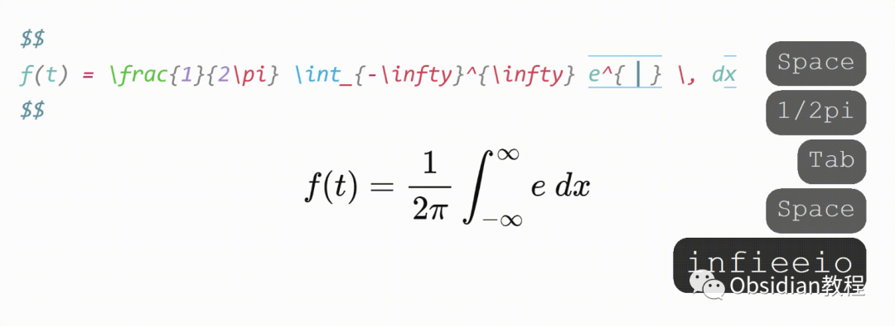
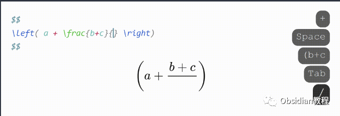
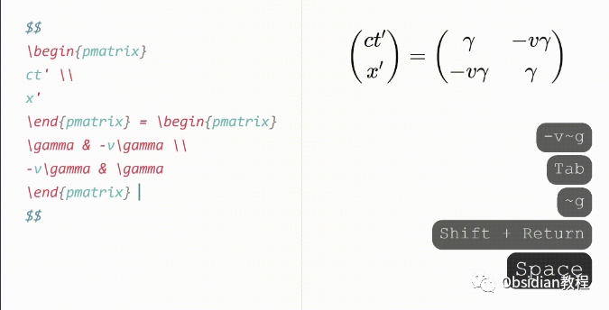
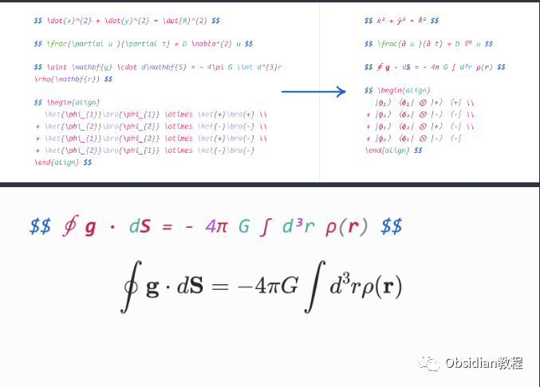
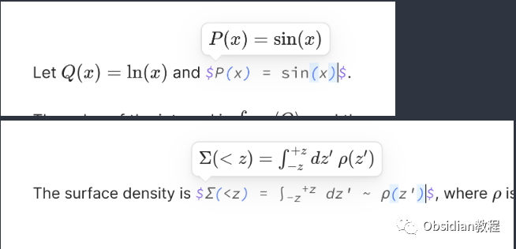
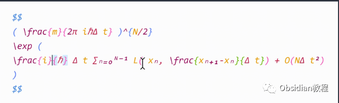
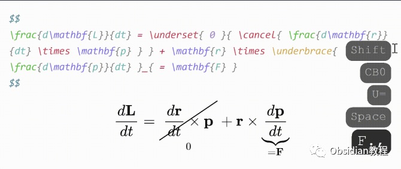
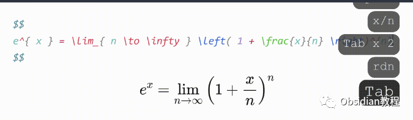
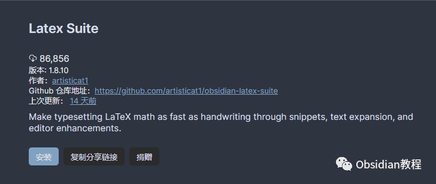

# Obsidian插件：LaTeX Suite通过快捷方式和文本扩展使 LaTeX 数学排版速度快如手写

Obsidian 是一款非常流行的笔记软件，特别受到喜欢使用 Markdown 和 LaTeX 的用户群体的欢迎。  
今天，我们将详细讨论 Obsidian 的一个插件——LaTeX Suite。  
这个插件旨在通过快捷方式和文本扩展使 LaTeX 数学排版速度快如手写，灵感来自 Gilles Castel 使用 UltiSnips 的设置。

下面，我将为您提供一个详细的教程，介绍如何使用 LaTeX Suite 插件，以及它的主要功能和用法。  

### 1基本使用

LaTeX Suite 插件的核心功能是通过简短的触发词来快速插入复杂的 LaTeX 代码。例如：  

  * 输入 sqx 会自动扩展为 \sqrt{x}。
  * 输入 a/b 会自动扩展为 \frac{a}{b}。
  * 输入 par x y 会自动扩展为 \frac{\partial x}{\partial y}。

  
这些简写大大提高了编写 LaTeX 数学公式的效率。

#### 

2显示数学模式

要进入显示数学模式，您可以输入 dm，然后开始输入 LaTeX 代码。例如：  

  * 输入 xsr 会转换为 x^{2}。
  * 输入 x/y Tab 会转换为 \frac{x}{y}。
  * 输入 sin @t 会转换为 \sin \theta。

####   

#### **默认片段**

  
LaTeX Suite 插件附带了一套默认的片段，这些片段基于 Gilles Castel 的设置。您可以根据需要修改、删除或添加自己的片段。  

#### **自动分数**

  
当您输入如 1/x 这样的表达式时，插件会自动将其转换为 \frac{1}{x} 形式，并将光标移动到括号内。  

#### **矩阵快捷方式**

  
在矩阵、数组、对齐或情况环境中，您可以使用 Tab 键插入 & 符号，使用 Enter 键插入 \\\ 并换行，Shift + Enter 可以快速移动到下一行的末尾。  

#### **Conceal 功能**

  
启用此功能后，LaTeX 代码会被隐藏，以更易读的格式呈现。例如，\dot{x}^{2} + \dot{y}^{2} 会显示为 ẋ² + ẏ²。将光标移动到公式上时，原始 LaTeX 代码会显示出来。  

#### **Tabout 功能**

  
当光标位于方程式的末尾时，按 Tab 键会将光标移出 $ 符号。否则，Tab 键会将光标移动到下一个闭合括号。  

#### **预览内联数学**

  
当光标位于内联数学内时，会显示一个弹出窗口，展示渲染后的数学公式。

#### **彩色和高亮匹配括号**

  
匹配的括号会以相同的颜色渲染，以提高可读性。当光标靠近括号时，该括号及其配对括号会被高亮显示。  

#### **视觉片段**

您可以通过选择一些数学公式并输入特定的字符来添加注释或划掉项。例如，输入 U 会将其包围在 \underbrace 中。

#### **自动放大括号**

  
当触发包含 \sum、\int 或 \frac 的片段时，任何包围的括号都会通过 \left 和 \right 放大。  

#### **编辑器命令**

  
您可以使用插件提供的编辑器命令，例如“框选当前方程式”或“选择当前方程式”。  

### **片段的格式**

  
片段在 LaTeX Suite 中的格式如下：
      
      *   *   *   *   *   *   *   * 
    
    
    
    {  trigger: string | RegExp,  replacement: string,  options: string,  priority?: number,  description?: string,  flags?: string}

  

  * trigger：触发此片段的文本。
  * replacement：用于替换触发词的文本。
  * options：片段的运行模式，如文本模式或数学模式。
  * priority（可选）：片段的优先级。
  * description（可选）：片段的描述。
  * flags（可选）：正则表达式片段的标志。

### 

3插件安装

### **1.在线安装**（需要科学上网） ：****

### ****  
****

### 点击“社区插件”下的“浏览”按钮，在左上角的搜索框中搜索“ LaTeX Suite”，然后点击“安装”按钮。

###   
启用插件：安装成功后，点击“启用”以启用插件。  

  
**2.离线安装：****  
****因为网络原因很多同学无法直接在线安装obsidian插件，这里我已经把obsidian所有热门插件下载好了**  
只需要关注下方公众号，后台回复：**插件** 即可获取

### 

4总结

LaTeX Suite 是一个强大的插件，可以显著提高在 Obsidian 中编写 LaTeX 数学公式的效率。通过简短的触发词、自动扩展和其他高级功能，它让数学公式的编辑变得快速而直观。  
无论您是数学、物理学还是工程学的学生，或者任何需要频繁使用 LaTeX 的专业人士，这个插件都将成为您强大的助手。  
  
  
1******扫码购买****《 Obsidian实战教程》****从入门到精通， 链接您的每一个思维瞬间。**  

